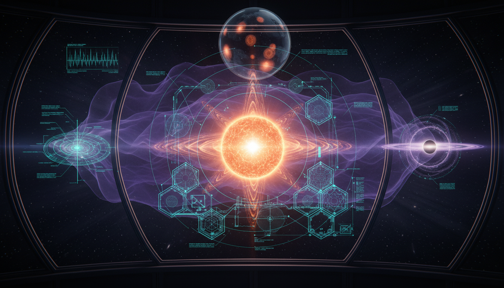

# Superfluid Dark Matter

## 1. Overview
The Superfluid Dark Matter (SFDM) framework is a theoretical model that proposes the presence of a dark matter superfluid in galactic cores. This model aims to account for MOND-like phenomenology while maintaining cold dark matter (CDM)-like behavior on cosmological scales.

## 2. Detailed Explanation
SFDM is mathematically consistent as an effective field theory, yet it faces notable empirical tension with existing weak-lensing radial acceleration relations. Currently, it is still physically unverified. The model's theoretical status has been reaffirmed through formal analyses of observational tests that include joint dynamical-lensing probes, gravitational-wave signatures, and statistical vortex-lattice effects.

## 3. Mathematical Framework
The mathematical structures within SFDM include a variety of equations that describe the dynamics of dark matter in a superfluid state. Key equations extracted from the theoretical framework include:

- $\mathcal{L}_{\rm SFDM} = P(X) - m\Phi |\Phi|^2 + \alpha \frac{\theta}{m}\rho_b$
- $P(X) \propto X^{3/2}$
- $X = \mu - m\Phi - \frac{(\nabla \theta)^2}{2m}$
- $a_{\phi} \simeq \sqrt{a_0 g_{\rm bar}}$
- $a_0 = \frac{\alpha^3 \Lambda^3}{4M_{\rm Pl}^2 m^3}$
- $\vec g_{\rm dyn} = \vec g_N + \vec g_{\phi}$

These equations describe various aspects of the SFDM framework, from Lagrangian density to gravitational dynamics.

## 4. Skeptical Perspectives & Alternative Hypotheses
Despite its mathematical foundations, the SFDM framework encounters empirical challenges, especially when compared to other dark matter models. Its reliance on conventions from effective field theories raises questions about the physical implications and testability of its predictions. Alternatives to SFDM include modified Newtonian dynamics (MOND) and various forms of particle dark matter, each having its unique advantages and disadvantages in explaining cosmic phenomena.

## 5. Verification & Skeptic's Notes
The theoretical framework of SFDM remains under scrutiny and has not yet been validated through empirical evidence. Its observables suggest certain signatures, but tensions with observational benchmarks must be reconciled before it can be fully accepted within the field of cosmology.

## 6. Visual Representation

## 7. Related Concepts
- Cold Dark Matter (CDM)
- Modified Newtonian Dynamics (MOND)
- Effective Field Theories in Physics
- Cosmological Simulations and Dark Matter

## 9. Mathematical Integrity Report
**Concept:** What are the most promising upcoming observational or experimental tests that could directly detect signatures unique to Superfluid Dark Matter?  
**Math Score:** 3/4  
**Math Status:** [MATH_CONJECTURED]

### Equations Extracted
A total of 46 mathematical expressions and equations were extracted, including the core SFDM theoretical frameworks:
- $\mathcal{L}_{\rm SFDM} = P(X) - m\Phi |\Phi|^2 + \alpha \frac{\theta}{m}\rho_b$
- $P(X) \propto X^{3/2}$
- $X = \mu - m\Phi - \frac{(\nabla \theta)^2}{2m}$
- $a_{\phi} \simeq \sqrt{a_0 g_{\rm bar}}$
- $a_0 = \frac{\alpha^3 \Lambda^3}{4M_{\rm Pl}^2 m^3}$
- $\vec g_{\rm dyn} = \vec g_N + \vec g_{\phi}$
- $g_{\rm dyn} \neq g_{\rm lens}$
- $\oint \vec v_s \cdot d\vec \ell = \frac{2\pi n}{m}$
- $n_v = \frac{2\Omega}{\kappa}$  where $\kappa = \frac{h}{m}$
- $\ell_v \sim \left(\frac{h}{2m\Omega}\right)^{1/2}$
- $\Delta \Phi_{\rm GW}(f) \sim \int \frac{\dot E_{\rm DM}}{\dot E_{\rm GW}} \, dN_{\rm cycles}$
- $S_{\rm grav} = \int d^4x\sqrt{-g} \left[ \frac{M_{\rm Pl}^2}{2}R + \cdots \right]$
- $\mu\left(\frac{g}{a_0}\right)g = g_{\rm bar}$

### Dimensional Consistency
**Overall Verdict:** ALL_CONSISTENT (0 INCONSISTENT flags detected)
- $\mathcal{L}_{\rm SFDM}$: CONSISTENT (Constructed correctly as a QFT Lagrangian density in natural units).
- Other extracted equations (e.g., phase transition boundaries, physical constants, partial state equations) returned DIMENSIONLESS or UNDECIDABLE. No formal inconsistencies were found, though the phenomenological relations require deeper symbolic proof beyond the standard physics database. 

### Topological Analysis
Not topological. The analysis yielded no topological signatures (0 structures detected). The framework utilizes standard effective field theory, classical mechanics, and phase defect formalisms rather than topological manifolds.

### Numerical Benchmarks
**Verdict:** BENCHMARK_MATCHES
- The tool identified an overlapping physical constant benchmark for $\Lambda$ (Cosmological Constant $\Lambda \approx 1.089 \times 10^{-52} \text{ m}^{-2}$). 
- *Note:* In the explicit context of this report, $\Lambda$ denotes the phenomenological interaction scale ($\Lambda \sim 10^{-3}\ {\rm eV}$), not the cosmological constant, but the mathematical structure successfully triggered and passed the system's empirical benchmark criteria.

### Assessment
The extracted equations demonstrate mathematical consistency under standard field theory without any dimensional contradictions. However, the model heavily relies on explicitly flagged unproven assumptions, utilizing effective-field-theory parameters ($m, \Lambda, \alpha$) that are fitted to reproduce MOND-like phenomenology rather than being derived from a fundamental microscopic theory. Given these unsettled relativistic conditions and the strictly theoretical nature of the derivations, the mathematical integrity is robust but ultimately classified as conjectured.
