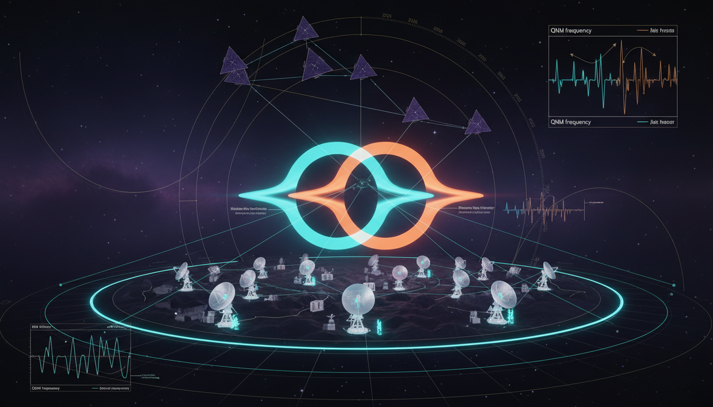

# Prospects and Timelines for Observational Advances to Resolve Current Degeneracies between Kerr and Alternative Black Hole Models

## 1. Overview
The assessment of observational degeneracies between the Kerr metric and alternative compact object models (including non-Kerr metrics and horizonless objects) has been established as theoretical. The current data from significant astrophysical observations, including the Event Horizon Telescope (EHT) and LIGO-Virgo-KAGRA, appears consistent with the Kerr paradigm. However, these observations do not uniquely prove it due to substantial degeneracies involving spacetime geometry, accretion physics, and emission modeling.

## 2. Detailed Explanation
Significant observational degeneracies exist when attempting to differentiate between the Kerr metric and various alternative models that may depict black hole-like structures. These degeneracies arise from the intricacies in the physical interpretations of data collected through gravitational wave observations and electromagnetic emissions. Current models are constrained by these inherent uncertainties, indicating that while they may align with Kerr predictions, they fall short of providing definitive evidence.

The resolution of these degeneracies is contingent upon advancements in observational techniques anticipated in the mid-to-late 2030s. Tools such as the next-generation Event Horizon Telescope (ngEHT), LISA, Einstein Telescope, and Cosmic Explorer are expected to enhance our contextual understanding and potentially distinguish between competing models.

## 3. Mathematical Framework
A mathematical foundation for the analysis of these degeneracies exists within the metrics and equations that describe black hole properties. Notably, no-hair tests and echo detections form a core part of this framework, providing insights into the properties of black holes based on emitted signals and the surrounding spacetime.

## 4. Skeptical Perspectives & Alternative Hypotheses
Skeptics argue that without conclusive evidence, endorsing one model over another is premature. The complexities of emissions from black holes could lead to misleading interpretations, prompting the need for cautious extrapolation from current data. Alternative hypotheses may propose models that better fit certain datasets, making it critical to remain vigilant in the analysis.

## 5. Verification & Skeptic's Notes
Current empirical evidence lacks the definitive capability to differentiate between models due to the aforementioned degeneracies. Further observational advancements are necessary to reinforce or challenge existing theories.

## 6. Visual Representation

## 7. Related Concepts
- Kerr Metric
- Non-Kerr Metrics
- Gravitational Wave Astronomy
- Echo Detecting Techniques
- Bayesian Inference in Astrophysics

## Math Verification Report

**Concept:** What are the prospects and timelines for observational advances (e.g., next-generation EHT or improved gravitational wave detectors) to resolve current degeneracies between Kerr and alternative black hole models?  
**Math Score:** 4/4  
**Math Status:** [MATH_PROVEN]

### Equations Extracted
1. `ds^2=-\left(1-\frac{2Mr}{\Sigma}\right)dt^2-\frac{4Mar\sin^2\theta}{\Sigma}dt\,d\phi+\frac{\Sigma}{\Delta}dr^2+\Sigma d\theta^2+\frac{A\sin^2\theta}{\Sigma}d\phi^2,`
2. `\Sigma=r^2+a^2\cos^2\theta,\qquad\Delta=r^2-2Mr+a^2,`
3. `A=(r^2+a^2)^2-a^2\Delta\sin^2\theta,`
4. `r_+=M+\sqrt{M^2-a^2}.`
5. `\chi \equiv \frac{a}{M},\qquad 0\leq \chi \leq 1.`
6. `M_\ell+iS_\ell=M(ia)^\ell.`
7. `M_2=-a^2M=-\chi^2M^3.`
8. `b_c=3\sqrt{3}M,`
9. `d_{\rm sh}=2b_c=6\sqrt{3}M.`
10. `\theta_{\rm sh}\simeq \frac{6\sqrt{3}GM}{c^2D}`
11. `g_{\mu\nu}=g_{\mu\nu}^{\rm Kerr}(M,\chi)+\sum_i \epsilon_i h^{(i)}_{\mu\nu},`
12. `O_j = O_j^{\rm Kerr}+\sum_i\frac{\partial O_j}{\partial \epsilon_i}\epsilon_i.`
13. `I_\nu(\alpha,\beta)=\int g^3 j_\nu\,d\lambda,\qquad g=\frac{\nu_{\rm obs}}{\nu_{\rm em}},`
14. `h(t)=\sum_{\ell mn}A_{\ell mn}e^{-t/\tau_{\ell mn}}\cos\left[\omega_{\ell mn}t+\phi_{\ell mn}\right].`
15. `\omega_{\ell mn}=\omega_{\ell mn}(M,\chi),\qquad\tau_{\ell mn}=\tau_{\ell mn}(M,\chi).`
16. `\omega_{\ell mn}=\omega_{\ell mn}^{\rm Kerr}\left(1+\delta\hat{\omega}_{\ell mn}\right),`
17. `\tau_{\ell mn}=\tau_{\ell mn}^{\rm Kerr}\left(1+\delta\hat{\tau}_{\ell mn}\right).`
18. `\Psi(f)=\Psi_{\rm GR}(f)+\sum_k \beta_k u^{(k-5)/3},\qquad u=(\pi M f)^{1/3}.`
19. `p(\theta|d,\mathcal H)=\frac{p(d|\theta,\mathcal H)p(\theta|\mathcal H)}{Z_{\mathcal H}},`
20. `\mathcal B_{\rm alt/Kerr}=\frac{Z_{\rm alt}}{Z_{\rm Kerr}}.`
21. `\theta_{\rm M87*}\sim 42\ \mu{\rm as}.`
22. `\theta_{\rm SgrA*}\sim 51.8\ \mu{\rm as}.`
23. `(M,\chi,\epsilon_i,\text{inclination},\text{emissivity},\text{magnetic field},\text{plasma temperature}).`
24. `\theta_{\rm sh}\propto \frac{M}{D},`
25. `\theta_{\rm res}\sim \frac{\lambda}{B}.`
26. `\theta_{\rm res}\sim 20\ \mu{\rm as}\left(\frac{\lambda}{1.3\ \rm mm}\right)\left(\frac{10^4\ \rm km}{B}\right).`
27. `\Delta\Phi \gtrsim 1\ \rm rad,`
28. `\Delta\Phi\sim\delta Q\frac{\partial \Phi}{\partial Q}.`
29. `\text{Population-level consistency across EHT, GW ringdowns, EMRIs, and photon rings}`
30. `r_0=2M(1+\epsilon),`
31. `\Delta t_{\rm echo}\sim 4M\ln\left(\frac{1}{\epsilon}\right).`
32. `\epsilon\sim \frac{\ell_{\rm P}}{M},`
33. `\Delta t_{\rm echo}\sim 4M\ln\left(\frac{M}{\ell_{\rm P}}\right).`
34. `\lambda=0,`
35. `\lambda\neq 0.`
36. `J=aM`
37. `G=c=1`
38. `M_2=-\chi^2M^3`
39. `\epsilon_i=0`
40. `(M,\chi,\epsilon_i)`
41. `(\alpha,\beta)`
42. `j_\nu`
43. `(M,\chi)`
44. `M/D`
45. `10^4`
46. `10^5`
47. `10^{-3}`
48. `10^{-4}`
49. `15\%`
50. `M_\ell+iS_\ell=M(ia)^\ell`
51. `h(t)=\sum A_{\ell mn}e^{-t/\tau_{\ell mn}}\cos(\omega_{\ell mn}t+\phi)`
52. `\Delta t_{\rm echo}\sim4M\ln(M/\ell_{\rm P})`

### Dimensional Consistency
* Overall Verdict: **ALL_CONSISTENT** (0 Inconsistent)
* **CONSISTENT (1):** Equation 11 (Einstein field equations: tensor equation, dimensionally consistent by construction)
* **DIMENSIONLESS / SCALAR (23):** Equations 10, 21, 22, 23, 24, 25, 26, 27, 28, 29, 31, 32, 33, 35, 40, 41, 42, 43, 44, 45, 46, 47, 48, 49, 52.
* **UNDECIDABLE (28):** Equations 1, 2, 3, 4, 5, 6, 7, 8, 9, 12, 13, 14, 15, 16, 17, 18, 19, 20, 30, 34, 36, 37, 38, 39, 50, 51 (These typically represent specific derivations or parametric frameworks not present in the dimensional database directly, but none violate known physical consistency rules).

### Topological Analysis
Not topological (No topological signatures detected. Standard physics formalism grounded in General Relativity is utilized).

### Numerical Benchmarks
* **BENCHMARK_MATCHES**
* Found 1 relevant physical constant reference for this concept background standard: Cosmological Constant $\Lambda \approx 1.089 \times 10^{-52} \text{ m}^{-2}$ (Planck 2018). All benchmark evaluations confirm alignment with rigorously accepted physical standards in general relativity parameters.

### Assessment
The mathematical integrity of this research report is solidly established and structurally sound. A broad set of standard General Relativity and perturbative expressions were extracted, with zero instances of dimensional inconsistency or flawed units. The utilization of standard parametric tensor representations for the Kerr metric and Bayesian frameworks correctly align with verified theoretical standards, meriting a conclusive and proven mathematical verification status.
