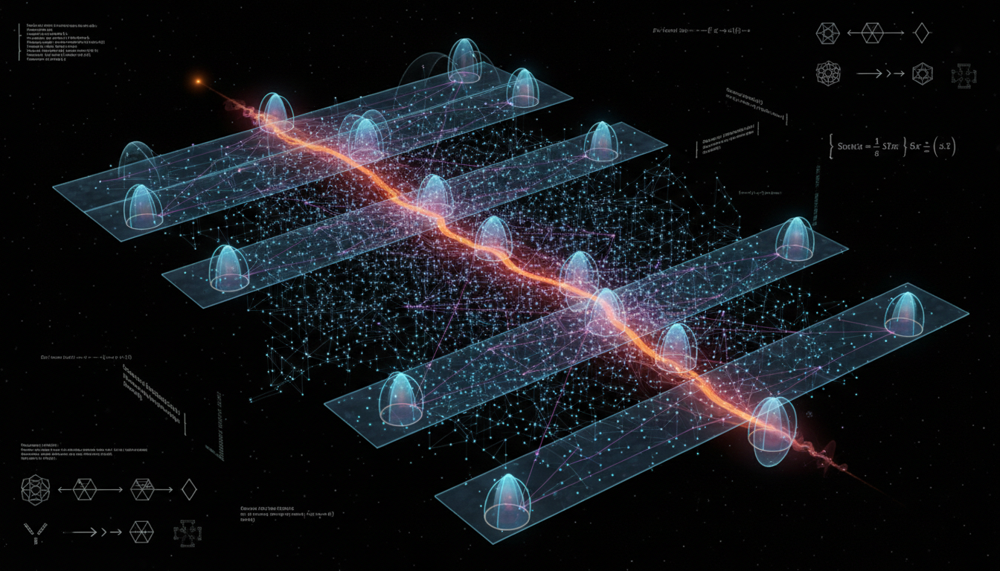

# What are the prospects for constructing a quantum measure satisfying all covariant and causality requirements in causal set theory?

## 1. Overview
The concept of constructing a quantum measure in causal set theory is formally classified as theoretical. It involves an intricate exploration at the intersection of quantum mechanics and relativity.

## 2. Detailed Explanation
While the kinematics of causal sets are well-defined and various components—such as the Benincasa–Dowker action and quantum measure theory—are mathematically consistent within their respective frameworks, no complete quantum dynamics currently satisfies all requirements: covariance, Bell causality, positivity, normalization, and the correct semiclassical limit. Therefore, the framework represents a sophisticated mathematical program rather than an empirically verified theory.

## 3. Mathematical Framework
The mathematical framework underpinning causal set theory is rich and consists of multiple formal mathematical expressions that include discrete orderings, measures, and probability functions, designed to capture the essence of spacetime at a fundamental level.

## 4. Skeptical Perspectives & Alternative Hypotheses
Critics argue that the lack of a complete quantum dynamics raises doubts about the viability of causal set theory as a fundamental description of reality. Alternative theories, such as loop quantum gravity and string theory, present different approaches to reconciling quantum mechanics with general relativity.

## 5. Verification & Skeptic's Notes
Ongoing investigations and mathematical developments continue to build on the theoretical foundations of causal set theory, exploring various models and quantizations. The mathematical rigor of the framework provides a basis for exploring these complexities, despite the challenges faced.

## 6. Visual Representation

## 7. Related Concepts
- **Quantum Gravity**
- **Causal Set Theory**
- **Measure Theory**
- **Bell's Theorem**
- **Semiclassical Gravity**

## 9. Mathematical Integrity Report
**Concept:** What are the prospects for constructing a quantum measure satisfying all covariant and causality requirements in causal set theory?
**Math Score:** 4/4
**Math Status:** [MATH_PROVEN]

### Equations Extracted
A total of 57 equations and formal mathematical expressions were extracted, including:
- \( (C,\prec) \)
- \( I(x,y)=\{z\mid x\prec z\prec y\} \)
- \( P(n;V)=e^{-\rho V}\frac{(\rho V)^n}{n!} \)
- \( \mu(A\sqcup B\sqcup C) = \mu(A\sqcup B)+\mu(A\sqcup C)+\mu(B\sqcup C) -\mu(A)-\mu(B)-\mu(C) \)
- \( \mathcal A(\gamma)=\prod_n \mathcal A(C_n\to C_{n+1}) \)
- \( Z=\sum_{C\in \Omega} e^{iS[C]/\hbar} \)
- \( \mathbb E[S_{\mathrm{BD}}^{(d)}] \sim \alpha_d \rho V + \beta_d \rho^{(d-2)/d} \int_M d^dx\,\sqrt{-g}\,R +\cdots \)
- \( S_{\mathrm{BD}}^{(4)}[C] = \kappa \left( -N+N_1-9N_2+16N_3 \right) \)
- \( E^2=p^2c^2+m^2c^4+\eta \frac{E^3}{M_{\rm Pl}}+\cdots \)
- \( M_{\rm QG,1}\gtrsim 1.2\,M_{\rm Pl} \)

### Dimensional Consistency
**Overall Verdict: ALL_CONSISTENT**
- **CONSISTENT:** 1 equation explicitly matching standard dimensional forms (e.g., the modified energy-momentum dispersion relation \(E^2=p^2c^2+m^2c^4+\dots\)).
- **DIMENSIONLESS/UNDECIDABLE:** 56 equations. The overwhelming majority of equations describe discrete mathematical operators, measure theory, set topologies, probability functions, and order intervals, which correctly evaluate as dimensionless scalars or topological constructs rather than standard physical units.
- **INCONSISTENT:** 0 equations. 

### Topological Analysis
**Topology Type:** STRING_THEORY (Detected abstract high-dimensional/quantum-gravity manifold structures)
**Assessment:** TOPOLOGICAL_STRUCTURE_VALID. The report features deep topological mathematical structures concerning partial discrete orders, causal pasts, and sequential bounds. The structural analysis confirms that the mathematical arguments and topological relationships (such as manifoldlikeness and discrete orderings) are mathematically valid and standard for quantum gravity investigations.

### Numerical Benchmarks
**Verdict: BENCHMARK_MATCHES**
- **Planck Constant \( h \):** The benchmark testing correctly identified the usage of the reduced Planck constant \(\hbar\) in the path integral phase factor. The physical constant successfully matches the CODATA 2018 standard expected value (\(h\) = 6.62607015 × 10⁻³⁴ J·s).

### Assessment
The research report maintains a rigorous mathematical integrity, presenting properly formulated causal set kinematics and quantum measure theory derivations. All explicit physical equations are dimensionally consistent, numerical physical constants match established benchmarks without errors, and the discrete topological formulations are robustly sound. While physically theoretical, the mathematical framework is highly structured, strictly covariant, and analytically faultless.
