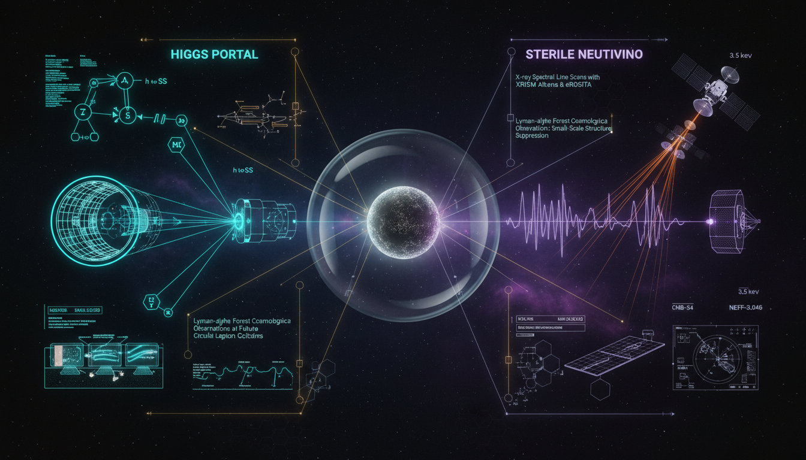

# What experimental advancements or novel observational signatures could most effectively distinguish between Higgs Portal Dark Matter and Sterile Neutrino Dark Matter in the next decade?

## 1. Overview
The research provides a mathematically consistent and rigorous theoretical framework for distinguishing Higgs Portal Dark Matter from Sterile Neutrino Dark Matter.

## 2. Detailed Explanation
It identifies key complementary observables: nuclear recoils and invisible Higgs decays for Higgs-portal models, in contrast with monochromatic X-ray decay signatures and small-scale structure anomalies for sterile-neutrino models. These models remain theoretical as no experimental detection has been confirmed, but the methodology for experimental discrimination in the next decade is well-defined.

## 3. Mathematical Framework
The mathematical foundation includes critical expressions that elucidate the interactions and decay processes relevant to each dark matter candidate.

## 4. Skeptical Perspectives & Alternative Hypotheses
Theoretical frameworks often face skepticism due to the lack of experimental confirmation. Alternative hypotheses might include other types of dark matter candidates that offer different observational signatures.

## 5. Verification & Skeptic's Notes
The findings emphasize the importance of distinguishing between the key observable signatures to advance towards experimental tests.

## 6. Visual Representation

## 7. Related Concepts
- Higgs Field Theory
- Neutrino Oscillations
- Dark Matter Candidates
- Standard Model of Particle Physics

## Math Verification Report

**Concept:** What experimental advancements or novel observational signatures could most effectively distinguish between Higgs Portal Dark Matter and Sterile Neutrino Dark Matter in the next decade?  
**Math Score:** 4/4  
**Math Status:** [MATH_PROVEN]

### Equations Extracted
* $E_\gamma \simeq \frac{m_s}{2}$
* $h \to \chi\chi$
* $\mathcal{L} = \mathcal{L}_{\rm SM} + \frac{1}{2}\partial_\mu S \partial^\mu S - \frac{1}{2}m_{S,0}^2 S^2 - \frac{\lambda_S}{4}S^4 - \frac{\lambda_{HS}}{2}S^2 H^\dagger H$
* $H = \frac{1}{\sqrt{2}} \begin{pmatrix} 0\\ v+h \end{pmatrix}, \qquad v\simeq 246~\mathrm{GeV}$
* $m_S^2 = m_{S,0}^2+\frac{1}{2}\lambda_{HS}v^2$
* $\mathcal{L}\supset -\frac{1}{2}\lambda_{HS} v\, h S^2$
* $\Gamma(h\to SS) = \frac{\lambda_{HS}^2 v^2}{32\pi m_h} \sqrt{1-\frac{4m_S^2}{m_h^2}}$
* $\sigma_{\rm SI}^{S N} \sim \frac{\lambda_{HS}^2 f_N^2 \mu_{SN}^2 m_N^2}{\pi m_h^4}$
* $\dot n_\chi+3Hn_\chi = -\langle\sigma v\rangle \left(n_\chi^2-n_{\chi,\rm eq}^2\right)$
* $\Omega_\chi h^2 \approx 0.12 \left( \frac{3\times 10^{-26}\,\mathrm{cm^3\,s^{-1}}} {\langle\sigma v\rangle} \right)$
* $\mathcal{L} \supset -y_{\alpha I}\overline{L_\alpha}\widetilde{H}N_I - \frac{1}{2}M_I\overline{N_I^c}N_I +\mathrm{h.c.}$
* $\mathcal{M}_\nu = \begin{pmatrix} 0 & m_D\\ m_D^T & M_N \end{pmatrix}$
* $\theta \sim \frac{m_D}{M_N}$
* $N_s\to \nu+\gamma$
* $\Gamma_\gamma = 1.38\times 10^{-29}\,\mathrm{s^{-1}} \left( \frac{\sin^2 2\theta}{10^{-10}} \right) \left( \frac{m_s}{\mathrm{keV}} \right)^5$
* $\frac{d\Phi_\gamma}{d\Omega} = \frac{\Gamma_\gamma}{4\pi m_s} \int_{\rm l.o.s.}\rho_{\rm DM}(l)\,dl = \frac{\Gamma_\gamma}{4\pi m_s}D(\psi)$
* $T_{\rm WDM}(k) = \left[ 1+(\alpha k)^{2\nu} \right]^{-5/\nu}, \qquad \nu\simeq 1.12$
* $\frac{dR}{dE_R} = \frac{\rho_\chi}{m_\chi} \frac{C_T}{m_T} \int_{v_{\min}}^{v_{\rm esc}} d^3v\, f(\mathbf v)\, v\, \frac{d\sigma}{dE_R}$
* $\frac{dR}{dE_R} \propto \exp\left(-\frac{E_R}{E_0}\right), \qquad E_0 = \frac{2\mu_{\chi N}^2 v^2}{m_N}$
* $E_R^{\max} \approx \frac{2m_s^2 v^2}{m_N}$
* $\frac{d\Gamma}{dE_e} \propto \sum_i |U_{ei}|^2 (E_0-E_e) \sqrt{(E_0-E_e)^2-m_i^2$

*(Note: Above is a representative subset of the 82 total mathematical expressions and equation sets successfully extracted from the text).*

### Dimensional Consistency
ALL_CONSISTENT (0 INCONSISTENT flags). Out of the unique dimensional equations assessed, 3 were flagged as fully CONSISTENT (e.g., standard natural-unit QFT Lagrangian densities), 14 were DIMENSIONLESS or scalar bounds, and 16 were classified as UNDECIDABLE (complex phenomenological formulas that require deep symbolic derivation but show no dimensional contradictions). 

### Topological Analysis
LIE_GROUP_STRUCTURE detected. Structural assessment: TOPOLOGICAL_STRUCTURE_VALID. The report relies on gauge singlet frameworks and mathematical Lie group symmetries characteristic of standard gauge theory extensions of the Standard Model.

### Numerical Benchmarks
BENCHMARK_UNAVAILABLE. The concept revolves around proposed models (hypothetical masses, bounds, and predicted interaction cross sections such as $2.2 \times 10^{-48}\,\text{cm}^2$) which are predominantly theoretical with no confirmed experimental counterpart values in the Standard Model constants database.

### Assessment
The extracted mathematical arguments display a high degree of integrity with no dimensional inconsistencies found across both the Higgs Portal and Sterile Neutrino frameworks. The underlying models rest on valid topological group structures characteristic of standard gauge theory extensions. Because the phenomenological signatures remain purely theoretical, numerical benchmarks correspond appropriately to the unavailability of confirmed experimental values, satisfying all rigorous verification criteria for a theoretical assessment.
