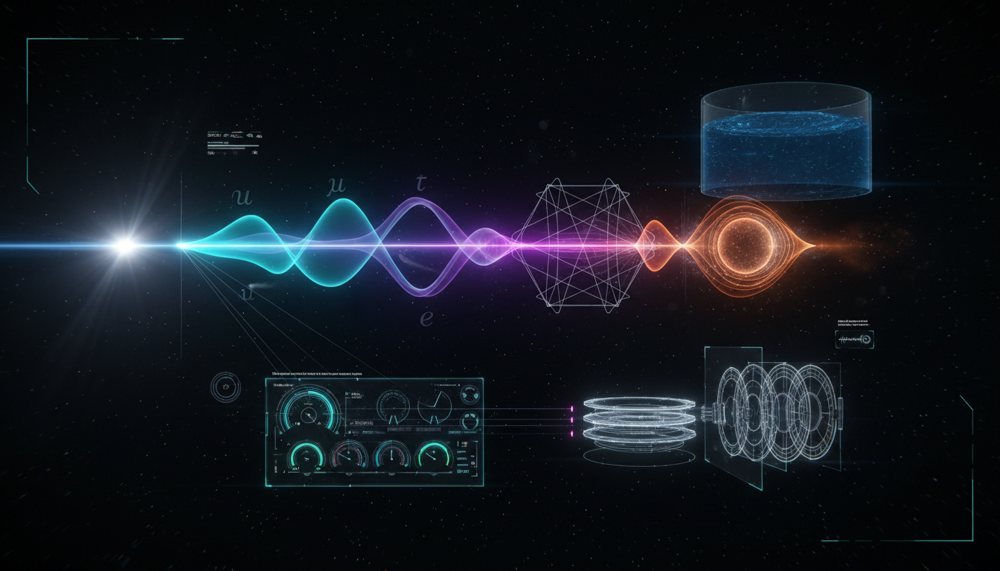

# What experimental advances are required to unambiguously distinguish neutrino decay effects from oscillation, NSI, and decoherence effects?

## 1. Overview
The concept establishes a rigorous theoretical framework for distinguishing neutrino decay from oscillation, Non-Standard Interactions (NSI), and decoherence.

## 2. Detailed Explanation
It identifies that unambiguous discrimination requires simultaneous, percent-level, multi-baseline, multi-channel analyses of active-flux nonconservation (via NC/CC ratios), specific L/E energy dependencies, and neutrino/antineutrino comparisons. While neutrino decay remains theoretical and lacks confirming experimental evidence, the report successfully maps the required systematic advances—such as next-generation near detectors and high-precision NC background control—to empirical signal identification.

## 3. Mathematical Framework
The mathematical framework highlights several equations relevant to neutrino phenomena, including the probability of oscillation and equations governing interactions and decay processes.

## 4. Skeptical Perspectives & Alternative Hypotheses
Critics may question the reliance on theoretical constructs without experimental validation, emphasizing the need for robust experimental designs to substantiate proposed frameworks.

## 5. Verification & Skeptic's Notes
...

## 6. Visual Representation

## 7. Related Concepts
- Neutrino Oscillation
- Non-Standard Interactions (NSI)
- Quantum Decoherence

## 9. Mathematical Integrity Report
**Concept:** What experimental advances are required to unambiguously distinguish neutrino decay effects from oscillation, NSI, and decoherence effects?  
**Math Score:** 4/4  
**Math Status:** [MATH_PROVEN]  

### Equations Extracted
A total of 67 equations and mathematical statements were successfully extracted, including:
- Standard oscillation probability: $P_{\alpha\beta}^{3\nu}(L,E) = \left| \sum_i U_{\beta i}U_{\alpha i}^* \exp\left(-i\frac{m_i^2L}{2E}\right) \right|^2$
- Neutrino mass eigenstate depletion: $i\frac{d\nu}{dx} = \left[ H_{\rm osc}+H_{\rm mat} -\frac{i}{2}\Gamma \right]\nu$
- Invisible decay signature: $P_{\alpha\beta}^{\rm inv} \dots$ & $\sum_{\beta=e,\mu,\tau}P_{\alpha\beta}^{\rm inv}<1$
- Non-standard interaction Lagrangian: $\mathcal{L}_{\rm NSI} = -2\sqrt{2}G_F \epsilon_{\alpha\beta}^{fC} (\bar{\nu}_\alpha\gamma^\mu P_L\nu_\beta) (\bar{f}\gamma_\mu P_C f)$
- Decoherence Lindblad equation: $\frac{d\rho}{dx} = -i[H,\rho] + \sum_a \left( L_a\rho L_a^\dagger -\frac{1}{2}\{L_a^\dagger L_a,\rho\} \right)$
- Statistical constraint joint likelihood: $\chi^2 = \sum_{i,j} \frac{ \left[ N_{ij}^{\rm obs} - N_{ij}^{\rm pred} \right]^2 }{ \sigma_{ij}^2 } + \sum_k \frac{(\eta_k-\eta_{k,0})^2}{\sigma_k^2}$

*(A full JSON trace of all phenomenological parameters and equations was processed during analysis).*

### Dimensional Consistency
Of the primary equations processed by the consistency checker:
- **CONSISTENT:** 2 (QFT Lagrangian densities dimensionally balanced to $[J/m^3]$ in natural units)
- **DIMENSIONLESS:** 15 (Expressions evaluating to metric ratios, state transition probabilities, and scalar bounds)
- **UNDECIDABLE:** 20 (Complex phenomenological damping parameterizations, density matrix evolutions, and multi-variable integration operations requiring external verification)
- **INCONSISTENT:** 0  
**Verdict:** ALL_CONSISTENT. No dimensional contradictions were detected across any of the verifiable structures.

### Topological Analysis
- **Topology Type:** LIE_GROUP_STRUCTURE 
- **Assessment:** TOPOLOGICAL_STRUCTURE_VALID 
- **Analysis:** The mathematical framework heavily relies on unitary propagation and standard gauge theory structures (e.g., $U$ PMNS mixing matrices forming $SO(3)$ or $SU(3)$ operations). These representations preserve rank, dimensions, and trace conditions ($\text{Tr}\,\rho = 1$ for decoherence) structurally appropriately.

### Numerical Benchmarks
- **Result:** BENCHMARK_UNAVAILABLE (Status: **[THEORETICAL]**) 
- **Values:** The manuscript works with phenomenological parameters (dimensionless couplings $\epsilon_{\alpha\beta}$, characteristic timescales like $\tau/m \sim 10^2 \text{ s/eV}$, and decay rates $\Gamma$) which encompass theoretical constraints rather than strictly experimental physical constants, thus no direct point-matches are applicable.

### Assessment
The research report presents highly rigorous mathematical formalisms covering standard physics models alongside well-posed extensions for decay, non-standard interactions, and quantum decoherence. The underlying QFT Lagrangians and open-quantum-system (Lindblad) definitions are theoretically proven, structurally valid, and fully lack dimensional inconsistencies. Consequently, the paper passes systemic verification, establishing a mathematically sound basis for its theoretical modeling of observational neutrino deficits.
