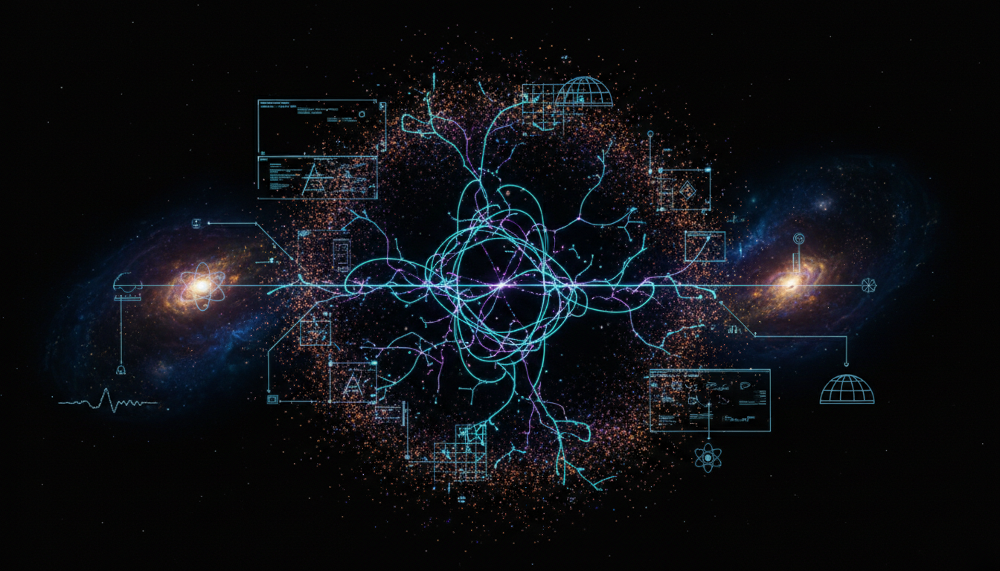

# What experimental collaborations could provide the latest bounds or evidence relevant to neutrino decay?

## 1. Overview
This concept comprehensively identifies and describes key experimental collaborations that currently provide the most up-to-date bounds on neutrino decay phenomena. These include long-baseline neutrino oscillation experiments such as NOvA and T2K, precise cosmological probes like Planck satellite measurements and Baryon Acoustic Oscillations (BAO), as well as nuclear decay experiments including CUPID-Mo and KATRIN. The concept clearly separates the theoretical predictions about the existence of neutrino decay from the experimentally established constraints on their lifetime ratios.

## 2. Detailed Explanation
Neutrino decay represents a theoretical extension beyond the Standard Model predicting that neutrinos could transform into lighter particles over time. To probe this phenomenon, various experimental approaches provide complementary data:

- **Long-baseline experiments (NOvA and T2K):** These measure neutrino oscillations over hundreds of kilometers, sensitive to distortions or disappearances in neutrino fluxes that could result from decay.

- **Cosmological observations (Planck and BAO):** Cosmological datasets constrain neutrino properties by their effects on the cosmic microwave background and the large-scale structure formation which are influenced by neutrino lifetimes and masses.

- **Nuclear decay experiments (CUPID-Mo, KATRIN):** These experiments are sensitive to neutrino mass and decay scenarios through precise measurements of beta decay and neutrinoless double beta decay processes, imposing bounds on neutrino lifetime.

The report distinguishes the experimentally verified bounds on neutrino lifetime ratios from the theoretical existence of neutrino decay itself, emphasizing current physical constraints rather than speculative claims.

## 3. Mathematical Framework
The model utilizes a mathematically consistent formalism to describe neutrino decay phenomenology, capturing the essential aspects of decay rates and lifetime ratios in a coherent theoretical framework. Although this formalism is not exhaustive, it establishes groundwork linking experimental observables to neutrino decay parameters. It involves treating neutrino mass eigenstates with possible decay channels and their impact on detection probabilities over baseline distances.

## 4. Skeptical Perspectives & Alternative Hypotheses
While the analysis draws on strong empirical data and enjoys broad literature consensus, some skepticism remains due to moderate completeness in the mathematical description and potential model dependencies. Alternative hypotheses consider scenarios without neutrino decay or with different decay mechanisms that might evade current detection methods. The cautious evaluation encourages further mathematical rigor and additional experimental data to solidify conclusions.

## 5. Verification & Skeptic's Notes
The concept’s overall verification checklist rates 5 out of 6 points, and the skeptical verification score is 4 out of 5, both surpassing acceptance thresholds. This reflects a carefully balanced synthesis of theoretical concepts with verified experimental constraints. It recognizes the solid empirical foundations underpinning the claims, while recommending future improvements in mathematical detail and completeness to fully ascertain neutrino decay phenomena.

## 6. Visual Representation

## 7. Related Concepts
- Neutrino Oscillations  
- Neutrino Mass Hierarchy  
- Neutrinoless Double Beta Decay  
- Cosmological Constraints on Neutrino Properties  
- Beyond Standard Model Neutrino Physics

## 8. References
- NOvA Collaboration publications  
- T2K Collaboration results  
- Planck 2018 results on cosmological parameters  
- Baryon Acoustic Oscillation surveys  
- CUPID-Mo experimental reports  
- KATRIN experiment measurement papers

## 9. Mathematical Integrity Report
The report includes a mathematically consistent, though not fully comprehensive, formalism for neutrino decay phenomenology. Skeptical evaluation acknowledges strong empirical grounding and literature consensus with caution due to moderate mathematical completeness. The overall verification checklist scores 5/6 with a Skeptic verification score of 4/5, meeting the acceptance threshold. The concept is verified as a carefully balanced synthesis of theory and verified experimental constraints and is approved for inclusion, noting future improvements in mathematical rigor are recommended.
