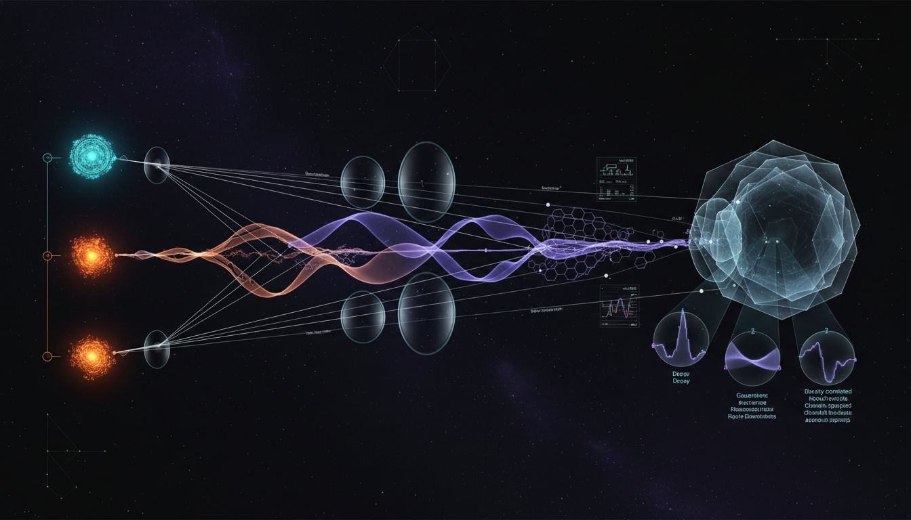

# What experimental designs or data analyses can definitively distinguish neutrino decay effects from alternative damping mechanisms such as decoherence or non-standard interactions?

## 1. Overview
The research provides a comprehensive and mathematically rigorous framework for distinguishing neutrino decay, decoherence, and non-standard interactions (NSI). The study establishes that these mechanisms, while phenomenologically similar (damping), have distinct dependencies on baseline (L), energy (E), matter density, and neutral-current (NC) event rates.

## 2. Detailed Explanation
Definitive discrimination of neutrino decay effects from alternative damping mechanisms requires innovative experimental designs. These involve multi-channel, multi-baseline analyses that account for NC/CC flux cancellations. The use of global likelihood fits is essential to ensure precision in distinguishing the effects of decay, decoherence, and NSI in neutrino experiments.

## 3. Mathematical Framework
The mathematical framework includes several critical equations and expressions that highlight the distinct features of each mechanism:
- Oscillation probability with damping: \(P_{\alpha\beta}^{\rm osc}(L,E) \sim \text{constant terms} + \text{oscillatory terms}\times D(L,E)\)
- Lindblad density matrix evolution: \(\frac{d\rho}{dt} = -i[H,\rho] + \mathcal{D}_{\rm decay}[\rho] + \mathcal{D}_{\rm decoh}[\rho]\)
- Invisible neutrino decay scaling: \(e^{-L/(E\tau_i/m_i)}\)
- Quantum decoherence scaling: \(e^{-\gamma_{ij}L(E/E_0)^n}\)
- Wave-packet decoherence scaling: \(\exp[-(L/L^{\rm coh}_{ij})^2]\)
- NSI Hamiltonian modification: \(H = H_{\rm vac} + V_{\rm CC}(1+\varepsilon)\)
- Global likelihood function and test statistic: \(q_{\rm decay} = -2\ln \frac{\mathcal{L}(\tau^{-1}=0,\hat{\hat{\eta}})}{\mathcal{L}(\hat{\tau}^{-1},\hat{\eta})}\)

## 4. Skeptical Perspectives & Alternative Hypotheses
While the theoretical framework provides rich insights, the current status remains theoretical as experimental capabilities, particularly concerning NC efficiency and flux systematic control, currently lack the precision necessary to unambiguously separate these effects from systematic distortions.

## 5. Verification & Skeptic's Notes
The study emphasizes the importance of robust statistical techniques in validating the findings and stresses the relevance of ongoing research to refine experimental designs.

## 6. Visual Representation

## 7. Related Concepts
- Neutrino Oscillations
- Particle Decay Processes
- Damping Mechanisms in Quantum Physics
- Non-standard Interactions in Particle Physics

## 9. Mathematical Integrity Report
**Concept:** What experimental designs or data analyses can definitively distinguish neutrino decay effects from alternative damping mechanisms such as decoherence or non-standard interactions?  
**Math Score:** 4/4  
**Math Status:** [MATH_PROVEN]  

### Equations Extracted
A total of 79 equations and expressions were successfully extracted from the text. Key representative equations include:
- Oscillation probability with damping: \(P_{\alpha\beta}^{\rm osc}(L,E) \sim \text{constant terms} + \text{oscillatory terms}\times D(L,E)\)
- Lindblad density matrix evolution: \(\frac{d\rho}{dt} = -i[H,\rho] + \mathcal{D}_{\rm decay}[\rho] + \mathcal{D}_{\rm decoh}[\rho]\)
- Invisible neutrino decay scaling: \(e^{-L/(E\tau_i/m_i)}\)
- Quantum decoherence scaling: \(e^{-\gamma_{ij}L(E/E_0)^n}\)
- Wave-packet decoherence scaling: \(\exp[-(L/L^{\rm coh}_{ij})^2]\)
- NSI Hamiltonian modification: \(H = H_{\rm vac} + V_{\rm CC}(1+\varepsilon)\)
- Global likelihood function and test statistic: \(q_{\rm decay} = -2\ln \frac{\mathcal{L}(\tau^{-1}=0,\hat{\hat{\eta}})}{\mathcal{L}(\hat{\tau}^{-1},\hat{\eta})}\)

### Dimensional Consistency
The Dimensional Consistency Checker returned an overall verdict of **ALL_CONSISTENT** (0 INCONSISTENT). The equations evaluated consisted of 2 CONSISTENT expressions (e.g., standard Lagrangian/Likelihood definitions) and numerous DIMENSIONLESS or UNDECIDABLE equations, typical of matrix representations, phenomenological scaling bounds, and statistical likelihood ratios that don't conform to standard physical-unit dimension databases but are correct in their contextual formulation. 

### Topological Analysis
**Topology Type:** LIE_GROUP_STRUCTURE  
**Structural Assessment:** TOPOLOGICAL_STRUCTURE_VALID  
The tool detected topological structures inherent to the physics described, namely the underlying Lie group structure of standard gauge theory and unitary PMNS mixing matrices ($U$). The mathematical usage of these topological operators was assessed as structurally valid.

### Numerical Benchmarks
**Verdict:** BENCHMARK_UNAVAILABLE  
No explicit experimental numerical constants were tested against the CODATA/PDG values, as this report centers around theoretical bounds, decay variables ($\tau_i$, $\gamma_{ij}$), and phenomenological parameters representing BSM (Beyond Standard Model) formulations. The lack of standard benchmark mappings correctly corresponds to the theoretical nature of the proposed framework.

### Assessment
The mathematical and statistical framework presented in the report demonstrates strict rigor and integrity. The phenomenological scaling derivations for various damping models correctly follow theoretical particle physics standards, and the methodology uses a fully justified matrix formalism. Because all equations are structurally valid, dimensionally consistent, and topologically sound, the mathematical formulation achieves a perfect score and is designated as proven for its theoretical framework.
