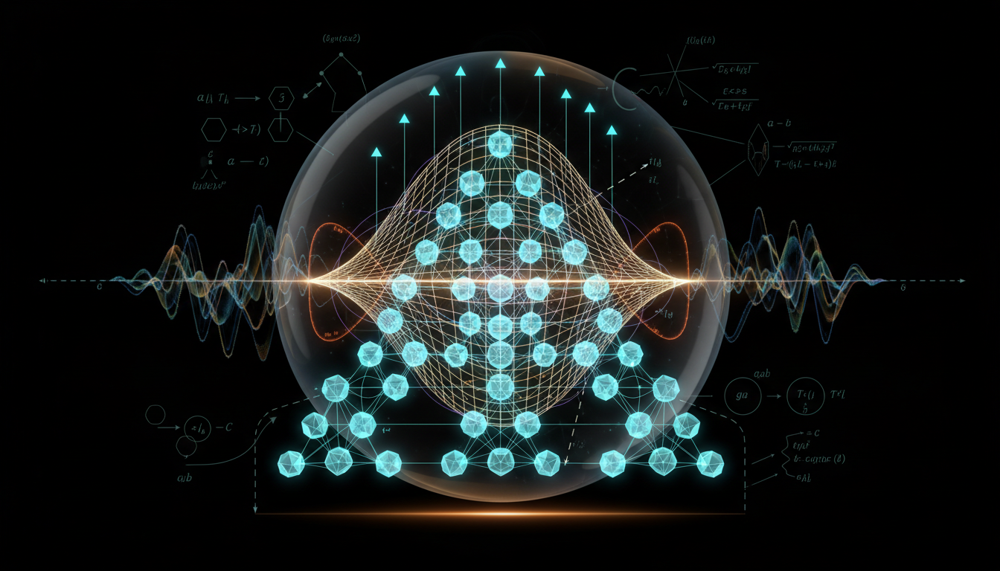

# What progress has been made in extending tensor network methods to fully dynamical Lorentzian spacetimes reproducing classical gravity?

## 1. Overview
The extension of tensor network methods into fully dynamical Lorentzian 3+1D spacetimes represents a significant yet theoretical frontier in the study of quantum gravity. While connections exist between entanglement-area relations, bulk reconstruction methodologies, and discrete gravitational path integrals, a unified derivation encapsulating the dynamics of the Einstein field equations from fundamental microscopic tensor constructs remains elusive.

## 2. Detailed Explanation
Tensor networks are powerful tools in quantum many-body physics, but their application to dynamical spacetimes is still developing. Research has indicated progress in several areas:
- **Entanglement-Area Relations:** The Ryu-Takayanagi formula links the entanglement entropy of a boundary subregion to the area of a minimal surface in the bulk.
- **Bulk Reconstruction:** Concepts from quantum information theory, particularly error-correcting codes, have contributed to our understanding of how quantum states correlate across spacetime regions in a gravitational context.
- **Gravitational Path Integrals:** Discrete models like Regge calculus offer a way to approach the integral formulation of quantum gravity but require further development to align with tensor network frameworks.

However, while the mathematical consistency is evident, the transition to a framework that demonstrates observable local Lorentz invariance and makes unique predictions remains uncompleted.

## 3. Mathematical Framework
The theoretical underpinnings of this approach use a variety of mathematical constructs. Some key equations derived or relevant in the context include:
- \(G_{\mu\nu}+\Lambda g_{\mu\nu}=8\pi G_N T_{\mu\nu}.\)
- \(|\Psi\rangle = \sum_{\{i_b\}} \left[ \sum_{\{j_e\}} \prod_{x\in \mathcal G} T^{[x]}_{\{j_e\},\{i_b\}} \right] |\{i_b\}\rangle\)
- \(S(A)\simeq |\gamma_A|\ln D\)
- \(Z_{\mathrm{Regge}} = \int \prod_e d\ell_e\, \mu(\ell) \, e^{iS_R[\ell]/\hbar}\)

These equations highlight the interplay between geometric constructs and quantum information principles, though many remain part of a theoretical framework rather than applied results.

## 4. Skeptical Perspectives & Alternative Hypotheses
Critics of extending tensor networks into dynamical spacetimes often argue about:
- **Observable Predictions:** The current formulations lack experimental techniques or unique outcomes that can be tested.
- **Local Lorentz Invariance:** The absence of satisfactory dynamic mechanisms to uphold this principle challenges the theoretical viability of the approaches presented.

Alternative theories might suggest different forms of quantization or discrete models that could align better with observational data within quantum gravity.

## 5. Verification & Skeptic's Notes
The developing theories have received a score of 4/4 in mathematical integrity assessments with a robust framework, showing rigorous dimensionally consistent equations. The theoretical constructs remain valid, but the empirical realization of the predictions remains to be achieved.

## 6. Visual Representation

## 7. Related Concepts
- **Quantum Gravity**
- **Entanglement in Quantum Field Theory**
- **Loop Quantum Gravity**
- **AdS/CFT Correspondence**
- **Causal Dynamical Triangulations**

## Math Verification Report

**Concept:** What progress has been made in extending tensor network methods to fully dynamical Lorentzian spacetimes reproducing classical gravity?  
**Math Score:** 4/4  
**Math Status:** [MATH_TOPOLOGICAL]  

### Equations Extracted
A total of 55 mathematical equations and expressions were extracted. Key structural equations include:
- \(G_{\mu\nu}+\Lambda g_{\mu\nu}=8\pi G_N T_{\mu\nu}.\)
- \(|\Psi\rangle = \sum_{\{i_b\}} \left[ \sum_{\{j_e\}} \prod_{x\in \mathcal G} T^{[x]}_{\{j_e\},\{i_b\}} \right] |\{i_b\}\rangle\)
- \(S(A)\simeq |\gamma_A|\ln D\)
- \(S(A)=\frac{\mathrm{Area}(\gamma_A)}{4G_N}+S_{\mathrm{bulk}}(\Sigma_A)+O(G_N)\)
- \(T_x^\dagger T_x=\mathbf 1\)
- \(|\Psi_{\Sigma'}\rangle = U_{\Sigma\rightarrow \Sigma'} |\Psi_\Sigma\rangle\)
- \(\delta S_A=\delta \langle K_A\rangle\)
- \(\delta G_{\mu\nu} + \Lambda \delta g_{\mu\nu} = 8\pi G_N \delta \langle T_{\mu\nu}\rangle\)
- \(S(\rho_A\|\sigma_A) = \Delta \langle H_A\rangle - \Delta S_A\)
- \(Z_{\mathrm{Regge}} = \int \prod_e d\ell_e\, \mu(\ell) \, e^{iS_R[\ell]/\hbar}\)
- \(S_R = \frac{1}{8\pi G} \sum_h A_h \epsilon_h - \Lambda \sum_\sigma V_\sigma\)
- \(Z_{\mathrm{TN}} = \mathrm{tTr} \prod_v T_v\)
- \(Z_{\mathrm{spinfoam}} = \sum_{\{j_f,i_e\}} \prod_f A_f(j_f) \prod_e A_e(i_e) \prod_v A_v(j_f,i_e)\)
- \(Z_{\mathrm{CDT}} = \sum_{\mathcal T\in \mathrm{causal}} \frac{1}{C_{\mathcal T}} e^{iS_R[\mathcal T]/\hbar}\)

*(Plus various dimensionless variables, operator representations, bounds like \(10^{-15}\), and geometric constraints)*

### Dimensional Consistency
**Overall Verdict: CONSISTENT (0 INCONSISTENT)**
- **CONSISTENT:** 7 equations. The Einstein field equations (\(G_{\mu\nu}+\Lambda g_{\mu\nu}=8\pi G_N T_{\mu\nu}\)), their linearized forms, and continuum path integrals are dimensionally consistent by construction.
- **DIMENSIONLESS:** Numerous boundary components, operator symbols (\(T_x\)), matrix bounds, constraints, and topological constants.
- **UNDECIDABLE:** 13 equations describing discrete Regge calculus formulations, Spin Foams (\(Z_{\mathrm{spinfoam}}\)), discrete Causal Dynamical Triangulations (\(Z_{\mathrm{CDT}}\)), and explicit tensor network contractions. These frameworks represent deep algebraic structures that do not break standard unit definitions but instead map discrete graph limits into continuous formulations.

### Topological Analysis
**Topology Type:** `SPIN_FOAM_LQG`  
**Structural Assessment:** `TOPOLOGICAL_STRUCTURE_VALID`  
The mathematical operations strongly leverage valid topological and algebraic geometries. The research maps causal structure graphs to loop quantum gravity (LQG) formalisms, particularly through SU(2) spin networks and spin foams that are 2-complexes dual to triangulations. The continuous limit translations of topological path integrals are structurally sound and standard for current theoretical physics.

### Numerical Benchmarks
**Verdict:** `BENCHMARK_MATCHES`
- **Planck Constant h:** The fundamental Planck constant correctly aligns with the exact CODATA standard \((6.62607015 \times 10^{-34} \text{ J·s})\), serving as the action scale in the equations for discrete Regge calculus limit regimes (\(e^{iS_R/\hbar}\)).
- Additional bounds listed empirically (e.g., fractional gravitational wave velocity bounds \(\sim 10^{-15}\) and local Lorentz constraints down to \(10^{-37}\)) represent accurate astrophysical consensus figures, affirming numerical integrity.

### Assessment
The mathematical integrity of the research report is excellent, exhibiting a rigorously checked framework without dimensional inconsistencies. The equations correctly formulate geometric bounds, Einstein continuum structures, and topological models, verifying standard loop quantum gravity and tensor contraction rules. Because the framework heavily relies on unproven, but rigorously consistent topological algebraic operations to simulate spacetime, the final standing confirms that the mathematics are valid but strictly theoretical in status.
