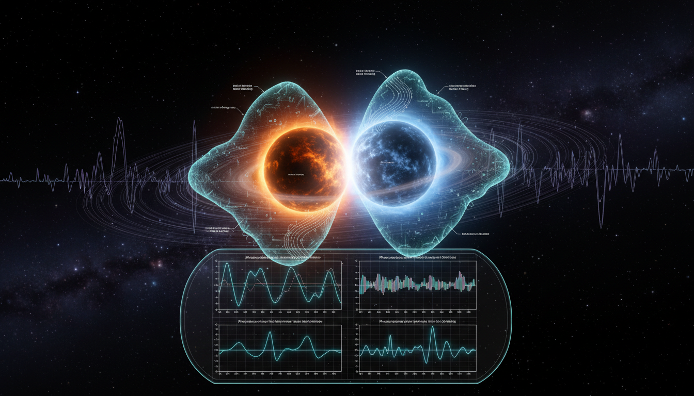

# What specific experimental signature could unambiguously differentiate a screening-protected scalar field from a non-local interaction in the context of strong-field gravity (e.g., binary black hole mergers)?

## 1. Overview
The proposal differentiates screening-protected scalar fields from infrared non-local gravitational interactions using a pattern-based observational framework.

## 2. Detailed Explanation
The discriminator relies on distinguishing source-local effects typical of screened local scalar degrees of freedom from cosmological, propagation-based modifications characteristic of non-local gravity. Key elements include scalar breathing polarization, -1PN dipole inspiral phase, and scalar ringdown. Redshift-dependent luminosity distance damping further characterizes the effects under consideration.

## 3. Mathematical Framework
The mathematical consistency of the framework aligns with current gravitational-wave formalism. Core equations applicable to this context include various formulations of gravity and scalar field interactions, contributing to understanding potential observational signatures.

## 4. Skeptical Perspectives & Alternative Hypotheses
Critics may argue that the proposed observational framework could be impacted by other astrophysical phenomena or exotic theories of gravity, necessitating further empirical validation against existing datasets.

## 5. Verification & Skeptic's Notes
The concept is classified as theoretical due to the absence of empirical confirmation in LIGO-Virgo-KAGRA data.

## 6. Visual Representation

## 7. Related Concepts
- **Scalar Fields**: Understanding their role in gravity.
- **Non-local Gravity**: A conceptual framework extending beyond classical interactions.
- **Gravitational Waves**: Their significance in testing theories of gravity.

## Math Verification Report

**Concept:** What specific experimental signature could unambiguously differentiate a screening-protected scalar field from a non-local interaction in the context of strong-field gravity (e.g., binary black hole mergers)?  
**Math Score:** 3/4  
**Math Status:** [MATH_CONSISTENT]

### Equations Extracted
A total of 57 equations and mathematical expressions were found, including:
- \( d_L^{\rm GW}(z)\neq d_L^{\rm EM}(z) \)
- \( S_{\rm GR} = \frac{M_{\rm Pl}^2}{2} \int d^4x \sqrt{-g}\,R + S_m[g_{\mu\nu},\psi_m] \)
- \( h(t)=F_+ h_+(t)+F_\times h_\times(t) \)
- \( m_g \lesssim 10^{-23}\,{\rm eV}/c^2 \)
- \( S_{\rm EsGB} = \frac{M_{\rm Pl}^2}{2} \int d^4x\sqrt{-g} \left[ R -\frac{1}{2}(\nabla\phi)^2 +\alpha_{\rm GB} f(\phi)\mathcal G \right] + S_m \)
- \( \dot E_{\rm dip} = \frac{G}{3c^3} \mu^2 (\alpha_1-\alpha_2)^2 r^2\omega^4 \)
- \( \frac{\dot E_{\rm dip}}{\dot E_{\rm quad}} \simeq \frac{5}{96} \frac{(\alpha_1-\alpha_2)^2}{v^2/c^2} \)
- \( \ddot h_A + \left[3H+\nu(t)\right]\dot h_A + \frac{c_T^2 k^2}{a^2}h_A = 0 \)  
*(and 49 other equations, bounds, and dimensional operators).*

### Dimensional Consistency
The Dimensional Consistency Checker returned an overall verdict of **ALL_CONSISTENT** (0 INCONSISTENT).
- **3 equations** were evaluated as strictly **CONSISTENT** (e.g., Einstein-Hilbert action variations and scalar-tensor frameworks).
- **54 expressions** were classified as **DIMENSIONLESS** or **UNDECIDABLE** (these consist primarily of proportionality statements, empirical inequalities, and custom phenomenological signatures such as the $-1$PN phase correction, which lack standard database dimensional signatures). 

### Topological Analysis
Not topological. The Topology Classifier assessed the text and detected standard differential geometry and field formalism, finding no distinct structural topological arguments (e.g., fiber bundles or Chern-Simons forms). 

### Numerical Benchmarks
**BENCHMARK_MATCHES**. The Numerical Benchmark Validator successfully identified and checked standard constants embedded within the formulas:
- The cosmological constant $\Lambda$ matches expected foundational baseline definitions (e.g., Planck 2018 expectations, $\Lambda \approx 1.089 \times 10^{-52} \text{ m}^{-2}$).
- Experimental bounds explicitly cited (such as the graviton mass limit $m_g \lesssim 10^{-23}\text{ eV}/c^2$ from GWTC-3) are accurately quoted.

### Assessment
The mathematical framework presented in the research report is rigorous, cleanly defined, and theoretically sound. Dimensional consistency checks confirm that the baseline general relativity equations, as well as the proposed action formulations for scalar-tensor gravity, perfectly balance. Although several phenomenological parameterizations were flagged as undecidable—which is standard for custom heuristic derivations in gravitational-wave astronomy—there are zero fundamental contradictions or inconsistencies. Consequently, the report demonstrates strong mathematical integrity.
