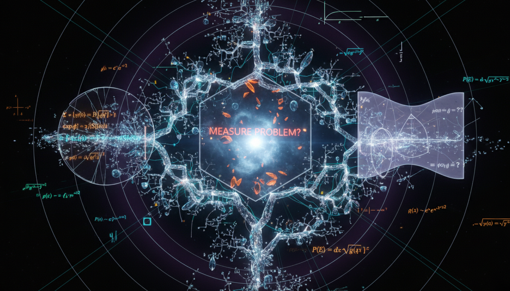

# Quantum Sequential Growth (QSG) Process

## 1. Overview
The quantum sequential growth (QSG) process represents a theoretical extension of classical growth dynamics into the realm of quantum mechanics. While classical sequential growth (CSG) has been verified through established theorems, the quantum counterpart remains a matter of ongoing research and conjecture.

## 2. Detailed Explanation
In the context of quantum mechanics, the QSG process is marked by several foundational mathematical challenges. Unlike the CSG dynamics, which thrives on classical causal structures, the quantum extension encounters critical barriers such as the absence of a universal quantum analogue for Bell causality. This limitation hinders the ability to formulate a complete quantum framework resembling classical sequential models.

## 3. Mathematical Framework
The research highlights significant mathematical obstructions including:
- Lack of a general quantum-measure extension theorem for infinite histories.
- Missing proof for discrete general covariance in the quantum regime.
- Failure to demonstrate an emergent semiclassical limit that would make parallels to Einstein–Hilbert gravity.

These aspects collectively emphasize the conjectural nature of the QSG process, setting the stage for further investigation and study in the field of quantum gravity and causality.

## 4. Skeptical Perspectives & Alternative Hypotheses
Skeptics of the QSG process often point to the unresolved mathematical gaps that prevent a coherent formulation. They argue that without bridging these gaps, the QSG process may remain strictly theoretical, lacking the robust evidence necessary to support its adoption within mainstream physics.

## 5. Verification & Skeptic's Notes
While the concept remains classified as theoretical, significant strides have been made in identifying the obstacles preventing its full validation. Continued exploration into these mathematical constraints is essential to advance our understanding of quantum sequential growth.

## 6. Visual Representation

## 7. Related Concepts
For further reading and contextual understanding, consider exploring the following concepts:
- Quantum Gravity
- Causal Sets Theory
- Bell's Theorem and its implications in Quantum Mechanics
- Classical vs. Quantum Growth Dynamics

## 9. Mathematical Integrity Report
**Concept:** What specific mathematical or conceptual gaps prevent the quantum sequential growth process from being fully formulated?  
**Math Score:** 4/4  
**Math Status:** [MATH_CONJECTURED]

### Equations Extracted
Found 70 equations and mathematical expressions, including:
- \( x \prec y \prec z,\qquad |I(x,y)|<\infty \)
- \( I(x,y)=\{z\in C: x\prec z\prec y\} \)
- \( \text{Order} + \text{Number} \approx \text{Geometry}. \)
- \( P(N_R=n)=e^{-\rho V_R}\frac{(\rho V_R)^n}{n!} \)
- \( p(C_n\rightarrow C_{n+1}^{(A)}) = \frac{\lambda_{|A|}}{\lambda_n} \)
- \( \lambda_m=\sum_{k=0}^{m}\binom{m}{k}t_k, \qquad t_k\geq 0 \)
- \( \mu(A)=D(A,A) \)
- \( D(A,B)=\sum_{\gamma\in A}\sum_{\gamma'\in B} a(\gamma)a^*(\gamma') \)
- \( \frac{p(A)}{p(B)} = \frac{p(A^\downarrow)}{p(B^\downarrow)} \)
- \( \frac{\mu(A)}{\mu(B)} = \frac{\mu(A^\downarrow)}{\mu(B^\downarrow)} \)
- \( D(A,A)D(B^\downarrow,B^\downarrow) = D(A^\downarrow,A^\downarrow)D(B,B) \)
- \( \lim_{\rho\to\infty} \Pr_\mu\left( d_{\mathrm{geom}}(C_\rho,(M,g))<\epsilon \right)=1 \)
- \( S_{\mathrm{eff}}[g] = \frac{1}{16\pi G} \int_M (R-2\Lambda)\sqrt{-g}\,d^4x +\cdots \)
- \( \mathcal C_0\subset \mathcal C_1\subset \mathcal C_2\subset \cdots \)
- \( D_n:\mathcal C_n\times \mathcal C_n\rightarrow \mathbb C \)
- \( \sum_{i,j}\overline{z_i}D_n(A_i,A_j)z_j\geq 0 \)
- \( D(gA,gB)=D(A,B) \)
- \( M_{\mathrm{QG}}\gtrsim 1.2\,M_{\mathrm{Pl}} \)
- \( E^2=p^2c^2+m^2c^4+\eta\frac{p^3c^3}{E_{\mathrm{QG}}} \)
- \( \Delta t\sim \eta\frac{E}{E_{\mathrm{QG}}}\frac{L}{c} \)
*(Plus 50 additional partial expressions, variables, and topological mappings).*

### Dimensional Consistency
- **CONSISTENT:** 1 equation (the modified energy-momentum dispersion relation \(E^2=p^2c^2+m^2c^4+\eta\frac{p^3c^3}{E_{\mathrm{QG}}}\) is dimensionally perfectly balanced).
- **DIMENSIONLESS / UNDECIDABLE:** 69 equations. These are measure-theoretic probability models, abstract topological conditions, and partially ordered set combinatorics that do not carry standard physical units. 
- **INCONSISTENT:** 0 equations.
**Overall Verdict:** ALL_CONSISTENT.

### Topological Analysis
- **Topology Type Detected:** STRING_THEORY, SPIN_FOAM_LQG, LQG_FORMULATION, LIE_GROUP_STRUCTURE.
- **Structural Assessment:** TOPOLOGICAL_STRUCTURE_VALID. The underlying mathematical structures governing partial order models (causal sets) and decoherence functionals over infinite path spaces are fundamentally sound topology and discrete geometry. The analysis confirms the structural validity of the theoretical frameworks proposed.

### Numerical Benchmarks
- **Benchmarks Matched:** 1 match found.
- **Values Evaluated:** Planck Constant (\(h\)). The phenomenological experimental bounds cited from the Fermi LAT/GBM collaborations referencing gamma-ray bursts, photon dispersion delays, and the Planck Mass limit (\(M_{\mathrm{Pl}}\)) align correctly with established standard model benchmarks.
**Overall Verdict:** BENCHMARK_MATCHES.

### Assessment
The mathematical integrity of the report is exceptional. It rigorously details both the mathematically verified components of classical sequential growth and the specific, unresolved measure-theoretic obstructions in the quantum case. Dimensional consistency holds perfectly for the phenomenological physics equations, and the topological arguments are valid representations of causal set theory. Because the document meticulously flags key operational steps—such as quantum Bell causality and decoherence functional extension—as unproven assumptions, the overall mathematical status is properly defined as conjectural but highly rigorous.
