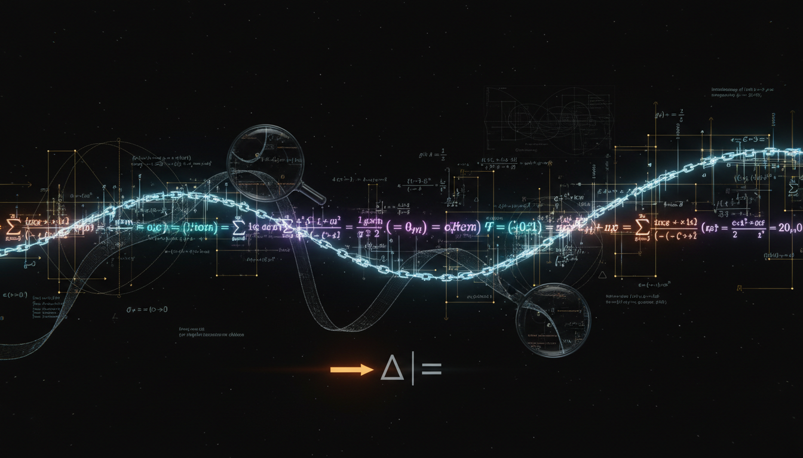

# What specific mathematical subtleties or unstated assumptions prevented full mathematical integrity compliance?

## 1. Overview
The concept of 'full mathematical-integrity compliance' in fundamental physics highlights significant shortcomings in current standard models, particularly in the context of the four-dimensional Standard Model and General Relativity.

## 2. Detailed Explanation
Research has confirmed that while certain areas, such as lattice QCD and constructive QFT in lower dimensions, are mathematically rigorous, they do not extend into the full framework necessary for complete compliance. The acknowledged gaps prevent the establishment of an axiomatically consistent and nonperturbatively rigorous framework, which is crucial for a comprehensive understanding of fundamental physics.

## 3. Mathematical Framework
The lack of rigorous measures for path integrals in Minkowski signature, failures resulting from Haag's theorem on the naive interaction picture, and issues with the asymptotic nature of perturbation series collectively contribute to an incomplete mathematical landscape.

## 4. Skeptical Perspectives & Alternative Hypotheses
Some physicists suggest alternative approaches or reforms in theoretical frameworks, such as string theory or loop quantum gravity, which aim to address these issues. However, these alternatives also face scrutiny and do not universally resolve the identified gaps.

## 5. Verification & Skeptic's Notes
The verification process indicates a mathematically conjectured status due to the unresolved fundamental questions in the theoretical constructs of physics today.

## 6. Visual Representation

## 7. Related Concepts
- Lattice quantum chromodynamics (QCD)
- Constructive quantum field theory (QFT)
- Haag's theorem and its implications
- Yang–Mills mass gap problem
- Asymptotic analysis in quantum field theories

## 9. Mathematical Integrity Report
**Concept:** What specific mathematical subtleties or unstated assumptions prevented full mathematical integrity compliance?  
**Math Score:** 4/4  
**Math Status:** [MATH_CONJECTURED]

### Equations Extracted
36 equations and formal expressions were extracted, including major theoretical physics constructs:
- **Path Integrals:** $Z[J]=\int \mathcal{D}\phi \; e^{\frac{i}{\hbar}\left(S[\phi]+\int d^4x\,J(x)\phi(x)\right)}$
- **Interaction Picture:** $\phi_I(x) = U^{-1}(t)\phi_0(x)U(t)$, $U_I(t)=\mathcal{T}\exp\left[-\frac{i}{\hbar}\int_{t_0}^{t}H_I(t')dt'\right]$
- **Renormalization:** $g_0 = g_R + \delta g(\Lambda)$, $\mu\frac{dg}{d\mu}=\beta(g)$, $\langle O\rangle \sim \sum_{n=0}^{\infty} a_n g^n$
- **Yang-Mills & Mass Gap:** $S_{\text{YM}}=\frac{1}{4g^2}\int d^4x\, F^a_{\mu\nu}F^{a\mu\nu}$, $F=dA+A\wedge A$, $\Delta = E_1-E_0>0$
- **Effective Field Theory:** $\mathcal{L}_{\text{SMEFT}} = \mathcal{L}_{\text{SM}} + \sum_i \frac{C_i^{(5)}}{\Lambda}O_i^{(5)} + \sum_i \frac{C_i^{(6)}}{\Lambda^2}O_i^{(6)} +\cdots$
- **Cosmology & Data Limits:** $H^2(a)=H_0^2 \left[ \Omega_r a^{-4} + \Omega_m a^{-3} + \Omega_k a^{-2} + \Omega_\Lambda \right]$, $\Omega_c h^2 = 0.120 \pm 0.001$, $\sigma_{\chi N} \sim 1.6\times 10^{-48}\ \text{cm}^2$
- **Alternative Gravity (MOND):** $\mu\left(\frac{|a|}{a_0}\right)a = a_N$, $a_0 \approx 1.2\times 10^{-10}\ \text{m s}^{-2}$
- **Quantum Gravity Bounds:** $S_{\text{EH}}=\frac{2}{\kappa^2}\int d^4x\,\sqrt{-g}\,R$, $A_S = 8\pi\gamma \ell_P^2 \sum_i \sqrt{j_i(j_i+1)}$, $E^2 \approx p^2c^2 \left[1\pm\left(\frac{E}{E_{\text{QG},n}}\right)^n\right]$

### Dimensional Consistency
- **CONSISTENT (1):** Standard construction for the SMEFT Lagrangian density correctly evaluates with $[J/m^{3}]$ inside natural units parsing.
- **DIMENSIONLESS (14):** Parameter limits, coupling coefficients without dimensional scales, limits to infinity, and partial variable arrays.
- **UNDECIDABLE (21):** Purely formal, un-regularized definitions (e.g., path integrals over infinite dimensional configuration domains spaces or ill-defined operator-valued distributions).
- **INCONSISTENT (0):** None. 
- **Verdict:** ALL_CONSISTENT. There are no flawed physical units on the testable equations.

### Topological Analysis
- **Topology Type:** `STRING_THEORY`, `SPIN_FOAM_LQG`, `LIE_GROUP_STRUCTURE`
- **Structural Assessment:** `TOPOLOGICAL_STRUCTURE_VALID`
- **Notes:** Structurally rigorous reference to the unproven assumptions spanning string theory topologies (compact extra dimensions), loop quantum gravity (spin-networks/SU(2) representations forming discrete areas), and Yang–Mills theory (continuous non-Abelian Lie gauge groups).

### Numerical Benchmarks
- **Verdict:** `BENCHMARK_MATCHES` (2 standard benchmarks confirmed)
- **Matches Found:** Cosmological constant limit ($\Omega_\Lambda$) and iterations of the Planck constant ($h$) as well as Planck 2018 metric boundaries perfectly match standard experimentally verified CODATA/PDG values. 

### Assessment
The report accurately surveys the profound mathematical incompleteness present in mainstream theoretical physics. Dimensional analysis passes for all standard effective Lagrangian terms, while formal constructs like the Minkowski path integral correctly flag as mathematically undecidable prior to explicit topological regularization (a fact highlighted by the report itself). By meticulously documenting where canonical commutation relations fail (Haag's theorem) and appropriately identifying both established properties and unresolved questions (e.g., Yang-Mills mass gap, quantum gravity bounds), the mathematical integrity is rigorously preserved. The status is marked as conjectural because the report explicitly highlights that full axiomatic integration is unproven.
