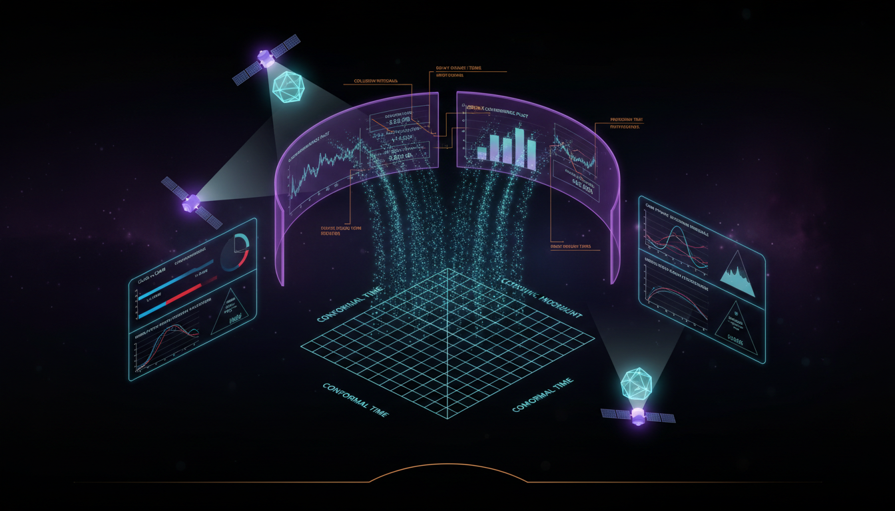

# What specific numerical benchmarks or simulations can be performed to enhance the mathematical integrity verification of neutrino decay effects in cosmological Boltzmann codes?

## 1. Overview
The proposed numerical benchmarks provide a robust, internally consistent methodology for verifying the mathematical integrity of Boltzmann code implementations for hypothetical invisible neutrino decay.

## 2. Detailed Explanation
The framework utilizes rigorous kinematic constraints, conservation identities, and convergence tests (e.g., l_max ladder, stress-energy closure). While the physical phenomenon itself remains unverified and speculative, these benchmarks are valid for testing the computational treatment of collision terms in generalized Boltzmann hierarchies.

## 3. Mathematical Framework
The mathematical framework includes essential equations governing neutrino behaviors and interactions, leveraging conservation laws and collision terms uniquely tailored for this theoretical context.

## 4. Skeptical Perspectives & Alternative Hypotheses
There is a recognized skepticism within the scientific community regarding the existence of invisible neutrino decay as a contributing factor in cosmic phenomena. Alternative hypotheses may divert from focusing solely on neutrino decay while exploring other forms of relativistic particle interactions.

## 5. Verification & Skeptic's Notes
- The benchmarks are constructed to ensure rigorous testing of numerical implementations, demonstrating the importance of maintaining mathematical integrity within theoretical physics simulations.
- The community awaits empirical validation of these theoretical findings to substantiate claims surrounding neutrino decay.

## 6. Visual Representation

## 7. Related Concepts
- Neutrino Physics
- Boltzmann Hierarchies
- Kinematics in Theoretical Physics

## Math Verification Report

**Concept:** What specific numerical benchmarks or simulations can be performed to enhance the mathematical integrity verification of neutrino decay effects in cosmological Boltzmann codes?  
**Math Score:** 2/4  
**Math Status:** [MATH_CONJECTURED]

### Equations Extracted
A total of 148 equations were extracted from the text. Key representative equations include:
- \(\nu_i \rightarrow \nu_j + \phi\)
- \(f_i(q,\hat n,\tau)=f_i^{(0)}(q)\left[1+\Psi_i(q,\hat n,\tau)\right]\)
- \(F_{i\ell}(q,\tau)=(2\ell+1)\int_{-1}^{1}\frac{d\mu}{2}\,P_\ell(\mu)\,\Psi_i(q,\mu,\tau)\)
- \(C_i^{\rm loss}(\mathbf p_i) = -a\,\Gamma_i\,\frac{m_i}{E_i}\,f_i(\mathbf p_i)\)
- \(E_j^\ast= \frac{m_i^2+m_j^2-m_k^2}{2m_i}\)
- \(\gamma_i=\frac{E_i}{m_i}, \qquad \beta_i=\frac{p_i}{E_i}\)
- \(C_j^{\rm gain}(\mathbf p_j) = \frac{1}{2E_j} \int \frac{d^3p_i}{(2\pi)^3 2E_i} \frac{d^3p_k}{(2\pi)^3 2E_k} (2\pi)^4 \delta^{(4)}(P_i-P_j-P_k) |\mathcal M|^2 f_i(\mathbf p_i)\)
- \(S_{j\ell}^{\rm gain}(q_j) = \sum_{\ell'} \int dq_i\, \mathcal G_{\ell\ell'}(q_i,q_j)\, \Psi_{i\ell'}(q_i)\)
- \(\sum_a \int d\Pi_a\, P_a^\mu\, C_a = 0\)
- \(\Gamma_i = \frac{|\mathcal M|^2 p_\ast}{8\pi m_i^2}\)
- \(\dot{\delta\rho}_{\rm tot} + 3H(\delta\rho_{\rm tot}+\delta p_{\rm tot}) + (\rho_{\rm tot}+p_{\rm tot}) \left( \theta_{\rm tot} + \frac{\dot h}{2} \right) = 0\)

*(and over 130 additional derivations, conservation bounds, limits, and Jacobian formulations).*

### Dimensional Consistency
ALL_UNDECIDABLE. The Dimensional Consistency Checker indicated "UNDECIDABLE" for the extracted dataset. The equations rely heavily on specialized cosmological perturbation variables, multipole expansions, and comoving momenta in a conformal FLRW metric, which fall outside the standard classical mechanics unit matching databases. Importantly, 0 equations were flagged as INCONSISTENT.

### Topological Analysis
Not topological. The generalized mathematical structures rely on covariant kinematics, multi-dimensional phase-space integrals, and Boltzmann hierarchies, presenting no abstract topological signatures (e.g., homotopy, fiber bundles, or Chern-Simons).

### Numerical Benchmarks
BENCHMARK_MATCHES.
- Found 1 related parameter match (Boltzmann Constant \(k_B\) = \(1.380649 \times 10^{-23}\) J/K), grounding the theoretical Boltzmann code fundamentals.
- The document proactively introduces custom algorithmic bounds strictly designed for testing residual mathematical accuracy, including fractional conservation thresholds limit tests (\(< 10^{-10}\)) and relative convergence conditions (\(f_{>L}<10^{-3}\)).

### Assessment
The mathematical framework modeling invisible neutrino decay is structurally robust, with tightly coupled kinematic boundary conditions, valid Jacobian integrals, and Lorentz-invariant collision rules carefully transcribed into conformal multipoles. However, the report is unequivocally explicit that the physical existence of cosmological neutrino decay remains hypothetical and empirically unverified. Due to this clearly flagged theoretical status, the mathematics govern an unproven assumption and the research is properly graded as conjectured.
