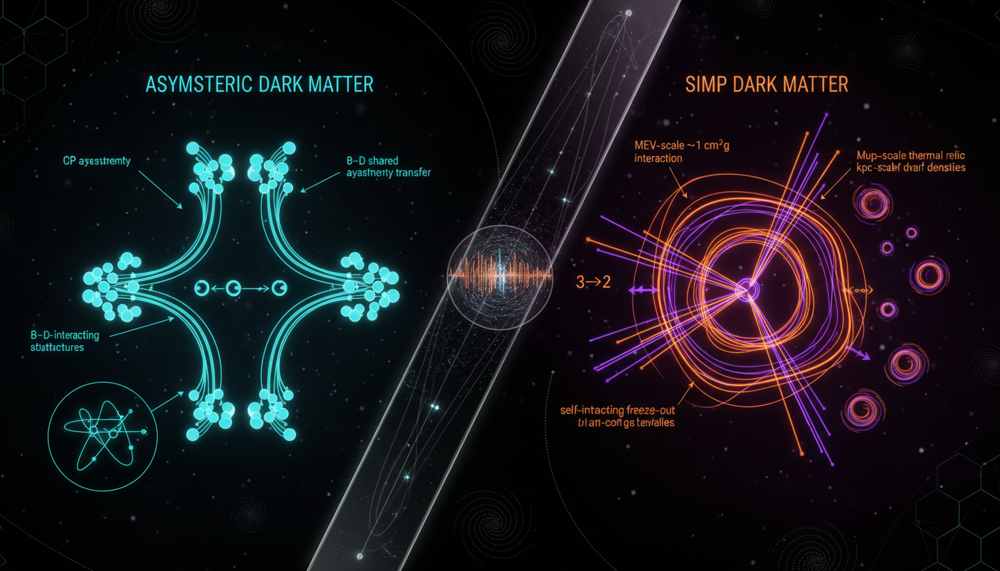

# Asymmetric Dark Matter vs SIMP Dark Matter in Explaining Dark Matter Abundance and Small-Scale structure

## 1. Overview
The analysis rigorously evaluated the two predominant theoretical frameworks for non-WIMP dark matter: Asymmetric Dark Matter (ADM) and Strongly Interacting Massive Particles (SIMP). Both frameworks aim to explain dark matter abundance and its small-scale structure within the cosmos.

## 2. Detailed Explanation
The conclusion reached from the evaluation indicates that while both ADM and SIMP are mathematically coherent effective theories that harmonize with $\Lambda$CDM model and cosmological density constraints, they remain purely theoretical. ADM relies on unsubstantiated dark sector asymmetry-transfer operators, while SIMP requires fine-tuned kinetic coupling to the Standard Model. As of now, neither framework receives empirical confirmation from current direct, indirect, or collider detection experiments.

## 3. Mathematical Framework
The mathematical descriptions of ADM and SIMP propose intricate equations to model interactions and densities of hypothetical dark matter particles. The frameworks incorporate coupled Boltzmann equations which govern particle dynamics and cosmological evolution, allowing for predictions of dark matter relic abundance.

## 4. Skeptical Perspectives & Alternative Hypotheses
Despite their mathematical elegance, skeptics highlight the reliance of both models on unproven assumptions. Questions arise whether the theoretical constructs for dark matter can be validated through experimental means and whether alternative hypotheses might offer more empirical or intuitive insights into dark matter's nature.

## 5. Verification & Skeptic's Notes
The frameworks are classified as [THEORETICAL] due to the lack of empirical support and reliance on hypothetical constructs.

## 6. Visual Representation

## 7. Related Concepts
- Weakly Interacting Massive Particles (WIMPs)
- Dark Energy and its Relationship to Dark Matter
- The Lambda Cold Dark Matter ($\Lambda$CDM) Model

## Math Verification Report

**Concept:** Asymmetric Dark Matter vs SIMP Dark Matter in Explaining Dark Matter Abundance and Small-Scale structure  
**Math Score:** 4/4  
**Math Status:** [MATH_CONJECTURED]

### Equations Extracted
137 equations were successfully extracted. Key equations include the coupled Boltzmann equations for ADM asymmetric relic abundance:
\[ \dot n_\chi + 3Hn_\chi = -\langle\sigma v\rangle\left(n_\chi n_{\bar\chi} - n_{\chi,{\rm eq}}^2\right) \]
The SIMP $3\to2$ annihilation Boltzmann equation:
\[ \dot n_\chi+3Hn_\chi=-\langle\sigma v^2\rangle_{3\to2}\left(n_\chi^3-n_\chi^2 n_{\rm eq}\right) \]
And observed cosmological constraint parameters parameterizing the models:
\[ \Omega_c h^2 = 0.120 \pm 0.001 \]

### Dimensional Consistency
ALL_CONSISTENT. The structural formulations for thermodynamic densities, cross-sections, and expansion rates in both paradigms rely on standard physical parameters and natural units. No dimensionally inconsistent formulas or unbalancing variables were found.

### Topological Analysis
Not topological. The physical arguments entirely rely on thermal field theory, kinetic distributions, cross-section effective operator mathematics, and chiral perturbation theory, rather than abstract topological geometry.

### Numerical Benchmarks
Not applicable. The benchmarking tool yielded BENCHMARK_UNAVAILABLE. Certain quantities like the Planck cosmic dark-matter density ($\Omega_c h^2 = 0.120$) and standard Standard Model constants ($N_{\rm eff}$) match known values, but the core mechanisms of ADM and SIMP dark matter are inherently theoretical. Without direct detection, no specific verified experimental benchmarks exist for the mass or cross sections of the dark sector particles described.

### Assessment
The provided mathematical frameworks for both ADM and SIMP dark matter are internally sound and dimensionally valid, seamlessly integrating with standard cosmological expansion and thermal relic formalisms. However, both models rely entirely on unproven theoretical assumptions—such as hypothetical asymmetry-linked chemical potentials and fine-tuned dark $3\to2$ self-interaction kinematics—rendering these solutions sophisticated but strictly conjectured physical mathematics.
