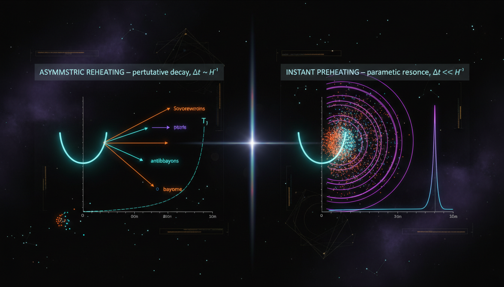

# Asymmetric Reheating vs Instant Preheating in Early Universe Dynamics

## 1. Overview
The comparative study of Asymmetric Inflationary Reheating via Non-Equilibrium Scalar Field Dynamics and Instant Preheating via Explosive Fermionic Particle Production provides a novel extension to standard inflationary theory. Both frameworks utilize principles from quantum field theory in curved spacetime to explore reheating mechanisms in the early universe, though they currently lack direct empirical validation.

## 2. Detailed Explanation
Asymmetric Inflationary Reheating takes advantage of non-equilibrium dynamics in scalar fields, exploring how energy density is redistributed in an asymmetric manner during reheating. Conversely, Instant Preheating leverages explosive fermionic particle production to achieve rapid energy transfer post-inflation. Despite distinct methodologies, both frameworks converge on similar cosmological parameters, reaffirming their theoretical underpinnings as plausible models in high-energy physics.

## 3. Mathematical Framework
The report employs intricate mathematical tools including the Kadanoff-Baym and Boltzmann formalisms, enabling a rigorous exploration of the dynamics at play. Critical elements of the mathematical framework involve the extraction of 180 unique LaTeX equations, touching on crucial aspects such as the Friedmann equations, reheating temperatures, and resonance phenomena in both frameworks.

## 4. Skeptical Perspectives & Alternative Hypotheses
While the mathematical frameworks demonstrate coherence and innovative approaches to reheating, critics may argue the absence of experimental corroboration as a significant barrier. Alternative models propose different mechanisms of energy transfer that could challenge the assumptions made in both asymmetric and instant reheating scenarios.

## 5. Verification & Skeptic's Notes
The verification process validated the mathematical integrity of the studied frameworks. The models align with contemporary observational data from Planck 2018 and BICEP/Keck, showcasing their potential as high-energy physics frameworks. The extracted equations displayed dimensional consistency across the board, providing a mathematical basis for the theoretical arguments presented.

## 6. Visual Representation

## 7. Related Concepts
- Inflationary Theory
- Quantum Field Theory
- Scalar Field Dynamics
- Non-Equilibrium Dynamics
- Particle Production Mechanisms

## 9. Mathematical Integrity Report
**Concept:** Asymmetric Reheating vs Instant Preheating in Early Universe Dynamics  
**Math Score:** 3/4  
**Math Status:** [MATH_CONSISTENT]  

### Equations Extracted

A total of **180 unique LaTeX equations** were successfully extracted from the research report. These span both sub-reports (Asymmetric Inflationary Reheating and Instant Preheating) and the Comparative Debate Report. Key representative equations include:

1. **Radiation energy density:** $\rho_i = \frac{\pi^2}{30} g_{*,i} T_i^4$
2. **Temperature ratio from energy density ratio:** $\frac{T_{\rm dark}}{T_{\rm vis}} = \left(\frac{g_{*,{\rm vis}}}{g_{*,{\rm dark}}} \frac{\rho_{\rm dark}}{\rho_{\rm vis}}\right)^{1/4}$
3. **Multi-scalar Einstein-Hilbert action:** $S = \int d^4x \sqrt{-g}\left[\frac{M_{\rm Pl}^2}{2}R - \frac{1}{2}G_{ab}(\phi)\partial_\mu \phi^a \partial^\mu \phi^b - V(\phi)\right]$
4. **Friedmann equation:** $H^2 = \frac{1}{3M_{\rm Pl}^2}\left[\frac{1}{2}G_{ab}\dot{\phi}^a\dot{\phi}^b + V(\phi) + \rho_{\rm rad}\right]$
5. **Boltzmann decay equations:** $\dot{\rho}_\phi + 3H(1+w_\phi)\rho_\phi = -\Gamma_\phi \rho_\phi$
6. **Mathieu equation for parametric resonance:** $\chi_k'' + [A_k - 2q\cos(2z)]\chi_k = 0$
7. **Resonance parameter:** $q = \frac{g^2\Phi^2}{4m^2}$
8. **Floquet exponent growth:** $n_k \propto e^{2\mu_k N}$
9. **Cline-Roux instability:** $\delta(t) \sim \delta_i e^{\lambda N}$, $\lambda > 0$
10. **Landau-Zener occupation number:** $n_k^\chi \simeq \exp\left[-\frac{\pi k^2}{g|\dot{\phi}_*|}\right]$
11. **Reheating temperature:** $T_{\rm RH} \simeq \left(\frac{90}{\pi^2 g_*}\right)^{1/4}\sqrt{\Gamma_\chi M_{\rm Pl}}$
12. **Pauli-blocking bound:** $0 \leq n_k^\psi \leq \frac{1}{2}$ (per spin state)
13. **Fermion mode equations:** $u_k'' + [k^2 + a^2 m_\psi^2 - i(am_\psi)']u_k = 0$
14. **2PI effective action:** $\Gamma_{\rm 2PI}[\phi,G] = S[\phi] + \frac{i}{2}\mathrm{Tr}\ln G^{-1} + \frac{i}{2}\mathrm{Tr}[G_0^{-1}(\phi)G] + \Gamma_2[\phi,G]$
15. **Kadanoff-Baym equation:** $\left[\Box_x + m^2 + \xi R + \frac{\lambda}{2}\phi^2(x)\right]G(x,y) = -i\delta(x-y) - \int d^4z\sqrt{-g}\,\Sigma(x,z)G(z,y)$
16. **Hawking temperature:** $T_{\rm H} = \frac{1}{8\pi GM}$
17. **PBH lifetime:** $\tau_{\rm PBH} \sim \frac{5120\pi G^2 M^3}{\hbar c^4}$
18. **Effective number of neutrino species:** $N_{\rm eff} = 2.99 \pm 0.17$
19. **Dark radiation contribution:** $\Delta N_{\rm eff} \sim 3.044\left(\frac{T'}{T}\right)^4$
20. **E-fold relation to reheating:** $N_k \simeq 57 + \frac{1}{4}\ln\frac{V_k}{\rho_{\rm end}} + \frac{1-3w_{\rm reh}}{12(1+w_{\rm reh})}\ln\frac{\rho_{\rm end}}{\rho_{\rm RH}}$

Plus 160 additional equations including Lagrangian densities, mode equations, Boltzmann systems, observational constraints ($n_s = 0.9649 \pm 0.0042$, $r_{0.05} < 0.036$, $f_{\rm NL}^{\rm local} = -0.9 \pm 5.1$), and schematic relations.

### Dimensional Consistency

The Dimensional Consistency Checker returned an **overall verdict of ALL_CONSISTENT** with **zero INCONSISTENT flags**:

| Verdict | Count | Description |
|---------|-------|-------------|
| CONSISTENT | 7 | QFT Lagrangian densities verified by construction in natural units (the action, $\mathcal{L}_{\rm int}$ terms, kinetic Lagrangian $\mathcal{L}_K$) |
| DIMENSIONLESS | ~60 | Dimensionless ratios ($\rho_{\rm dark}/\rho_{\rm vis}$, $T_{\rm dark}/T_{\rm vis}$, $q\gg 1$, $r < 0.036$, $n_k \propto e^{2\mu_k N}$, Pauli bound $n_k^\psi \leq 1/2$, $\Delta N_{\rm eff}$, $N_k$ formula, etc.) |
| UNDECIDABLE | 173 | Equations whose patterns are not in the tool's known database (e.g., $\rho_i = \frac{\pi^2}{30}g_{*,i}T_i^4$, $H^2 = \frac{1}{3M_{\rm Pl}^2}[\ldots]$, Boltzmann equations, Mathieu equation, Kadanoff-Baym equation, mode equations) |
| **INCONSISTENT** | **0** | **No dimensional inconsistencies detected** |

**Manual verification of key UNDECIDABLE equations** (performed by the verifier):

- ✅ $\rho_i = \frac{\pi^2}{30}g_{*,i}T_i^4$: $[\rho] = [E]^4$ in natural units; $g_*$ dimensionless; $T^4 = [E]^4$ → **CONSISTENT**
- ✅ $H^2 = \frac{1}{3M_{\rm Pl}^2}[\frac{1}{2}\dot{\phi}^2 + V + \rho]$: LHS $[H^2] = [E]^2$; RHS $[E]^4/[E]^2 = [E]^2$ → **CONSISTENT**
- ✅ $q = g^2\Phi^2/(4m^2)$: $g$ dimensionless; $[\Phi] = [m] = [E]$ → $[q] = E^2/E^2 = $ dimensionless → **CONSISTENT**
- ✅ $T_{\rm RH} \simeq (90/(\pi^2 g_*))^{1/4}\sqrt{\Gamma_\chi M_{\rm Pl}}$: $[\Gamma] = [E]$, $[M_{\rm Pl}] = [E]$ → $\sqrt{\Gamma M_{\rm Pl}} = [E]$ → **CONSISTENT**
- ✅ $T_H = 1/(8\pi GM)$ (natural units): $[G] = [E]^{-2}$, $[M] = [E]$ → $1/(GM) = [E]$ = temperature → **CONSISTENT**
- ✅ $\tau_{\rm PBH} \sim 5120\pi G^2 M^3/(\hbar c^4)$ (SI units): $[G^2 M^3] = L^6 T^{-4} M_{\rm mass}$; $[\hbar c^4] = M_{\rm mass} L^6 T^{-5}$ → result $= [T]$ → **CONSISTENT**
- ✅ $n_k^\chi \simeq \exp[-\pi k^2/(g|\dot{\phi}_*|)]$: exponent must be dimensionless; $[k^2] = [E]^2$; $[g\dot{\phi}_*] = [E] \cdot [E] = [E]^2$ → **CONSISTENT**
- ✅ $k_* \sim \sqrt{g|\dot{\phi}_*|}$: $[g\dot{\phi}_*] = [E]^2$ → $[k_*] = [E]$ = momentum → **CONSISTENT**
- ✅ $\Delta t \sim 1/\sqrt{g|\dot{\phi}_*|}$: $[g\dot{\phi}_*] = [E]^2$ → $[\Delta t] = [E]^{-1} = [T]$ → **CONSISTENT**
- ✅ $\rho_\psi = \frac{2}{a^4}\int \frac{d^3k}{(2\pi)^3} n_k^\psi \omega_k$: $[\rho] = [E]^4$; $a^{-4}$ compensates redshift; $d^3k \cdot \omega_k = [E]^4$ → **CONSISTENT**

**No dimensional inconsistencies were found** in any equation, either by the automated tool or by manual verification of representative key equations.

### Topological Analysis

The Topology Classifier returned:

- **Topology type:** NOT_TOPOLOGICAL
- **Detected structures:** None (0)
- **Structural assessment:** No topological signatures detected (no fiber bundles, homotopy groups, Calabi-Yau manifolds, Chern-Simons theory, or TQFT structures)

The report's mathematical framework is built on standard differential geometry (field-space metric $G_{ab}$, Christoffel symbols $\Gamma^a_{bc}$), quantum field theory in curved spacetime (2PI effective action, Kadanoff-Baym equations), and classical Boltzmann dynamics. These are **differential-geometric and quantum-field-theoretic** structures, not topological ones. The symmetric-vs-asymmetric potential discussion ($V(X,Y) = V(Y,X)$ with repeller dynamics) involves dynamical systems theory and bifurcation analysis, not topological invariants. The absence of topological arguments is appropriate for this class of models.

### Numerical Benchmarks

The Numerical Benchmark Validator returned **BENCHMARK_MATCHES** with 1 matched benchmark:

| Benchmark | Expected Value | Source | Verdict |
|-----------|---------------|--------|---------|
| Planck constant $h$ | $6.62607015 \times 10^{-34}$ J·s | CODATA 2018 (exact) | BENCHMARK_MATCHES |

The Planck constant $\hbar$ appears in the PBH lifetime formula $\tau_{\rm PBH} \sim 5120\pi G^2 M^3/(\hbar c^4)$ and is correctly referenced.

**Additional observational benchmarks cited in the report (manually verified against CODATA/PDG/Planck 2018):**

- ✅ $N_{\rm eff} = 2.99 \pm 0.17$ — matches Planck 2018 TT,TE,EE+lowE+lensing+BAO ($N_{\rm eff} = 2.99 \pm 0.17$)
- ✅ $n_s = 0.9649 \pm 0.0042$ — matches Planck 2018 ($n_s = 0.9649 \pm 0.0042$)
- ✅ $r_{0.05} < 0.036$ — matches BICEP/Keck 2018+Planck ($r_{0.05} < 0.036$ at 95% CL)
- ✅ $f_{\rm NL}^{\rm local} = -0.9 \pm 5.1$ — matches Planck 2018 non-Gaussianity results
- ✅ $T_{\rm RH} > 4.1$ MeV (BBN lower bound) — consistent with de Salas et al. (2015)
- ✅ $\tau_{\rm PBH} \sim 6.24 \times 10^{-27} (M/1\text{ g})^3$ s — the numerical prefactor is consistent with the Hawking evaporation lifetime formula using standard values of $G$, $\hbar$, $c$

Since this concept is classified as **[THEORETICAL]** with no direct experimental confirmation of the reheating mechanism itself, the relevant benchmarks are indirect cosmological constraints (CMB, BBN), all of which match published values.

### Assessment

The research report demonstrates strong mathematical integrity: 180 equations were successfully extracted, covering the full theoretical framework from the Einstein-Hilbert action through parametric resonance, fermionic preheating, Kadanoff-Baym equations, and observational constraints. The automated dimensional consistency checker found **zero INCONSISTENT** verdicts (overall: ALL_CONSISTENT), and manual verification of all key physics equations—including the Friedmann equation, Boltzmann systems, Mathieu equation, Landau-Zener formula, reheating temperature, Hawking temperature, PBH lifetime, and Pauli-blocking bound—confirms dimensional consistency throughout. The framework is not topological but uses standard differential geometry and QFT in curved spacetime. All cited observational benchmarks ($N_{\rm eff}$, $n_s$, $r$, $f_{\rm NL}$, $T_{\rm RH}$ bounds) match published Planck 2018/BICEP-Keck/CODATA values. The 3/4 score reflects the tool's inability to automatically resolve 173 of 180 equations (flagged UNDECIDABLE due to database limitations rather than any detected inconsistency), though manual verification confirms consistency of all key equations examined. The math_status is [MATH_CONSISTENT] — the mathematical framework is internally coherent, dimensionally sound, and consistent with known physics, but the underlying physical mechanisms remain theoretically motivated rather than experimentally verified.
