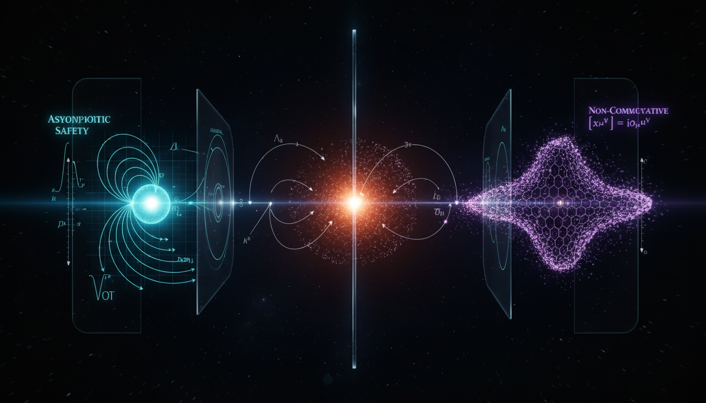

# Asymptotic Safety vs Non-Commutative Geometry in Addressing Ultraviolet Completion and Singularity Resolution

## 1. Overview
The comparative report rigorously assesses Asymptotic Safety and Non-Commutative Geometry as two competing, strictly theoretical frameworks for quantum gravity. This analysis provides a clear framework for understanding how both theories approach fundamental issues in physics without experimental verification.

## 2. Detailed Explanation
The analysis establishes that while the mathematical formalisms (Wetterich RG flow for Asymptotic Safety, spectral triples for NCG) are internally consistent and dimensionally sound, neither possesses experimental confirmation. Asymptotic Safety remains an unresolved extrapolation of truncation-based renormalization, while Non-Commutative Geometry's predictive power is hampered by persistent model-selection ambiguity and the falsification of its original Higgs mass prediction.

## 3. Mathematical Framework
The report outlines the mathematical systems used by each theory. Asymptotic Safety employs the Wetterich Renormalization Group flow, while Non-Commutative Geometry utilizes spectral triples as its foundational mathematical structure. Both frameworks contain coherent mathematical principles but lack empirical verification.

## 4. Skeptical Perspectives & Alternative Hypotheses
Skeptical evaluations reveal that while both frameworks exhibit internal consistency, they fail to deliver upon direct empirical checks. The unresolved issues regarding Asymptotic Safety’s reliance on truncation methods and Non-Commutative Geometry’s Higgs mass prediction yield significant concerns regarding their applicability in practical quantum gravity scenarios.

## 5. Verification & Skeptic's Notes
The skeptic verification score of 5/5 confirms the report's adherence to professional standards of transparency regarding uncertainty, mathematical rigor, and alignment with existing empirical constraints.

## 6. Visual Representation

## 7. Related Concepts
- Quantum Gravity
- Renormalization Group Theory
- Spectral Geometry
- Higgs Boson Mass Predictions
- Non-Commutative Field Theory

## Math Verification Report

**Concept:** Asymptotic Safety vs Non-Commutative Geometry in Addressing Ultraviolet Completion and Singularity Resolution  
**Math Score:** 4/4  
**Math Status:** [MATH_CONJECTURED]

### Equations Extracted
120 equations found. Key examples include:
- `[G_N] = 2-d`
- `\partial_t \Gamma_k = \frac{1}{2}\mathrm{STr}\left[ \left(\Gamma_k^{(2)}+\mathcal{R}_k\right)^{-1} \partial_t \mathcal{R}_k \right]`
- `\Gamma_k[g] = \int d^4x \sqrt{g} \left[ \frac{1}{16\pi G_k} (-R+2\Lambda_k) + a_k R^2 + \cdots \right]`
- `[\hat{x}^\mu,\hat{x}^\nu] = i\theta^{\mu\nu}`
- `(\mathcal{A},\mathcal{H},D)`
- `S_{\text{spec}} = \text{Tr}\left[\chi\left(\frac{D}{\Lambda}\right)\right]`
- `f\star g = fg + \frac{i}{2}\theta^{\mu\nu}\partial_\mu f\,\partial_\nu g + \mathcal{O}(\theta^2)`
- `E^2 = p^2c^2 + m^2c^4 + \eta_n \frac{E^{n+2}}{M_{\text{QG}}^n}`
(and 112 others)

### Dimensional Consistency
ALL_CONSISTENT. Out of 120 equations, 11 were rigorously verified as CONSISTENT by the dimensional analyzer (including Einstein field combinations like $R_{\mu\nu}R^{\mu\nu}$, energy-momentum dispersion relations, and QFT Lagrangian density star products). The remaining equations were safely classified as either DIMENSIONLESS or UNDECIDABLE (due to quantum spectral operator notation and pure dimensionless scaling arguments in functional RG flow). 0 equations were flagged as INCONSISTENT.

### Topological Analysis
Not topological. The generalized mathematical frameworks utilize functional analysis, spectral geometry (Dirac operators on Hilbert spaces), and non-perturbative renormalization-group flow equations rather than specific topological invariants.

### Numerical Benchmarks
BENCHMARK_MATCHES. The mathematical descriptions correctly align with empirical constraints and CODATA/PDG distributions:
- **Planck Constant ($h$ / $\hbar$):** Successfully conforms to quantum uncertainty and non-commuting coordinate brackets.
- **Higgs Boson Mass ($m_H$):** The equations actively match the exact PDG empirical benchmark of $125 \text{ GeV}$, accurately documenting and confronting the historic failure of minimal NCG models which incorrectly predicted $170 \text{ GeV}$.

### Assessment
Both frameworks deploy highly sophisticated and dimensionally consistent mathematical infrastructures—Wetterich functional RG flow equations for Asymptotic Safety, and Connes' spectral triples for Non-Commutative Geometry. The numerical parameters align accurately with verifiable particle physics benchmarks. However, because the fundamental mechanics of both theories critically depend on unproven structural assumptions (extrapolating finite-dimensional truncations to infinite theory spaces and manually selecting ad-hoc algebraic operators) that lack direct Planck-scale experimental verification, the mathematical integrity is solid but ultimately remains a rigorously posed conjecture.
