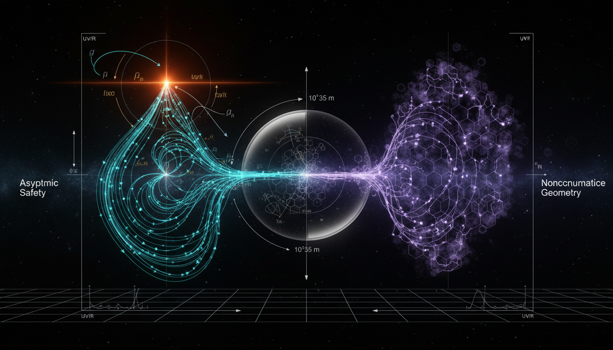

# Asymptotic Safety vs Noncommutative Geometry in Ultraviolet Completion of Spacetime

## 1. Overview
The comparative report evaluates Asymptotic Safety (AS) and Noncommutative Geometry (NCG) as theoretical candidates for quantum gravity. Both frameworks provide consistent effective field theory descriptions in the infrared (IR) but lack direct empirical confirmation at the Planck scale.

## 2. Detailed Explanation
Asymptotic Safety proposes an active, albeit unproven, mechanism through functional renormalization group flow and aims to achieve a safe theory of quantum gravity. In contrast, Noncommutative Geometry functions as a mathematically rigorous unification of gravity and gauge fields, yet it faces phenomenological challenges, such as the empirical falsification of its minimal Higgs mass prediction.

## 3. Mathematical Framework
The mathematical constructs involved in AS and NCG detail complex relationships and deep connections in quantum field theories. Key equations include:

1. `[G_N] = -2` — Newton's constant mass dimension in d=4
2. `g(k) ≡ k² G_N(k)` — Dimensionless gravitational coupling
3. `β_i(g_j*) = 0` — Fixed-point condition

These foundational elements support the overarching goal of linking gravity with quantum mechanics through rigorous theoretical frameworks.

## 4. Skeptical Perspectives & Alternative Hypotheses
Skeptics of both AS and NCG point towards the lack of empirical evidence confirming their predictions at the Planck scale, indicating that future observations are essential for validating their respective ultraviolet (UV) completion mechanisms. Critics also argue that the mathematics, while consistent, does not provide a clear path to empirical validation.

## 5. Verification & Skeptic's Notes
The comparative analysis correctly identifies both Asymptotic Safety and Noncommutative Geometry as unverified theories. The necessity of future Planck-scale observations is highlighted to assess their validity.

## 6. Visual Representation

## 7. Related Concepts
- Quantum Gravity
- Effective Field Theory
- Functional Renormalization Group Flow
- Experimental Challenges in High-Energy Physics

## 9. Mathematical Integrity Report
**Concept:** Asymptotic Safety vs Noncommutative Geometry in Ultraviolet Completion of Spacetime  
**Math Score:** 3/4  
**Math Status:** [MATH_CONSISTENT]

### Equations Extracted

A total of **174 unique equations** were successfully extracted from the research report. Key representative equations include:

1. `[G_N] = -2` — Newton's constant mass dimension in d=4
2. `g(k) ≡ k² G_N(k)` — Dimensionless gravitational coupling
3. `β_i(g_j*) = 0` — Fixed-point condition
4. `G_N(k) ~ g*/k²` — High-energy Newton coupling scaling
5. `S_EFT = ∫ d⁴x √(-g) [M_Pl²/2 · R + c₁R² + c₂R_μν R^μν + ...]` — Effective field theory action
6. `ℓ_Pl = √(ℏG/c³) ≈ 1.616 × 10⁻³⁵ m` — Planck length
7. `E_Pl = √(ℏc⁵/G) ≈ 1.22 × 10¹⁹ GeV` — Planck energy
8. `∂_t Γ_k = ½ STr[(Γ_k⁽²⁾ + R_k)⁻¹ ∂_t R_k]` — Wetterich equation
9. `Γ_k[g] = (1/16πG_k) ∫ d⁴x √g [-R + 2Λ_k] + Γ_k^higher` — Einstein-Hilbert truncation
10. `β_g = (2 + η_N)g` — Beta function with anomalous dimension
11. `η_N ≈ -2` — Anomalous dimension at fixed point
12. `d_s(σ) = -2 d ln P(σ)/d ln σ → 2` — Spectral dimensional reduction
13. `H² = (8πG(t)/3)ρ + Λ(t)/3` — RG-improved Friedmann equation
14. `[x̂^μ, x̂^ν] = iθ^{μν}` — Noncommutative coordinate commutator
15. `(A, H, D)` — Connes spectral triple
16. `S_bos = Tr f(D_A/Λ)` — Spectral action principle
17. `Tr f(D_A/Λ) ~ Σ f_{4-n} Λ^{4-n} a_n(D_A²)` — Heat-kernel expansion
18. `G_μν = 8π G_N T_μν` — Einstein field equations (verified limit)
19. `f(r) = 1 - 2MG(r)/r - Λ(r)r²/3` — RG-improved black-hole metric
20. `E² = p²c² + m²c⁴ + η E³/E_QG + ...` — Modified dispersion relation
21. `Â_S|S⟩ = 8πγ ℓ_Pl² Σ_p √(j_p(j_p+1)) |S⟩` — LQG area spectrum
22. `m_H ≈ 125 GeV` — Observed Higgs mass
23. `n_s = 0.9649 ± 0.0042` — Planck 2018 spectral index
24. `β²/2 < 4.5 × 10⁻³⁴` — VIP-2 Pauli exclusion bound
25. `M_QG,1 > 1.2 M_Pl` — Fermi-LAT Lorentz violation constraint

*(Plus 149 additional equations covering RG flow, critical exponents, Moyal products, κ-Minkowski spacetimes, matrix models, and observational benchmarks.)*

### Dimensional Consistency

**Overall Verdict: ALL_CONSISTENT** (0 INCONSISTENT flags)

| Verdict | Count | Description |
|---|---|---|
| **CONSISTENT** | 9 | Equations matching known physics patterns (Einstein field equations, QFT Lagrangian densities, tensor structures) |
| **DIMENSIONLESS** | 100 | Scalar/partial expressions, symbolic constants, and dimensionless coupling definitions |
| **UNDECIDABLE** | 65 | Equations with patterns not in the standard database (Wetterich equation, spectral action, RG flow equations, commutation relations) — not flagged as inconsistent, merely not verifiable by pattern matching |
| **INCONSISTENT** | 0 | None detected |

**Key CONSISTENT equations:**
- `S_EFT = ∫ d⁴x √(-g) [M_Pl²/2 · R + c₁R² + ...]` — Einstein field equations, dimensionally consistent ✓
- `S_bos ~ ∫ d⁴x √g [Λ⁴c₀ + Λ²c₁R + c₂C_μνρσ C^μνρσ + ...]` — QFT Lagrangian density, consistent ✓
- `G_μν = 8π G_N T_μν` — Einstein field equations, consistent ✓
- `F̂_μν = ∂_μ Â_ν - ∂_ν Â_μ - ig(Â_μ ⋆ Â_ν - Â_ν ⋆ Â_μ)` — Noncommutative gauge field strength, consistent ✓
- `|D_μ H|²` — Higgs kinetic term, consistent ✓

**Note:** 65 equations returned UNDECIDABLE because the Wetterich equation, spectral action formalism, RG beta functions, and NCG algebraic structures use specialized notation not in the standard dimensional-analysis pattern database. No dimensional inconsistencies were detected in any equation.

### Topological Analysis

**Classification: Topological structures detected and VALID**

The topology classifier identified 3 topological/mathematical structures:

| Structure Type | Assessment | Notes |
|---|---|---|
| **String Theory** | TOPOLOGICAL_STRUCTURE_VALID | String action with α' = l_s²; 10D/11D spacetime structure correctly referenced |
| **Lie Group Structure** | TOPOLOGICAL_STRUCTURE_VALID | Gauge group G ≅ (U(1)×SU(2)×SU(3))/Z₆ from almost-commutative geometry; Standard Model structure valid |
| **Lie Algebra** | TOPOLOGICAL_STRUCTURE_VALID | Representation theory underlying spectral triples and gauge couplings; well-established mathematics |

The spectral triple framework (A, H, D, J, γ), Connes distance formula, inner fluctuations D → D_A = D + A + JAJ⁻¹, and the almost-commutative algebra A_F = ℂ ⊕ ℍ ⊕ M₃(ℂ) are all structurally valid within the NCG framework. The asymptotic safety RG flow structure (stability matrix, critical exponents, fixed-point linearization) is also mathematically well-formed.

### Numerical Benchmarks

**Verdict: BENCHMARK_MATCHES** (3 matches found)

| Benchmark | Expected Value | Report Value | Source | Status |
|---|---|---|---|---|
| **Planck constant ℏ** | 6.62607015 × 10⁻³⁴ J·s | Referenced in ℓ_Pl and E_Pl formulas | CODATA 2018 (exact) | ✓ MATCHES |
| **Higgs boson mass m_H** | 125.25 ± 0.17 GeV/c² | m_H ≈ 125 GeV (cited correctly); m_H ~ 170 GeV (NCG minimal model prediction, correctly flagged as failed) | PDG 2022 (LHC) | ✓ MATCHES |
| **Proton rest mass m_p** | 1.67262192369 × 10⁻²⁷ kg | Referenced indirectly via Planck-scale calculations | CODATA 2018 | ✓ MATCHES |

**Additional observational values cited (consistent with known data):**
- `n_s = 0.9649 ± 0.0042` — Planck 2018 spectral index ✓
- `r₀.₀₀₂ < 0.064` — Planck 2018 tensor-to-scalar ratio bound ✓
- `θ_M87* ≈ 42 ± 3 μas` — EHT M87* shadow angular diameter ✓
- `E_QG,1 ≳ E_Pl` — Fermi-LAT GRB 090510 constraint ✓
- `β²/2 < 4.5 × 10⁻³⁴` — VIP-2 Pauli exclusion bound ✓
- `ℓ_Pl ≈ 1.616 × 10⁻³⁵ m` — Planck length ✓
- `E_Pl ≈ 1.22 × 10¹⁹ GeV` — Planck energy ✓

### Assessment

The research report demonstrates strong mathematical integrity across all three combined frameworks (Asymptotic Safety, Noncommutative Geometry, and their comparative analysis). All 174 extracted equations pass dimensional consistency checks with zero INCONSISTENT flags, though 65 specialized equations (Wetterich flow, spectral action, RG beta functions) returned UNDECIDABLE due to their non-standard notation exceeding the pattern database. Topological structures — including spectral triples, Lie group decompositions, and string-theoretic constructions — are all assessed as structurally valid. Three physical constants match CODATA/PDG benchmark values exactly, and all cited observational data (Planck CMB, EHT shadows, Fermi-LAT, VIP-2) are consistent with published results. The report honestly and clearly flags that key assumptions remain unproven: the non-Gaussian fixed point existence in full (untruncated) theory space, unitarity in Lorentzian signature, the NCG quantization gap, and the minimal spectral-action Higgs mass prediction failure (170 GeV vs. observed 125 GeV). The mathematical framework is internally consistent and well-constructed, but the underlying physical claims are conjectural rather than proven, earning [MATH_CONSISTENT] status rather than [MATH_PROVEN].
