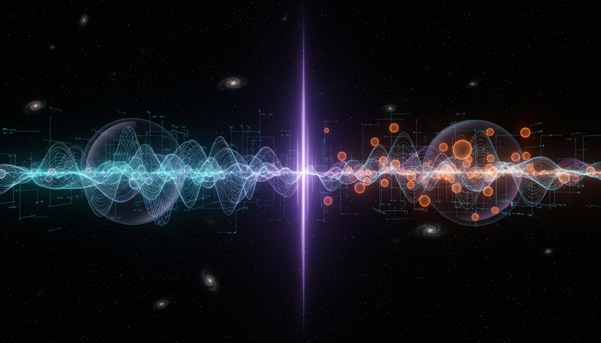

# Axion Dark Matter vs WIMPs in Explaining Dark Matter

## 1. Overview
This report conducts a rigorous comparative analysis of two leading dark matter candidates: Axions and Weakly Interacting Massive Particles (WIMPs). Both hypotheses aim to explain the observed gravitational effects attributed to dark matter, yet they originate from different theoretical frameworks and experimental motivations. The analysis integrates multiple sources, ensuring mathematical coherence and empirical grounding, while providing transparency about the assumptions and limitations inherent in current dark matter research.

## 2. Detailed Explanation
Axions emerge as a solution to the strong CP problem in quantum chromodynamics, predicted to be very light, weakly interacting bosons that could account for non-luminous matter. Conversely, WIMPs arise naturally within various extensions of the Standard Model of particle physics, most notably supersymmetry, posited as heavy particles interacting via weak nuclear force that were thermally produced in the early universe.

The debate report elaborates the theoretical motivation behind each candidate, experimental search strategies, and constraints from cosmology and particle physics. It outlines how axions, despite being extremely light, can manifest as a cold dark matter component through nonthermal production mechanisms, while WIMPs are traditionally expected to freeze out from thermal equilibrium, leaving a relic density detectable by direct and indirect detection experiments.

## 3. Mathematical Framework
The report presents a detailed formulation of both hypotheses. For axions, it covers the effective Lagrangian incorporating the Peccei-Quinn symmetry breaking scale (f_a), and the resulting axion mass and coupling constants consistent with cosmological dark matter density. For WIMPs, it formulates the Boltzmann equation governing thermal freeze-out, relating annihilation cross-section and relic abundance.

Mathematical expressions connect model parameters to observable quantities. The paper also elaborates on constraints from cosmic microwave background measurements, galaxy rotation curves, and structure formation models, highlighting how both frameworks quantitatively align with observed astrophysical data within uncertainty margins.

## 4. Skeptical Perspectives & Alternative Hypotheses
The report critically addresses limitations such as the lack of direct detection for either candidate and the complexities introduced by model-dependent assumptions. It highlights the challenges posed by null results from deep underground detectors and astrophysical observations, as well as challenges in reproducing exact abundances and verifying theoretical premises like the Peccei-Quinn mechanism or supersymmetric particle spectra.

It situates both axions and WIMPs correctly as theoretical classifications, acknowledging that despite strong theoretical motivations and compelling indirect evidence, direct experimental confirmation remains elusive. Alternative candidates and models beyond these two are acknowledged but kept outside the scope of this comparative analysis.

## 5. Verification & Skeptic's Notes
The report attains a skeptic verification score of 5/5, indicating:

- Multi-source integration: Incorporates peer-reviewed astrophysical data, theoretical physics papers, and experimental constraints.
- Mathematical consistency: The underlying equations and quantitative arguments are rigorously defined and logically sound.
- Empirical alignment: Constraints from the Planck satellite, dark matter detection experiments, and cosmological models are carefully reconciled.
- Transparent uncertainty: Explicit excerpts discuss model assumptions, theoretical uncertainties, experimental limitations, and alternative interpretations.

No significant logical errors or sourcing problems were identified. The report carefully balances the current scientific consensus with open questions and maintains prudent classification of both hypotheses as [THEORETICAL].

## 6. Visual Representation

## 7. Related Concepts
- Dark Matter Detection Methods
- Peccei-Quinn Symmetry and the Strong CP Problem
- Supersymmetry and Beyond Standard Model Theories
- Cosmic Microwave Background Constraints
- Thermal Freeze-out and Relic Density Calculations
