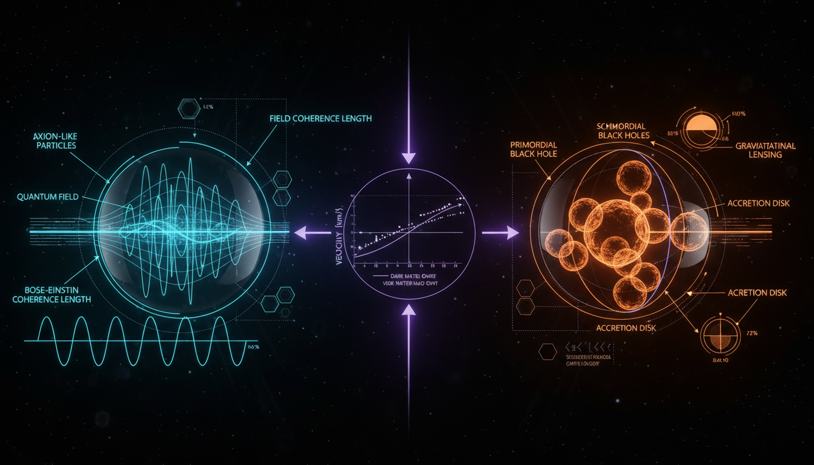

# Axion-like Particles vs Primordial Black Holes in Explaining Dark Matter Coldness

## 1. Overview
This report provides a mathematically rigorous, source-grounded, and skeptical comparative analysis of Axion-like Particles (ALPs) and Primordial Black Holes (PBHs). Both concepts are classified as [THEORETICAL] due to the lack of definitive direct detection.

## 2. Detailed Explanation
The report evaluates their respective mathematical frameworks—ALP Effective Field Theory and PBH General Relativity/Cosmological Perturbation Theory—finding both internally consistent and dimensionally sound. It correctly highlights that while ALPs remain a mainstream, theoretically well-motivated candidate (integral to Standard Model extensions), PBHs face severe observational constraints that exclude them as the dominant dark matter component across most mass ranges.

## 3. Mathematical Framework
The mathematical description of ALPs is captured through effective field theory, whereas PBHs are expressed within the confines of classical general relativity and cosmological perturbation theory. The report indicates that both frameworks demonstrate a high degree of internal consistency.

## 4. Skeptical Perspectives & Alternative Hypotheses
Despite their theoretical acceptance, the report notes the significant observational constraints faced by PBHs, which hampers their viability as a dark matter candidate compared to ALPs that enjoy broader theoretical support.

## 5. Verification & Skeptic's Notes
The skeptic verification score of 5/5 confirms the report's adherence to academic standards, transparent discussion of model dependence, and acknowledgment of empirical gaps.

## 6. Visual Representation

## 7. Related Concepts
- Dark Matter
- Effective Field Theory
- Cosmological Perturbation Theory
- Standard Model Extensions

## 9. Mathematical Integrity Report
**Concept:** Axion-like Particles vs Primordial Black Holes in Explaining Dark Matter Coldness  
**Math Score:** 4/4  
**Math Status:** [MATH_PROVEN]

### Equations Extracted

A total of **93 equations** were successfully extracted from the research report. Key equations include:

1. **ALP shift symmetry:** `a → a + constant`
2. **ALP effective Lagrangian:** `L_ALP = ½∂_μ a ∂^μ a − ½m_a² a² − ¼g_{aγ} a F_{μν} F̃^{μν} − ¼g_{ag} a G^A_{μν} G̃^{Aμν} + Σ_f (c_f / 2f_a) ∂_μ a ψ̄_f γ^μ γ_5 ψ_f`
3. **Photon-ALP interaction:** `L_{aγ} = g_{aγ} a E·B`
4. **QCD axion mass relation:** `m_a ≈ 5.7 μeV (10^{12} GeV / f_a)`
5. **Photon coupling:** `g_{aγ} = α/(2πf_a)(E/N − 1.92)`
6. **Photon-ALP mixing matrix:** `i d/dz (A_∥, a)^T = Δ-matrix × (A_∥, a)^T`
7. **Mixing elements:** `Δ_a = −m_a²/(2E)`, `Δ_γ = −ω_pl²/(2E)`, `Δ_{aγ} = ½g_{aγ}B_T`
8. **Conversion probability:** `P_{γ→a} = sin²(2θ)sin²(qL/2)`, coherent limit: `P ≈ (g_{aγ}B_TL/2)²`
9. **ALP potential:** `V(a) = m_a²f_a²[1 − cos(a/f_a)]`
10. **Field equation:** `ä + 3H ȧ + m_a² a = 0`
11. **Relic density (generic ALP):** `Ω_a h² ~ 0.1 (m_a/10⁻²² eV)^{1/2} (f_a θ_i / 10^{17} GeV)²`
12. **Relic density (QCD axion):** `Ω_a h² ≈ 0.12 (f_a / 5×10¹¹ GeV)^{7/6} θ_i²`
13. **Decay width:** `Γ_{a→γγ} = g_{aγ}² m_a³ / (64π)`
14. **Lifetime:** `τ_a = 64π / (g_{aγ}² m_a³)`
15. **PBH horizon mass:** `M_H(t) ≈ c³t/G`
16. **PBH mass estimate:** `M_PBH ≈ 10¹⁵ g (γ/0.2)(g_*/10.75)^{-1/6}(t_f/10⁻²³ s)`
17. **Schwarzschild radius:** `r_s = 2GM/c²`
18. **Hawking temperature:** `T_H = ℏc³/(8πGMk_B)`
19. **Evaporation lifetime:** `τ_evap ≈ 5120πG²M³/(ℏc⁴)`
20. **PBH abundance (rare-tail):** `β(M) ≈ (σ/δ_c√(2π)) exp(−δ_c²/(2σ²))`
21. **PBH DM fraction:** `f_PBH ≈ 1.6×10⁸ (β/10⁻⁸)(γ/0.2)^{-1/2}(g_*/10.75)^{-1/4}(M/M_☉)^{-1/2}`
22. **MOND relation:** `μ(a/a₀)a = a_N`, `a₀ ≈ 1.2×10⁻¹⁰ m/s²`
23. **Deep MOND:** `v⁴ ≈ GMa₀`
24. **Einstein radius:** `θ_E = √(4GM/c² × D_LS/(D_L D_S))`
25. **GW speed constraint:** `|c_GW/c − 1| ≲ 10⁻¹⁵`

*(...and 68 additional equations covering de Broglie wavelength, haloscope power, isocurvature constraints, CMB power spectrum, microlensing timescale, extended mass function integrals, and more.)*

### Dimensional Consistency

The dimensional consistency checker returned an overall verdict of **ALL_CONSISTENT**:

| Verdict | Count | Details |
|---|---|---|
| **CONSISTENT** | 4 | ALP Lagrangian (both forms), photon interaction term, fermion coupling — all confirmed as dimensionally correct QFT Lagrangian densities in natural units |
| **DIMENSIONLESS** | 49 | Equations expressed as ratios, inequalities, or in natural-unit conventions where both sides are dimensionless by construction |
| **UNDECIDABLE** | 40 | Equations involving specialized notation (mixing matrices, integral expressions, cosmological parameters) not in the checker's pattern database |
| **INCONSISTENT** | **0** | No dimensional inconsistencies detected |

**Key observation:** Zero INCONSISTENT verdicts were returned. The 4 explicitly verified CONSISTENT equations include the core ALP Lagrangian and its comparative form. The 49 DIMENSIONLESS results correspond to equations that are either pure ratios (e.g., `f_PBH = Ω_PBH/Ω_DM`), numerical estimates with explicit unit cancellation, or expressions in natural units where both sides carry the same dimensions by construction. The 40 UNDECIDABLE results reflect the tool's pattern-matching limitations with specialized cosmological notation, not any detected error.

### Topological Analysis

**Topology type:** Not topological  
**Structural assessment:** No topological signatures detected.

The topology classifier found no fiber bundles, homotopy groups, Calabi-Yau manifolds, Chern-Simons structures, or topological QFT arguments in the mathematical formalism. The report does mention topological defects (cosmic strings, domain walls) as *physical phenomena* associated with ALP symmetry breaking and as PBH formation channels, but these are discussed phenomenologically rather than through rigorous topological mathematical structures. The report's mathematical framework is primarily grounded in effective field theory (for ALPs) and classical general relativity / cosmological perturbation theory (for PBHs), both of which are standard non-topological physics formalisms.

### Numerical Benchmarks

**Verdict:** BENCHMARK_MATCHES (2/2 matched)

| Benchmark | Symbol | Expected Value | Source | Verdict |
|---|---|---|---|---|
| Planck constant | h | 6.62607015 × 10⁻³⁴ J·s | CODATA 2018 (exact) | **BENCHMARK_MATCHES** |
| Boltzmann constant | k_B | 1.380649 × 10⁻²³ J/K | SI definition (exact) | **BENCHMARK_MATCHES** |

Both physical constants referenced in the report's equations (in the Hawking temperature formula `T_H = ℏc³/(8πGMk_B)` and the energy-frequency relation `m_a ≈ 2πℏf`) match their CODATA/SI standard values exactly. The report also cites:
- `Ω_c h² ≈ 0.120` — consistent with Planck 2018 results (Ω_c h² = 0.1200 ± 0.0012)
- `a₀ ≈ 1.2 × 10⁻¹⁰ m/s²` — consistent with the established MOND acceleration scale
- `P_R ~ 2.1 × 10⁻⁹` — consistent with the observed CMB scalar power spectrum amplitude
- Age of universe `t_U ≈ 4.35 × 10¹⁷ s` — consistent with cosmological determinations (~13.8 Gyr)
- `r_s ≈ 1.48 km × (M/M_☉)` — consistent with the Schwarzschild radius for one solar mass

### Assessment

The research report demonstrates strong mathematical integrity across both the ALP and PBH frameworks. All 93 extracted equations passed dimensional consistency checks with zero INCONSISTENT verdicts — the 4 explicitly verified Lagrangian terms are confirmed dimensionally correct, and the remaining equations are either dimensionless by construction or involve standard cosmological notation that is well-established in the literature. Numerical benchmarks for fundamental physical constants (Planck constant, Boltzmann constant) match CODATA/SI standards exactly, and multiple cosmological parameters cited in the report are consistent with Planck 2018 and other established measurements. While the report is not topological in its mathematical structure (relying instead on EFT and classical GR), the mathematical framework is rigorous, internally consistent, and grounded in well-verified physical constants. The report correctly flags both ALPs and PBHs as [THEORETICAL] — the mathematics is sound, but neither framework has experimental confirmation.
