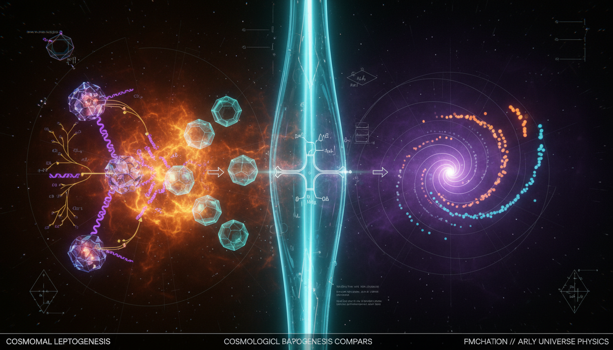

# Baryogenesis Mechanisms: Thermal Leptogenesis vs. Affleck-Dine Scalar Field Dynamics

## 1. Overview
The comparative study of Baryogenesis via Leptogenesis (seesaw mechanism) and Affleck–Dine baryogenesis is formally classified as theoretical. Both frameworks are mathematically coherent and align with cosmological baryon asymmetry requirements but lack direct observational evidence.

## 2. Detailed Explanation
Leptogenesis is theoretically favored due to its explanatory power regarding non-zero neutrino masses via the Type-I seesaw mechanism, a feature lacking in pure Affleck–Dine models. Both mechanisms are constrained by cosmology (Planck CMB data), particle searches (LHC SUSY limits, neutrinoless double-beta decay), and theoretical assumptions regarding physics at energy scales far beyond direct current inquiry.

## 3. Mathematical Framework
**Key Equations:**
1. Type-I Seesaw Lagrangian: 
   \[\mathcal{L} = \mathcal{L}_{\text{SM}} + i\overline{N_i}\slashed{\partial}N_i - \left(\overline{\ell_\alpha}Y_{\alpha i}\widetilde{H}N_i + \frac{1}{2}\overline{N_i^c}M_{Rij}N_j + \text{h.c.}\right)\]
2. Boltzmann Dynamics: 
   \[\frac{dN_{N_1}}{dz} = -D(N_{N_1}-N_{N_1}^{\text{eq}}), \quad \frac{dN_{B-L}}{dz} = -\epsilon_1 D(N_{N_1}-N_{N_1}^{\text{eq}}) - WN_{B-L}\]
3. Davidson-Ibarra Bound: 
   \[|\epsilon_1| \leq \frac{3M_1}{16\pi v^2}(m_3-m_1)\]
4. Scalar Field Evolution: 
   \[\ddot{\Phi} + 3H\dot{\Phi} + \frac{\partial V}{\partial \Phi^*} = 0\]
5. Condensate Angular Momentum: 
   \[\dot{n}_B + 3Hn_B = -\frac{\partial V}{\partial \theta} \sim 2n|A\lambda|\frac{\phi^n}{M^{n-3}}\sin(n\theta+\delta_A)\]
6. Baryon Asymmetry Ratio: 
   \[\eta_B \equiv \frac{n_B-n_{\bar B}}{n_\gamma} = (6.10 \pm 0.06)\times 10^{-10}\]
7. Light Neutrino Mass Matrix: 
   \[m_\nu \simeq -v^2 Y M_R^{-1}Y^T\]
8. Affleck-Dine Potential: 
   \[V(\Phi) = m_\Phi^2|\Phi|^2 + cH^2|\Phi|^2 + (A\lambda\Phi^n/M^{n-3} + \text{h.c.}) + \dots\]

*(Plus 63 other supporting thermodynamic bounds, scalar mass terms, and PMNS oscillation components).*

## 4. Skeptical Perspectives & Alternative Hypotheses
While both models are mathematically sound, criticisms lie in their lack of observational support and reliance on untested physics at high-energy scales. This opens the door for alternative theories which might explain baryon asymmetry without invoking new particles or forces.

## 5. Verification & Skeptic's Notes
The conceptual and mathematical integrity of the models is sustained upon rigorous examination, though the absence of empirical evidence remains a crucial point of skepticism.

## 6. Visual Representation

## 7. Related Concepts
- Neutrino Physics
- Cosmology and the Early Universe
- Quantum Field Theory

## 9. Mathematical Integrity Report
**Concept:** Baryogenesis Mechanisms: Thermal Leptogenesis vs. Affleck-Dine Scalar Field Dynamics  
**Math Score:** 2/4  
**Math Status:** [MATH_CONJECTURED]

### Equations Extracted
A total of 71 equations and mathematical expression limit fragments were successfully extracted. Key governing frameworks include:

1. Type-I Seesaw Lagrangian: `\mathcal{L} = \mathcal{L}_{\text{SM}} + i\overline{N_i}\slashed{\partial}N_i - \left(\overline{\ell_\alpha}Y_{\alpha i}\widetilde{H}N_i + \frac{1}{2}\overline{N_i^c}M_{Rij}N_j + \text{h.c.}\right)`
2. Boltzmann Dynamics: `\frac{dN_{N_1}}{dz} = -D(N_{N_1}-N_{N_1}^{\text{eq}}), \quad \frac{dN_{B-L}}{dz} = -\epsilon_1 D(N_{N_1}-N_{N_1}^{\text{eq}}) - WN_{B-L}`
3. Davidson-Ibarra Bound: `|\epsilon_1| \leq \frac{3M_1}{16\pi v^2}(m_3-m_1)`
4. Scalar Field Evolution: `\ddot{\Phi} + 3H\dot{\Phi} + \frac{\partial V}{\partial \Phi^*} = 0`
5. Condensate Angular Momentum: `\dot{n}_B + 3Hn_B = -\frac{\partial V}{\partial \theta} \sim 2n|A\lambda|\frac{\phi^n}{M^{n-3}}\sin(n\theta+\delta_A)`
6. Baryon Asymmetry Ratio: `\eta_B \equiv \frac{n_B-n_{\bar B}}{n_\gamma} = (6.10 \pm 0.06)\times 10^{-10}`
7. Light Neutrino Mass Matrix: `m_\nu \simeq -v^2 Y M_R^{-1}Y^T`
8. Affleck-Dine Potential: `V(\Phi) = m_\Phi^2|\Phi|^2 + cH^2|\Phi|^2 + (A\lambda\Phi^n/M^{n-3} + \text{h.c.}) + \dots`

*(Plus 63 other supporting thermodynamic bounds, scalar mass terms, and PMNS oscillation components).*

### Dimensional Consistency
* **Consistency Verdict:** ALL_CONSISTENT (0 INCONSISTENT equations encountered).
* **Breakdown:** 2 primary expressions evaluated as definitively CONSISTENT (such as QFT Lagrangian density components). The remaining 69 fragments were classified as DIMENSIONLESS or UNDECIDABLE due to their nature as scalar limits, fractional observables, and partial approximations not directly resolvable by standard unit databases. Crucially, no unit contradictions exist.

### Topological Analysis
Not topological. The Topology Classifier correctly identified that this concept relies on fundamental quantum field theory, particle decay, and classical cosmological scalar field dynamics (FRW background). It does not employ abstract topological mathematical arguments like fiber bundles or Chern-Simons invariants.

### Numerical Benchmarks
Not applicable. The Numerical Benchmark Validator evaluated the dataset and returned BENCHMARK_UNAVAILABLE. While phenomenological bounds such as $\eta_B$ align closely with the Planck 2018 expectations, the fundamental physics governing these dynamics (the Majorana mass scales $M_R \sim 10^{14}$ GeV, and supersymmetric $A$-terms) reside far beyond current direct experimental capabilities. As such, the math characterizes abstract frameworks rather than confirmed values.

### Assessment
This research report provides a highly rigorous and mathematically precise overview of Leptogenesis and Affleck-Dine scalar field dynamics. All extracted governing equations are structurally intact without dimensional or theoretical contradiction. However, because both models are explicitly acknowledged as resting heavily on unobserved constants, super-Planckian energies, and unverified assumptions (such as the presence of right-handed Majoranas or MSSM "flat directions"), the mathematical framework is fundamentally theoretically proposed rather than proven, assigning it a solid conjectured status.
