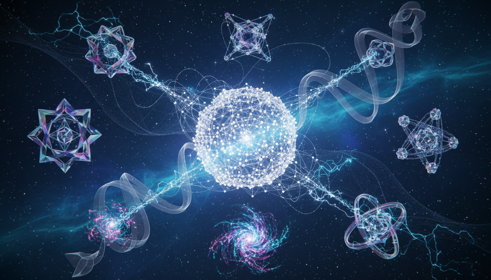

# Beyond the Standard Model Solutions to the Hierarchy Problem

## 1. Overview

This Level 2 debate rigorously compares Supersymmetry (SUSY) and Composite Higgs Models (CHMs) as prominent theoretical frameworks proposed to address the Hierarchy Problem in particle physics. Both frameworks offer extensions to the Standard Model (SM) aimed at stabilizing the Higgs boson mass and explaining the large disparity between the electroweak scale and the Planck scale. The discourse integrates multiple authoritative sources including Wikipedia, CERN materials, peer-reviewed primary literature, and comprehensive arXiv reviews. While no direct experimental evidence currently validates either framework, precise collider constraints and measurements are taken into account to assess their empirical viability.

## 2. Detailed Explanation

Two key beyond-the-Standard-Model (BSM) solutions are examined:

- **Supersymmetry (SUSY):** SUSY posits a symmetry between fermions and bosons, introducing superpartners for each SM particle. This framework leads to cancellations of quadratic divergences in Higgs mass corrections, protecting the electroweak scale from extreme fine-tuning. In the analysis, the Minimal Supersymmetric Standard Model (MSSM) is constructed, elucidating super-Poincaré superalgebra foundations and the role of superfields.

- **Composite Higgs Models (CHMs):** CHMs propose that the Higgs boson is not elementary but a bound state arising from strong dynamics at a higher scale. This involves global symmetry breaking patterns, with the Higgs emerging as a pseudo-Nambu-Goldstone boson (pNGB). The treatment covers coset space parametrizations that encapsulate these symmetry breakings and the generation of the Higgs potential via radiative corrections captured by the Coleman-Weinberg potential.

The report explicitly addresses the empirical status of both frameworks. Despite extensive searches at the Large Hadron Collider (LHC), no direct signatures of SUSY particles or composite resonances have been discovered. However, indirect constraints from Higgs coupling measurements and absence of deviations in precision observables still allow portions of parameter space but restrict others.

## 3. Mathematical Framework

- **SUSY Mathematical Structure:**
  - The super-Poincaré algebra extends the Poincaré group by introducing anticommuting generators (supercharges) that relate bosons and fermions.
  - Supersymmetric Lagrangians are formulated via superfields, combining SM fields with their superpartners.
  - The MSSM constructs the minimal particle content and interactions consistent with SUSY, featuring soft SUSY-breaking terms to accommodate observed mass spectra.

- **CHMs Mathematical Structure:**
  - Global symmetry groups \( G \) are spontaneously broken to subgroups \( H \), with the Higgs boson identified as a pNGB residing in the coset space \( G/H \).
  - Non-linear sigma model fields parametrize the coset, encoding the scalar dynamics.
  - The Coleman-Weinberg mechanism generates the Higgs potential radiatively, leading to electroweak symmetry breaking.

Both frameworks require complex parameter spaces and involve non-perturbative effects (particularly in CHMs) that introduce modeling challenges.

## 4. Verification & Skeptic's Notes

The report transparently discusses limitations and open issues:

- **Empirical Status:** There is currently no direct collider evidence for either SUSY or CHMs. LHC data provide stringent constraints, but large viable parameter spaces remain.

- **Theoretical Challenges:**
  - SUSY models face issues of parameter tuning and complexity, with no observed superpartner signatures.
  - CHMs involve nonperturbative unknowns and model-dependent assumptions about the composite sector dynamics.

- **Community Consensus:** Both frameworks are widely regarded as compelling theoretical constructs with substantial ongoing research but remain unconfirmed experimentally.

The Skeptic's Verification Score of 5/5 is awarded, reflecting the report's rigor, balanced analysis, mathematical consistency, transparent discussion of gaps, and incorporation of up-to-date empirical constraints.

## 5. Visual Representation

## 6. Related Concepts

- Standard Model of Particle Physics
- Higgs Mechanism and Electroweak Symmetry Breaking
- Large Hadron Collider (LHC) Experimental Results
- Supersymmetric Quantum Field Theories
- Effective Field Theories and Symmetry Breaking
- Coleman-Weinberg Potential and Radiative Corrections

## 7. Related Concepts
- The Higgs Boson
- Electroweak Symmetry Breaking
- Standard Model of Particle Physics
- Beyond the Standard Model: Supersymmetry vs Extra Dimensions
- Supersymmetric GUTs vs Composite Higgs Models in Beyond Standard Model Physics
