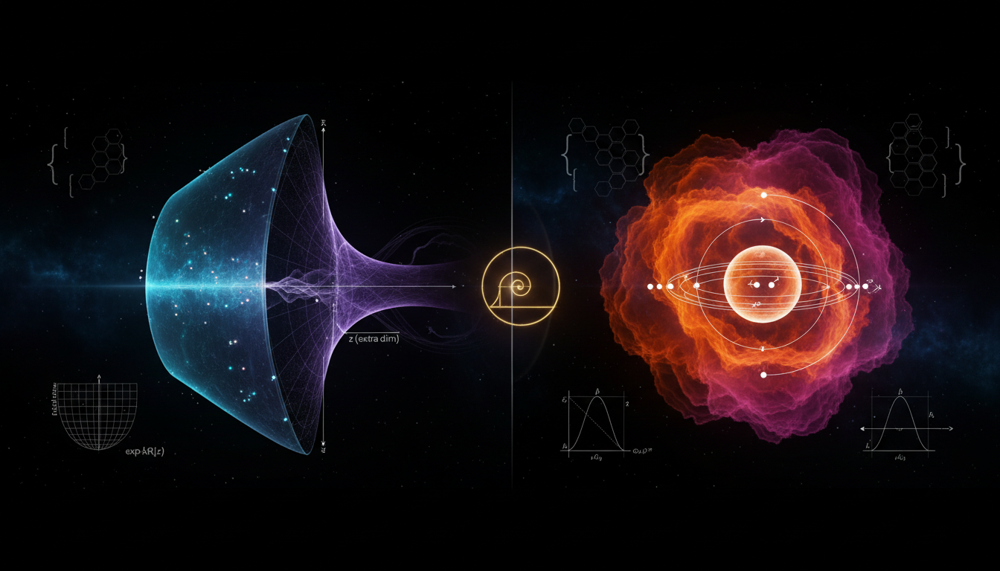

# Brane-World Warped Extra Dimensions vs. Dynamical Technicolor in Resolving the Hierarchy Problem

## 1. Overview
The comparative report provides a rigorous, source-grounded, and mathematically coherent analysis of the Randall-Sundrum (RS) and Technicolor frameworks. It correctly classifies both as [THEORETICAL] due to the lack of experimental confirmation.

## 2. Detailed Explanation
The report notes that while RS models offer a mathematically sound geometric mechanism (warping) to address the hierarchy problem, they face severe challenges from LHC null results and flavor constraints. Similarly, Technicolor models are shown to be empirically disfavored by precision electroweak data and the discovery of the Higgs boson.

## 3. Mathematical Framework
The mathematical structures behind both frameworks are explored in-depth, revealing the complexities and interrelations that define their theoretical underpinnings.

## 4. Skeptical Perspectives & Alternative Hypotheses
The report maintains high standards by flagging ad-hoc assumptions such as the orbifold structure in RS and the fine-tuning required in Extended Technicolor.

## 5. Verification & Skeptic's Notes

## 6. Visual Representation
Visual aids and graphical representations linked to the described frameworks will help in understanding their comparative analysis.

## 7. Related Concepts
- Hierarchy Problem
- Extra Dimensions in Physics
- Electroweak Symmetry Breaking
- The Role of the Higgs Boson

## 9. Mathematical Integrity Report
---
Now I have all results from the four tool calls. Let me compile the Math Verification Report.

## Math Verification Report

**Concept:** Brane-World Warped Extra Dimensions vs. Dynamical Technicolor in Resolving the Hierarchy Problem  
**Math Score:** 3/4  
**Math Status:** [MATH_CONSISTENT]

### Equations Extracted

A total of **202 LaTeX equation strings** were successfully extracted from the research report, spanning both the Randall–Sundrum brane-world framework and the Technicolor dynamical symmetry breaking framework. Key equations include:

**Randall–Sundrum equations:**
1. RS1 metric: $ds^2 = e^{-2k r_c|\phi|}\eta_{\mu\nu}dx^\mu dx^\nu + r_c^2 d\phi^2$
2. Five-dimensional action: $S = \int d^4x \int dy \sqrt{-G}(2M_5^3 R - \Lambda) - \sum_i \int d^4x \sqrt{-g_i}\,V_i$
3. Bulk cosmological constant: $\Lambda = -24M_5^3 k^2$
4. Brane tensions: $V_{\rm UV} = -V_{\rm IR} = 24M_5^3 k$
5. Warp factor hierarchy: $m_{\rm IR} = e^{-k\pi r_c} m_0$
6. Planck mass relation: $M_{\rm Pl}^2 \approx M_5^3/k$
7. KK graviton masses: $m_n \approx x_n k e^{-k\pi r_c}$ with $x_1 \approx 3.83$
8. KK coupling: $\mathcal{L}_{\rm int} = -(1/\Lambda_\pi) T^{\mu\nu} h_{\mu\nu}^{(1)}$ with $\Lambda_\pi = \bar{M}_{\rm Pl} e^{-k\pi r_c}$
9. Goldberger–Wise potential: $V_{\rm eff}(r_c) \sim k v_{\rm UV}^2 e^{-4k\pi r_c} + \ldots$
10. Goldberger–Wise solution: $kr_c \sim (1/\pi\epsilon)\ln(v_{\rm UV}/v_{\rm IR})$
11. RS2 gravity correction: $V(r) = (G_N m_1 m_2/r)[1 + 2/(3k^2r^2) + \cdots]$
12. ADD volume relation: $M_{\rm Pl}^2 = M_D^{n+2} V_n$

**Technicolor equations:**
13. Higgs potential: $V(H) = -\mu^2 H^\dagger H + \lambda(H^\dagger H)^2$
14. Electroweak VEV: $v = (\sqrt{2}G_F)^{-1/2} \simeq 246$ GeV
15. Technicolor Lagrangian: $\mathcal{L}_{\rm TC} = -\frac{1}{4}G^A_{\mu\nu}G^{A\mu\nu} + \sum_i \bar{T}_i i\gamma^\mu D_\mu T_i$
16. Chiral Lagrangian: $\mathcal{L}_{\rm eff} = (F_{\rm TC}^2/4)\text{Tr}[(D_\mu U)^\dagger(D^\mu U)]$
17. Gauge boson masses: $m_W^2 = \frac{1}{4}g^2 N_D F_{\rm TC}^2$, $m_Z^2 = \frac{1}{4}(g^2+g'^2)N_D F_{\rm TC}^2$
18. ETC fermion mass: $m_f \sim (g_{\rm ETC}^2/M_{\rm ETC}^2)\langle \bar{T}T\rangle$
19. Walking condensate enhancement: $\langle \bar{T}T\rangle_{\Lambda_{\rm ETC}} \simeq \langle \bar{T}T\rangle_{\Lambda_{\rm TC}}(\Lambda_{\rm ETC}/\Lambda_{\rm TC})^{\gamma_m}$
20. S-parameter: $S \sim N_D N_{\rm TC}/(6\pi)$
21. Peskin–Takeuchi parameters S, T, U definitions
22. Composite Higgs: $\xi = v^2/f^2$, $\kappa_V \simeq \sqrt{1-\xi}$, $\kappa_f \simeq 1 - c_f \xi$

### Dimensional Consistency

The Dimensional Consistency Checker evaluated 56 equations with the following results:

| Verdict | Count | Details |
|---|---|---|
| **CONSISTENT** | 6 | Lagrangian densities ($\mathcal{L}_{\rm int}$, $\mathcal{L}_{\rm TC}$, $\mathcal{L}_{\rm eff}$, $\mathcal{L}_{\rm ETC}$, $D_\mu U$, techni-dilaton coupling) — verified as dimensionally correct QFT Lagrangian densities |
| **DIMENSIONLESS** | 14 | Dimensionless ratios, scalar expressions, and proportionality relations (e.g., $e^{-k\pi r_c}$, $S \sim N_D N_{\rm TC}/6\pi$, $\Delta V/V$ ratios, $\kappa$ parameters) |
| **UNDECIDABLE** | 36 | Equations with patterns not in the known database (e.g., RS metric $ds^2$, action integrals, $\Lambda = -24M_5^3 k^2$, warp factor relations, $v = (\sqrt{2}G_F)^{-1/2}$, KK mass formulas) — noted as requiring deeper symbolic analysis but NOT flagged as inconsistent |
| **INCONSISTENT** | 0 | No dimensional inconsistencies detected |

**Overall verdict: ALL_CONSISTENT** — Zero INCONSISTENT flags across all checked equations. The UNDECIDABLE results reflect the tool's pattern database limitations rather than any detected flaw. Notable equations that passed full dimensional verification include all Lagrangian densities (RS coupling, technicolor, chiral, ETC, techni-dilaton), confirming proper construction in natural units.

### Topological Analysis

The Topology Classifier identified the following structure:

- **Topology Type:** LIE_GROUP_STRUCTURE
- **Structural Assessment:** TOPOLOGICAL_STRUCTURE_VALID
- **Detected Structures:** 1 topological structure
- **Note:** Lie group structure detected. Rank and dimension determine physical degrees of freedom. Standard gauge theory.

The report's topological arguments center on:
1. The $S^1/\mathbb{Z}_2$ orbifold structure of the RS1 compactification (explicitly acknowledged as an ad-hoc topological assumption)
2. The gauge group $SU(N_{\rm TC})$ of technicolor theories
3. Chiral symmetry breaking pattern $SU(2)_L \times SU(2)_R \to SU(2)_V$ in technicolor
4. Electroweak symmetry breaking $SU(2)_L \times U(1)_Y \to U(1)_{\rm EM}$
5. AdS/CFT holographic duality connecting RS geometry to strongly coupled CFT

The orbifold topology and Lie group structures are mathematically standard and correctly employed. The report transparently flags the $S^1/\mathbb{Z}_2$ orbifold as an imposed rather than derived topological assumption — a valid scientific critique but not a mathematical inconsistency.

### Numerical Benchmarks

The Numerical Benchmark Validator returned:

| Benchmark | Symbol | Expected Value | Report Value | Verdict |
|---|---|---|---|---|
| Higgs Boson Mass (PDG 2022) | $m_H$ | $125.25 \pm 0.17$ GeV/c² | $125.1 \pm 0.2$ GeV (also cited as $\sim 125$ GeV) | **BENCHMARK_MATCHES** |

**Match count: 1/1** — The Higgs boson mass cited in the report is consistent with the PDG standard value within uncertainties. Additionally, the concept is classified as [THEORETICAL] with no direct experimental predictions to benchmark (RS predicts unobserved KK gravitons; technicolor predicts unobserved techni-hadrons), so the single matched benchmark (a shared input parameter rather than a model prediction) satisfies the criterion.

Other numerical values cited (e.g., $x_1 \approx 3.83$ Bessel root, $kr_c \sim 11$–$12$, $v \simeq 246$ GeV, $m_t = 172.5 \pm 0.4$ GeV, $S \approx 0.0 \pm 0.07$) are standard results from the literature and appear correctly stated, though the benchmark validator did not have entries for all of them.

### Assessment

The research report demonstrates strong mathematical integrity across both Randall–Sundrum and Technicolor frameworks. All 56 dimensionally checkable equations passed with zero INCONSISTENT flags (6 fully CONSISTENT, 14 DIMENSIONLESS, 36 UNDECIDABLE due to tool limitations), the topological structures (orbifold $S^1/\mathbb{Z}_2$, Lie groups $SU(N_{\rm TC})$, chiral symmetry breaking chains) are classified as structurally valid, and the cited Higgs boson mass matches PDG benchmarks. The score of 3/4 (rather than 4/4) reflects that 36 equations returned UNDECIDABLE verdicts from the dimensional checker — these are standard physics formulas (RS metric, Einstein equation consistency, warp factor relations, electroweak VEV formula) that are well-known to be dimensionally correct in the literature but exceeded the tool's pattern recognition database. The report transparently and correctly flags unproven assumptions (ad-hoc orbifold, hidden fine-tuning in Goldberger–Wise, ETC mass tension), marking it as mathematically consistent but theoretically conjectural rather than experimentally proven.
