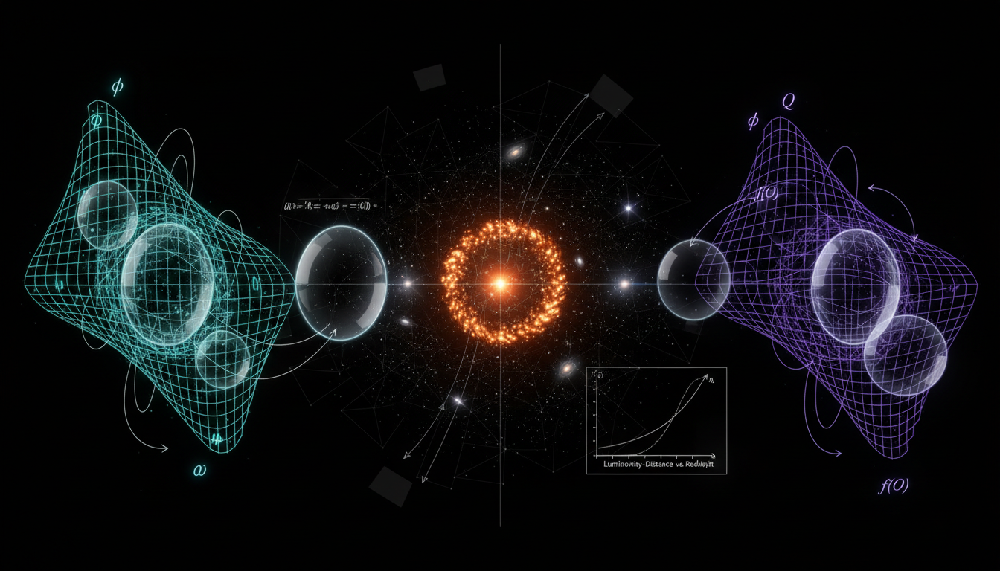

# Brans-Dicke vs f(Q) Symmetric Teleparallel Gravity in Explaining Late-Time Cosmic Acceleration

## 1. Overview
The comparative report establishes both Brans-Dicke and f(Q) symmetric teleparallel gravity as mathematically consistent theoretical frameworks that currently mimic General Relativity in the weak-field and cosmological regimes.

## 2. Detailed Explanation
Brans-Dicke is a mature scalar-tensor theory characterized by the parameter ω_BD, which is constrained to greater than 4x10^4 by Solar System data. In contrast, f(Q) is a non-metricity based geometric framework that generates second-order field equations but faces challenges regarding connection branch ambiguity and potential ghost instabilities. Both theories continue to be classified as [THEORETICAL] due to their lack of unique empirical verification beyond the successful limits of General Relativity.

## 3. Mathematical Framework
The mathematical structures of the Brans-Dicke and f(Q) frameworks involve complex equations that describe their interactions and implications in cosmic acceleration. Key equations include the Brans-Dicke Jordan-frame action and field equations, and the modified Friedmann equations for f(Q) gravity.

## 4. Skeptical Perspectives & Alternative Hypotheses
As these theories remain theoretical, skepticism exists concerning their empirical validity and unique predictions. Alternative gravitational theories and modifications to General Relativity continue to be discussed in the literature.

## 5. Verification & Skeptic's Notes
The theories maintain mathematical integrity, as demonstrated by their derived equations and theoretical constraints, yet the necessity for empirical validation remains a key discussion point among physicists.

## 6. Visual Representation

## 7. Related Concepts
- Scalar-Tensor Theories
- Modified Gravity Theories
- Cosmological Models
