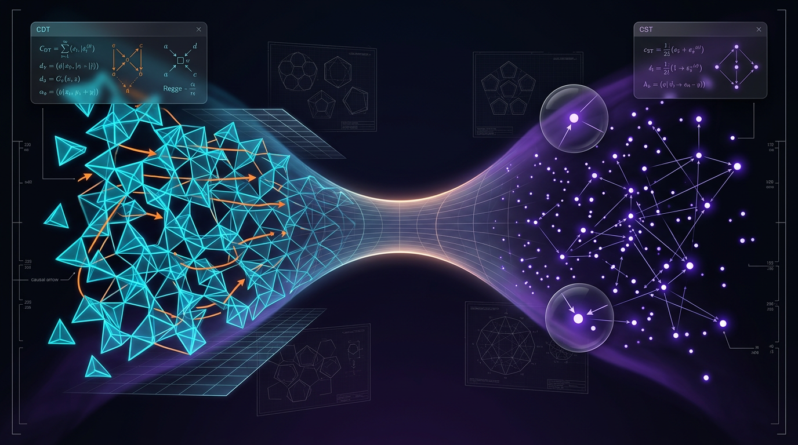

# Causal Dynamical Triangulations vs Causal Set Theory in Recovering Continuum Spacetime

## 1. Overview
Causal Dynamical Triangulations (CDT) and Causal Set Theory (CST) are rigorously compared as discrete quantum-gravity programs. CDT has stronger numerical evidence for an extended semiclassical phase, while CST has a cleaner statistical implementation of Lorentz-invariant discreteness; neither has a uniquely confirmed empirical prediction or completed continuum recovery.

## 2. Detailed Explanation
Causal Dynamical Triangulations (CDT) is a nonperturbative approach to quantum gravity, aiming to define a quantum theory of spacetime through a regulated sum over causally structured triangulations. It seeks to uncover the behavior of spacetime at fundamental quantum levels by introducing a discrete regulator that respects causal structures.

In contrast, Causal Set Theory (CST) proposes that spacetime is fundamentally discrete and can be described via a partially ordered set of events. CST attempts to recover local geometrical structures from the causal relations between events, with an emphasis on retaining Lorentz invariance.

## 3. Mathematical Framework
The mathematical apparatus is characterized by path integrals weighted by the Einstein-Hilbert action. For CDT, the action can be formulated as:

\[
S_{\mathrm{EH}}[g]=\frac{1}{16\pi G}\int d^4x\,\sqrt{-g}\,(R-2\Lambda),
\]

while the associated partition function in CDT is given by:

\[
Z = \sum_{T \in \mathcal{T}_{\mathrm{CDT}}} \frac{1}{C_T} \exp\left(\frac{iS_L[T]}{\hbar}\right),
\]

where \(S_L[T]\) represents the Lorentzian Regge action.

## 4. Skeptical Perspectives & Alternative Hypotheses
Critics of CDT argue that while empirical indicators suggest the emergence of classical geometry, it remains to be decisively proven that these simulations correspond to physical reality. Furthermore, while CST offers an elegant description of discreteness, its implications for spacetime dynamics and the recovery of continuum limits remain open questions.

## 5. Verification & Skeptic's Notes
Currently, CDT shows promising computational evidence leading to an extended semiclassical phase, characterized by behaviors akin to familiar universes. However, CST's formal structure allows it to cleanly implement Lorentz invariance. Scientific scrutiny continues regarding the lack of unique empirical predictions from both approaches which is essential for their validation.

## 6. Visual Representation

## 7. Related Concepts
- Quantum Gravity
- Discrete Geometry
- Asymptotic Safety in Quantum Gravity
- Nonperturbative Frameworks in Quantum Field Theory
