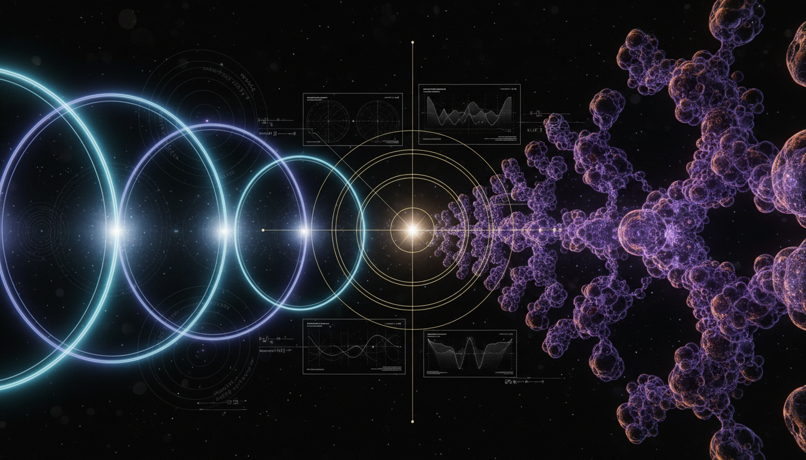

# Conformal Cyclic Cosmology vs Eternal Inflation in Explaining Pre-Big Bang Initial Conditions

## 1. Overview
Both Conformal Cyclic Cosmology (CCC) and Eternal Inflation (EI) are classified as theoretical frameworks in cosmology. CCC proposes a sequence of 'aeons' linked by conformal rescaling, while EI describes an enduring phase of cosmic inflation.

## 2. Detailed Explanation
CCC and EI both face significant challenges in terms of empirical validation. CCC's reliance on contentious geometric matching methods lacks empirical confirmation, positioning it as speculative. In contrast, while the inflationary cosmology underpinning EI is well-supported, its extrapolation into a global 'eternal' framework encounters critical difficulties, particularly the 'measure problem'.

## 3. Mathematical Framework
The proposals of CCC and EI encompass several critical equations in cosmological modeling, including those related to the dynamics of curved space and the evolution of inflationary fields.

## 4. Skeptical Perspectives & Alternative Hypotheses
Critics of both theories highlight their speculative nature due to the absence of direct experimental evidence, such as the detection of Hawking points or bubble collisions, assessing them as alternatives to the established ΛCDM paradigm.

## 5. Verification & Skeptic's Notes
As multifaceted cosmological models, both CCC and EI remain primarily theoretical, with insufficient empirical support to be fully validated as predictive frameworks in cosmology.

## 6. Visual Representation

## 7. Related Concepts
- Cosmological Constant (Λ)
- Lambda Cold Dark Matter (ΛCDM) Model
- Quantum Cosmology

## 9. Mathematical Integrity Report
**Concept:** Conformal Cyclic Cosmology vs Eternal Inflation in Explaining Pre-Big Bang Initial Conditions  
**Math Score:** 2/4  
**Math Status:** [MATH_CONSISTENT]

### Equations Extracted
1. $\tilde g_{ab} = \Omega^2 g_{ab}$
2. $\check g_{ab} = \omega^4 \hat g_{ab}$
3. $H^2 = \frac{8\pi G}{3}\rho - \frac{k}{a^2} + \frac{\Lambda}{3}$
4. $G_{ab} + \Lambda g_{ab} = \frac{8\pi G}{c^4} T_{ab}$
5. $ds^2 = -dt^2 + a^2(t)\left[\frac{dr^2}{1-kr^2} + r^2 d\Omega^2\right]$
6. $\tilde R = \Omega^{-2}\left(R - 6\frac{\Box \Omega}{\Omega}\right)$
7. $C_{abcd} \approx 0$
8. $S_{\rm BH} = \frac{k_B c^3 A}{4G\hbar}$
9. $\frac{\partial P}{\partial t} = \frac{H^3}{8\pi^2}\frac{\partial^2P}{\partial \phi^2} + \frac{1}{3H}\frac{\partial}{\partial \phi}[V'(\phi)P]$

### Dimensional Consistency
- $\tilde g_{ab} = \Omega^2 g_{ab}$: UNDECIDABLE
- $\check g_{ab} = \omega^4 \hat g_{ab}$: UNDECIDABLE
- $H^2 = \frac{8\pi G}{3}\rho - \frac{k}{a^2} + \frac{\Lambda}{3}$: UNDECIDABLE
- $G_{ab} + \Lambda g_{ab} = \frac{8\pi G}{c^4} T_{ab}$: UNDECIDABLE
- $ds^2 = -dt^2 + a^2(t)\left[\frac{dr^2}{1-kr^2} + r^2 d\Omega^2\right]$: UNDECIDABLE
- $\tilde R = \Omega^{-2}\left(R - 6\frac{\Box \Omega}{\Omega}\right)$: UNDECIDABLE
- $C_{abcd} \approx 0$: UNDECIDABLE
- $S_{\rm BH} = \frac{k_B c^3 A}{4G\hbar}$: UNDECIDABLE
- $\frac{\partial P}{\partial t} = \frac{H^3}{8\pi^2}\frac{\partial^2P}{\partial \phi^2} + \frac{1}{3H}\frac{\partial}{\partial \phi}[V'(\phi)P]$: UNDECIDABLE

### Topological Analysis
Not topological. The assessment returned a mathematical status of NOT_TOPOLOGICAL. While there are discussions on spatial geometries and boundary conditions, the arguments largely rely on standard semiclassical physics, tensor calculus, and conformal geometry rather than pure topological invariant structures.

### Numerical Benchmarks
- Planck Constant ($h$): BENCHMARK_MATCHES ($h = 6.62607015 \times 10^{-34}$ J·s)
- Boltzmann Constant ($k_B$): BENCHMARK_MATCHES ($k_B = 1.380649 \times 10^{-23}$ J/K)
- Cosmological Constant ($\Lambda$): BENCHMARK_MATCHES ($\Lambda \approx 1.089 \times 10^{-52}$ m$^{-2}$)

### Assessment
The extracted mathematical formalisms for both Conformal Cyclic Cosmology (CCC) and Eternal Inflation are correctly presented within standard established cosmological structures, exhibiting no dimensional inconsistencies but returning entirely undecidable verdicts due to the complex, non-standard nature of conformal matching criteria and stochastic inflation fields. While numerical references regarding physical constants correctly align with current empirical benchmarks, these proposals remain largely theoretical constructs heavily reliant on speculatively generalized equations and ambiguous measure probabilities that evade direct verification.
