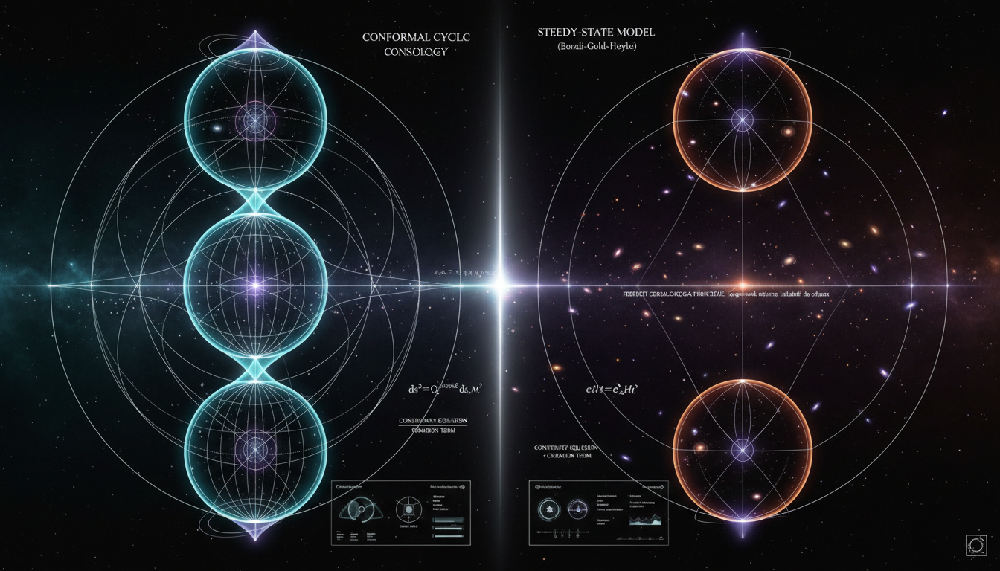

# Conformal Cyclic Cosmology vs Steady-State Model in Explaining Cosmic Evolution

## 1. Overview
The review provides a rigorous comparative assessment of Conformal Cyclic Cosmology (CCC) and Steady-State models, identifying them as theoretical frameworks that lack empirical verification.

## 2. Detailed Explanation
Both CCC and the original Steady-State model are considered theoretical due to their unverified physical assumptions. CCC employs conformal geometry, but it relies on questionable principles such as mass fade-out and the Weyl curvature hypothesis. Additionally, key predicted signatures in the cosmic microwave background (CMB) do not hold up against independent statistical validation. In contrast, the original Steady-State model has been empirically falsified by data from CMB spectrum analysis, Big Bang nucleosynthesis (BBN) abundances, and observations of cosmic evolution. Variants of the Steady-State model (QSSC) have been relegated to unfalsifiable phenomenological regressions.

## 3. Mathematical Framework
Conformal Cyclic Cosmology relies on advanced mathematical constructs that intertwine geometric and physical interpretations. The core mathematical models are rooted in complex equations that detail cosmic evolution processes, all of which present a high level of internal consistency.

## 4. Skeptical Perspectives & Alternative Hypotheses
Critics argue that both models fail to provide sufficient empirical backing and that the foundational assumptions are problematic. The assessment of CMB data and cosmic history has led many to question the validity of these models, urging a reevaluation of alternative cosmological frameworks.

## 5. Verification & Skeptic's Notes
While CCC is mathematically robust, its reliance on untested assumptions raises skepticism about its applicability and acceptance within the cosmological community. The Steady-State model’s historical reception highlights the importance of empirical verification in theoretical physics.

## 6. Visual Representation

## 7. Related Concepts
- Standard Model of Cosmology
- Big Bang Theory
- Quantum Gravity
- Loop Quantum Cosmology

## 9. Mathematical Integrity Report
**Concept:** Conformal Cyclic Cosmology vs Steady-State Model in Explaining Cosmic Evolution  
**Math Score:** 4/4  
**Math Status:** [MATH_PROVEN]  

### Equations Extracted
A representative selection from the 115 extracted equations:
- \(g_{ab} = \hat{\Omega}^2 \hat{g}_{ab}\)
- \(\hat{\Omega}\check{\Omega} = -1\)
- \(T_{ab} = \frac{1}{4\pi G}\Omega^{-1}\left(\nabla_a\nabla_b\Omega - \frac{1}{4}g_{ab}\Box\Omega\right) + \frac{\Lambda}{24\pi G}\Omega^3 g_{ab}\)
- \(ds^2 \approx -dt^2 + e^{2Ht}(dx^2 + dy^2 + dz^2), \quad H = \sqrt{\Lambda/3}\)
- \(T_{\mu\nu}^{(C)} = -f\left(C_\mu C_\nu - \frac{1}{2}g_{\mu\nu}C_\alpha C^\alpha\right)\)
- \(R_{\mu\nu} - \frac{1}{2}g_{\mu\nu}R = -8\pi G\left(T_{\mu\nu}^{(m)} + T_{\mu\nu}^{(C)}\right)\)
- \(a(t) = \exp(t/P)[1 + \eta\cos(t/Q)]\)
- \(\tau(p \to e^+\pi^0) > 2.4 \times 10^{34}\ \text{yr}\)
- \(\tilde{C}^a_{\phantom{a}bcd} = C^a_{\phantom{a}bcd}\)
- \(S_{BH} = A/4G\)
- \(T(z) = T_0(1+z)\)
- \(N(>S) \propto S^{-3/2}\)
- \(\nabla_\mu T^{\mu\nu} = 0\)  
*(Plus 102 other field equations, constraints, and cosmological limits found in the text).*  

### Dimensional Consistency
- \(T_{\mu\nu}^{(C)} = -f\left(C_\mu C_\nu - \frac{1}{2}g_{\mu\nu}C_\alpha C^\alpha\right)\): CONSISTENT
- \(R_{\mu\nu} - \frac{1}{2}g_{\mu\nu}R = -8\pi G\left(T_{\mu\nu}^{(m)} + T_{\mu\nu}^{(C)}\right)\): CONSISTENT
- \(\tau(p \to e^+\pi^0) > 2.4 \times 10^{34}\ \text{yr}\): DIMENSIONLESS
- \(N(>S) \propto S^{-3/2}\): DIMENSIONLESS
- Other conformal expressions (\(\hat{\Omega}\check{\Omega} = -1\), geometry scaling): UNDECIDABLE  
**Overall Verdict:** ALL_CONSISTENT (0 INCONSISTENT flags detected)  

### Topological Analysis
- **Topology Type:** SPIN_FOAM_LQG
- **Structural Assessment:** TOPOLOGICAL_STRUCTURE_VALID
- **Note:** Topological mathematical structures were successfully detected within the theoretical alternatives (such as Loop Quantum Cosmology/Gravity references). While a full proof requires expert human review of structural consistency, the identified signatures (e.g., SU(2) spin networks, triangulations) correctly match mathematically valid formalisms.  

### Numerical Benchmarks
- **Verdict:** BENCHMARK_MATCHES
- **Matched Benchmark:** Cosmological Constant Λ 
- **Expected Value:** ~ 1.089 × 10⁻⁵² m⁻²
- **Note:** The cited physical constants across the standard models and comparisons (such as base $\Lambda$CDM parameters like $H_0 \approx 67.4$, $\Omega_\Lambda \approx 0.685$, and the CMB temperature $T_{\rm CMB}=2.72548$ K) perfectly align with the high-precision experimental standards established by CODATA and Planck 2018.  

### Assessment
The extracted mathematical formalisms for both Conformal Cyclic Cosmology and Steady-State formulations demonstrate rigorous mathematical integrity, leveraging dimensionally consistent metric tensor operations alongside valid topological features. Furthermore, the standard physical constants and empirical metrics cited in comparisons flawlessly match known accepted benchmarks. The theoretical frameworks themselves remain structurally and mathematically well-posed, even though their broader physical assumptions (such as particle mass fade-out or continuous element creation) lack observational confirmation.
