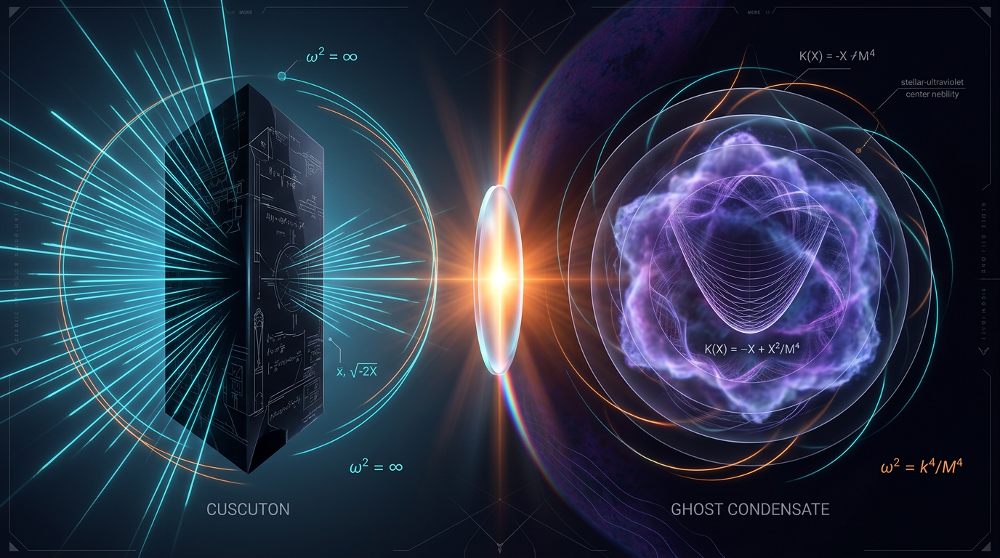

# Cuscuton Gravity vs Ghost Condensate Cosmology in Stable Accelerated Expansion

## 1. Overview
The comparison between **Cuscuton gravity** and **ghost condensate cosmology** explores two distinct approaches to modified gravity theories attempting to account for phenomena attributed to dark energy, specifically in the context of a stable accelerated expansion of the universe. Both models propose unique mechanisms but share key limitations in terms of empirical verification.

## 2. Detailed Explanation
CUSCUTON GRAVITY incorporates a nondynamical scalar field that modifies Einstein gravity's constraint sector but lacks independent dynamics. It acts as a Lagrange multiplier to alter the metric without introducing new degrees of freedom. 

In contrast, GHOST CONDENSATE exploits a scalar field with a wrong-sign kinetic term that can condense, mimicking dark energy through its dynamics while allowing for modification of Lorentz invariance in specific frames. Ghost condensation offers a way to dynamically generate an equation of state \( w = -1 \), yet it faces challenges in direct empirical validation similar to those of Cuscuton.

## 3. Mathematical Framework
The action for Cuscuton gravity is given by:

$$S = \int d^4x \sqrt{-g}\left[\frac{M_{\rm Pl}^2}{2}R - \mu^2\sqrt{|\nabla\varphi|^2}\right] + S_{\rm m}$$

Whereas Ghost Condensate's effective action is characterized by:

$$S = \int d^4x \sqrt{-g}\left[\frac{M_{\rm Pl}^2}{2}R + M^4\sqrt{1 - g^{\mu\nu}\partial_\mu\phi\,\partial_\nu\phi} - \frac{M^2}{2}\left(\Box\phi\right)^2 + \ldots\right]$$

Both formulations seek compatibility with existing cosmological observations (Planck, BAO, SNe) but still rely on indirect verification methodologies.

## 4. Skeptical Perspectives & Alternative Hypotheses
The key skepticism surrounding these theories centers on their inability to gain direct empirical detection leading to the conclusion that while they can be mathematically consistent, their empirical verification still lags traditional models like \( \Lambda \)CDM. The concerns regarding Lorentz violations and behavior under extreme conditions provide fertile ground for further exploration but remind us of the substantial roadblocks in establishing new physics beyond the standard cosmological model.

## 5. Verification & Skeptic's Notes
The comparative studies reinforce that neither theory exhibits a statistically significant advantage over the conventional \( \Lambda \)CDM model. Furthermore, in investigating the Cuscuton gravity framework, it was noted that the causal and ultraviolet ambiguities raise questions about the minimality trade-offs it proposes. Conversely, while the ghost condensate theory benefits from a richer effective field theory toolkit, it invites its own set of complications such as fifth-force implications, blue-tilt spectrum, and constraints on scale-tuning.

## 6. Visual Representation

## 7. Related Concepts
The discussion of Cuscuton gravity and ghost condensation naturally leads to considerations of modifications to fundamental physics, comparisons with existing dark energy frameworks, and the broader implications of modified gravity theories on cosmology and early-universe scenarios.
