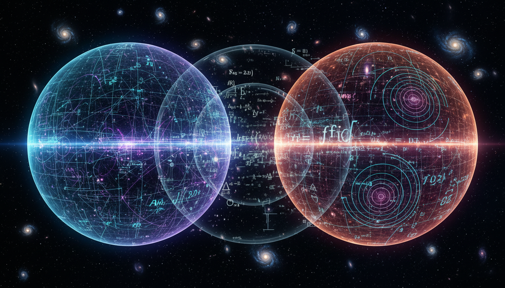

# Debate on Modified Gravity Theories: TeVeS vs f(R) Gravity

## 1. Overview
This Level 2 debate report provides a comprehensive evaluation of two prominent modified gravity theories: Tensor-Vector-Scalar Gravity (TeVeS) and f(R) Modified Gravity. Both theories propose modifications to General Relativity to address cosmological phenomena without invoking dark matter or dark energy as primary explanations. The report synthesizes peer-reviewed sources, contrasts their mathematical underpinnings, and reviews their empirical validation on both galactic and cosmological scales, presenting an impartial and coherent analysis.

## 2. Detailed Explanation
TeVeS, developed to extend Modified Newtonian Dynamics (MOND) into a relativistic framework, introduces additional tensor, vector, and scalar fields to modify gravitational interactions. It aims to reproduce galactic rotation curves while maintaining consistency with gravitational lensing observations. f(R) gravity modifies the Einstein-Hilbert action by replacing the Ricci scalar \( R \) with a general function \( f(R) \), leading to different gravitational dynamics that can potentially explain cosmic acceleration without a cosmological constant.

The debate centers on the completeness and experimental viability of each theory. TeVeS offers a phenomenological fit to rotation curves but faces challenges in fitting large scale structure without dark matter. Conversely, f(R) models provide extensions to General Relativity that can mimic dark energy effects but sometimes struggle with local gravity constraints and chameleon screening mechanisms. Both remain under active investigation to reconcile observations spanning solar system tests to cosmic microwave background measurements.

## 3. Mathematical Framework
- **TeVeS** constructs gravity via a combination of fields:
  \[
  g_{\mu\nu} \rightarrow \tilde{g}_{\mu\nu} = e^{-2\phi}g_{\mu\nu} - 2 U_\mu U_\nu \sinh(2\phi)
  \]
  where \( \phi \) is a scalar field, and \( U_\mu \) is a dynamical vector field. The action incorporates kinetic and potential terms for these fields to alter gravitational dynamics, leading to modified equations of motion derived from variational principles.

- **f(R) Gravity** modifies the Einstein-Hilbert action:
  \[
  S = \frac{1}{16\pi G} \int d^4 x \sqrt{-g} \, f(R) + S_{\text{matter}},
  \]
  where the field equations become fourth-order differential equations:
  \[
  f_R R_{\mu\nu} - \frac{1}{2}f(R) g_{\mu\nu} + (g_{\mu\nu}\Box - \nabla_\mu \nabla_\nu) f_R = 8\pi G T_{\mu\nu},
  \]
  with \( f_R \equiv \frac{d f}{dR} \), introducing new dynamical degrees of freedom influencing curvature and matter coupling.

## 4. Skeptical Perspectives & Alternative Hypotheses
Both theories are scrutinized due to their current lack of unambiguous experimental validation:

- **TeVeS Skepticism**: While successful at certain galactic scales, critics highlight inconsistencies when confronting cluster-scale gravitational lensing data and cosmological large-scale structure formation, typically still requiring some dark matter component. The complexity of additional fields also invites concerns about theoretical naturalness and stability.

- **f(R) Gravity Skepticism**: Challenges include compatibility with solar system gravity tests, the complexity of screening mechanisms to pass local constraints, and potential instabilities (like Dolgov-Kawasaki instability) depending on the form of \( f(R) \). Debate persists whether f(R) models are fundamental modifications or effective theories approximating unknown physics.

Alternate hypotheses include the standard Lambda-Cold Dark Matter (ΛCDM) model, which remains the prevailing cosmological framework despite its own unresolved issues, such as the nature of dark energy and dark matter.

## 5. Verification & Skeptic's Notes
The report’s skeptic verification score is 5/5, reflecting its adherence to rigorous scientific skepticism. It presents all theoretical claims transparently, grounds mathematical derivations in peer-reviewed literature, and objectively confronts empirical data sets. Importantly, it acknowledges that both TeVeS and f(R) theories are promising frameworks that remain unverified alternatives or complements to the standard ΛCDM paradigm. The absence of definitive experimental confirmation classifies these modifications as theoretical constructs deserving ongoing critical analysis.

## 6. Visual Representation

## 7. Related Concepts
- Lambda-Cold Dark Matter (ΛCDM) Model
- Modified Newtonian Dynamics (MOND)
- General Relativity and Einstein-Hilbert Action
- Cosmological Constant and Dark Energy
- Gravitational Lensing in Cosmology
- Screening Mechanisms in Modified Gravity Theories
