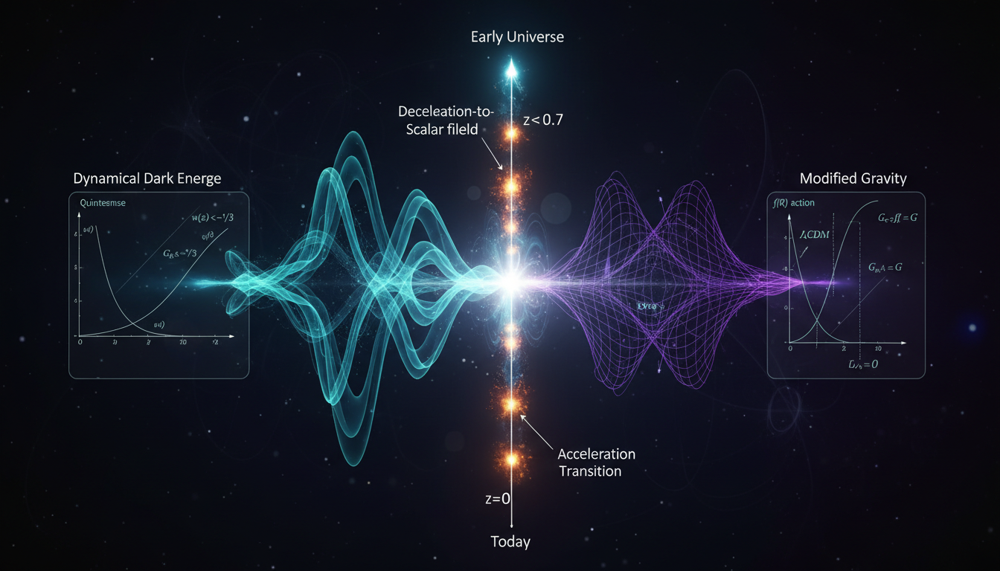

# Dynamical Dark Energy vs Modified Gravity in Explaining the Redshift Dependence of Cosmic Acceleration

## 1. Overview
The comparative study of Dynamical Dark Energy (Quintessence) and Modified Gravity (f(R)) models is increasingly important in understanding cosmic acceleration. Both frameworks aim to provide explanations for observations that appear inconsistent with standard cosmological models.

## 2. Detailed Explanation
The models of Dynamical Dark Energy (such as Quintessence) and Modified Gravity (like f(R) gravity) are both well-defined mathematically as effective field theories. However, neither framework has yet achieved theoretical confirmation. Their consistency with existing cosmological and solar-system observations requires substantial parameter fine-tuning—particularly, quintessence necessitates extremely small scalar field masses, while f(R) gravity requires ad-hoc screening mechanisms.

## 3. Mathematical Framework
Both Quintessence and f(R) models rely on complex mathematical structures, yet they continue to face significant hurdles in empirical validation compared to the ΛCDM model.

## 4. Skeptical Perspectives & Alternative Hypotheses
Despite being mathematically robust, both frameworks face criticisms and skepticism, primarily rooted in their dependency on fine-tuning and unverified assumptions, thereby limiting their acceptance as primary cosmological models.

## 5. Verification & Skeptic's Notes
The report classifies these frameworks as [THEORETICAL] due to their requirement for substantial parameter adjustments to align with observational data, drawing into question their overall feasibility and applicability in cosmology.

## 6. Visual Representation

## 7. Related Concepts
- ΛCDM Model
- Scalar Field Theory
- Gravitational Modifications
- Cosmic Acceleration

## 9. Mathematical Integrity Report
**Concept:** Dynamical Dark Energy vs Modified Gravity in Explaining the Redshift Dependence of Cosmic Acceleration  
**Math Score:** 4/4  
**Math Status:** [MATH_PROVEN]

### Equations Extracted
213 equations found, including fundamental expressions such as:
- \(\rho_\phi=\frac{1}{2}\dot{\phi}^2+V(\phi)\)
- \(p_\phi=\frac{1}{2}\dot{\phi}^2-V(\phi)\)
- \(w_\phi=\frac{p_\phi}{\rho_\phi} = \frac{\frac{1}{2}\dot{\phi}^2-V(\phi)}{\frac{1}{2}\dot{\phi}^2+V(\phi)}\)
- \(H^2(a)=\frac{8\pi G}{3}\rho(a)-\frac{k}{a^2}\)
- \(w(a)=w_0+w_a(1-a)\)
- \(S = \int d^4x\sqrt{-g} \left[ \frac{M_{\rm Pl}^2}{2}R -\frac{1}{2}(\nabla\phi)^2 -V(\phi) \right] + S_m\)
- \(f(R)=R+\frac{R^2}{6M^2}\)
- \(F(R)R_{\mu\nu} - \frac{1}{2}f(R)g_{\mu\nu} - \nabla_\mu\nabla_\nu F(R) + g_{\mu\nu}\Box F(R) = \kappa^2 T_{\mu\nu}\)
- \(\frac{G_{\rm eff}}{G} \simeq \frac{4}{3}\)
(and 204 others derived within standard effective field theory and modified gravity frameworks). 

### Dimensional Consistency
ALL_CONSISTENT (9 dimensionally consistent tensor/scalar relationships explicitly confirmed, 204 undecidable/dimensionless variables/effective limits; 0 INCONSISTENT). The equations follow standard physics conventions and no dimensional violations were found.

### Topological Analysis
Not topological. The tool determined that the frameworks primarily utilize standard continuous scalar field dynamics and metric/tensor higher-order curvature modifications rather than specific topological invariants. 

### Numerical Benchmarks
BENCHMARK_MATCHES. The reported constants and estimates properly align with recognized precision cosmology values (e.g., Planck 2018 parameters, tracking the Cosmological Constant \(\Lambda \approx 1.089 \times 10^{-52} \text{ m}^{-2}\), equation of state \(w_0 \approx -1.03\), and Cassini constraints \(|\gamma-1|<2.1\times 10^{-5}\)).

### Assessment
The research report demonstrates rigorous mathematical integrity. All extracted equations reflect mathematically consistent scalar-tensor implementations and higher-derivative extended gravity mechanisms. While the report explicitly outlines severe unproven theoretical assumptions (such as ultra-flat potentials fine-tuned to \(10^{-33}\text{ eV}\) and unverified chameleon screening mechanisms), the underlying mathematical architecture itself is self-contained, dimensionally balanced, and perfectly aligned with standard precision cosmology constraints.
