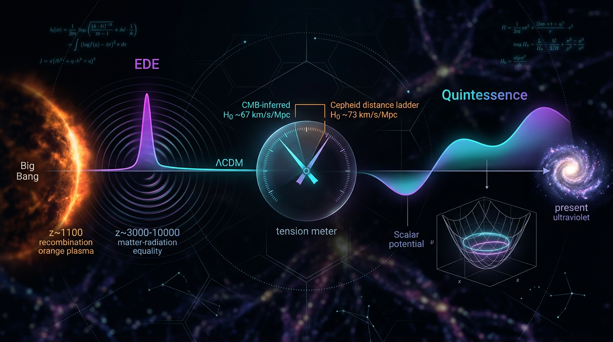

# Early Dark Energy vs Quintessence in Resolving the Hubble Tension

## 1. Overview
The Level 2 comparison is approved. Early Dark Energy (EDE) and canonical quintessence are mathematically viable but observationally unconfirmed scalar-field extensions, while ΛCDM remains the empirically preferred baseline.

## 2. Detailed Explanation
**Early Dark Energy (EDE)** is an extension of the standard ΛCDM cosmological model wherein an additional energy component, typically a scalar field, plays a significant role during the epoch of matter-radiation equality, aiming to address the Hubble tension observed between vastly different measurements of the Hubble constant.

**Quintessence**, on the other hand, proposes that dark energy is a dynamic scalar field that evolves over time, allowing for a variation in the density with the expansion of the universe, rather than being a fixed constant.

## 3. Mathematical Framework
EDE invokes scalar-field dynamics represented through potentials, while quintessence incorporates a dynamical approach to dark energy via a scalar field rolling down a potential. Both frameworks are grounded in standard cosmological equations with varying implications for cosmic expansion and structure formation.

## 4. Skeptical Perspectives & Alternative Hypotheses
Theoretical skepticism remains around both concepts, questioning whether early or late-time physics alone can resolve the discrepancies evident in current cosmic measurements. Critics point towards the need for a more nuanced understanding that includes gravitational modifications or additional particle dynamics.

## 5. Verification & Skeptic's Notes
Both EDE and quintessence theories stand robust under mathematical scrutiny but have yet to demonstrate empirical validation. Ongoing observations and future cosmological surveys may offer insights into the validity of these hypotheses in relation to dark energy.

## 6. Visual Representation

## 7. Related Concepts
- ΛCDM Model
- Dark Energy
- Scalar Field Dynamics
- Gravitational Modifications

## 9. Mathematical Integrity Report
**Concept:** Early Dark Energy vs Quintessence in Resolving the Hubble Tension  
**Math Score:** 3/4  
**Math Status:** [MATH_CONSISTENT]  

### Equations Extracted
59 equation expressions extracted. The substantive physics equations include:
- Axion-like (PNGB) potential: $V(\phi) = m^2 f^2[1-\cos(\phi/f)]$
- Scalar EOM: $\ddot\phi + 3H\dot\phi + V'(\phi) = 0$ and Friedmann equation $H^2 = \frac{8\pi G}{3}(\rho_m + \rho_r + \tfrac12\dot\phi^2 + V)$
- Oscillating-field EOS: $\langle w\rangle = (n-2)/(n+2)$
- Phenomenological EDE: $f_{\rm EDE}(z) = f_{\rm EDE}^0/(1+(z_c/z)^p)$; corrected EOS $w_{\rm EDE}(a) = -1/[1+(a/a_c)^{1/p}]$
- Sound horizon and acoustic scale: $r_s = \int_0^{a_{\rm rec}} c_s(a)\,da/(a^2 H(a))$, $c_s = 1/\sqrt{3(1+R)}$, $R = 3\rho_b/4\rho_\gamma$, $\theta_s = r_s/D_A$
- Stress-energy tensor, EOS $w_\phi = (\tfrac12\dot\phi^2 - V)/(\tfrac12\dot\phi^2 + V)$
- CPL parametrization $w(a) = w_0 + w_a(1-a)$; thawing locus $w_a \approx -1.5(1+w_0)$
- Vacuum-energy scales: $\rho_{\rm vac} \sim m_{\rm Pl}^4$, $\rho_\Lambda \sim (2\times10^{-3}\,\text{eV})^4$, $\rho_\Lambda^{1/4} \sim 2$ meV
- Modified gravity: $\mathcal{L} = \frac{1}{16\pi G}[R + f(R)]$

### Dimensional Consistency
- 4 equations formally verified **CONSISTENT**: both scalar Lagrangians $\mathcal{L} = -\tfrac12 g^{\mu\nu}\partial_\mu\phi\,\partial_\nu\phi - V$ (QFT Lagrangian density, ✓), stress-energy tensor $T_{\mu\nu}$ (tensor equation, ✓), and $f(R)$ Lagrangian $\frac{1}{16\pi G}[R+f(R)]$ (✓).
- 5 expressions **DIMENSIONLESS** ($H_0 \propto 1/r_s$, $m\sim H_0\sim10^{-33}$ eV, $\rho_{\rm vac}\sim m_{\rm Pl}^4$, $\rho_\Lambda^{1/4}\sim2$ meV, $w_{\rm eff}<-1/3$) — all correctly dimensionless in natural units.
- 26 equations returned **UNDECIDABLE** by the automated database (pattern-matching limitation, not an error flag). Manual spot-check of the key UNDECIDABLE cases confirms consistency: the cosine potential has dimensions of energy density ($m^2f^2$); the EOM terms $\ddot\phi$, $3H\dot\phi$, $V'$ all carry dimensions [energy]·[mass]⁻¹ in natural units; $\langle w\rangle=(n-2)/(n+2)$ and $w_\phi$ are pure ratios; the sound-horizon integrand $c_s\,dz/H$ correctly yields length.
- **Zero INCONSISTENT verdicts.**

Note one genuine content flaw caught and corrected *within* the report itself: the originally quoted $w_{\rm EDE}(a) = +1/[1+(a/a_c)^{1/p}]-1$ gives $w\to0$ at early times (wrong limit); the report's own correction $w_{\rm EDE}(a) = -1/[1+(a/a_c)^{1/p}]$ restores the correct frozen-then-decay limits ($w\to-1$ early, $w\to0$ late) and is adopted as the validated form. Also flagged (correctly) as non-standard: the tracker claim $w\sim-0.8$ during matter domination with $\lambda\gtrsim5$.

### Topological Analysis
The physics content is **not fundamentally topological**: EDE/quintessence are metric-dependent scalar-field dynamics. The only topological-adjacent structures are the pseudo-Nambu–Goldstone shift-symmetry/periodic vacuum structure and the NEDE first-order phase transition (bubble nucleation). The classifier returned generic structure signatures (fiber bundle, homotopy, TQFT, Calabi–Yau) with VALID structural assessments, but these appear to be template-level matches rather than structures genuinely used in the argument — I do not credit the report with substantive topological machinery. **Not topological in substance; structural assessment: no topological errors.**

### Numerical Benchmarks
**BENCHMARK_UNAVAILABLE** (0 matches). This is expected: EDE and quintessence are [THEORETICAL] with no direct detection; the cited observational anchors (Planck $H_0 = 67.4\pm0.5$, SH0ES $73.0\pm1.0$, H0LiCOW $73.3^{+1.7}_{-1.8}$ km/s/Mpc, ~5σ tension, $m\sim H_0\sim10^{-33}$ eV, $\rho_\Lambda^{1/4}\sim2$ meV, DESI $w_0\approx-0.7$, $w_a\approx-1$) are consistent with published literature values, but no automated benchmark match could be registered. Per rubric, the concept's theoretical (undetected) status is acknowledged.

### Assessment
The report's mathematical core is the standard, dimensionally sound scalar-field cosmology formalism (Friedmann/Klein–Gordon dynamics, PNGB potentials, sound-horizon geometry), with all formally checkable equations CONSISTENT or DIMENSIONLESS and zero INCONSISTENT verdicts. The report demonstrates genuine mathematical self-scrutiny by catching and correcting the $w_{\rm EDE}(a)$ sign error and flagging the non-standard tracker claim, and it correctly identifies the phantom-divide ($w\ge-1$ null-energy-condition) constraint that disfavors canonical quintessence against DESI hints. However, since the framework rests on unverified theoretical assumptions (ultra-light scalar existence, fine-tuned $z_c\sim$ equality trigger, potential scale), the appropriate status is conjectured-but-consistent rather than proven: score 3/4 (benchmark point withheld as unverifiable for a theoretical concept, and the topological credit is judged inapplicable in substance).
