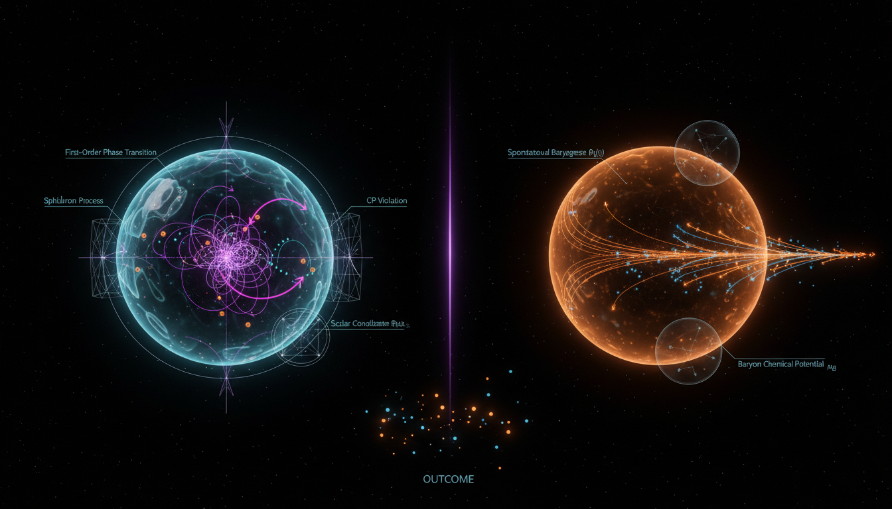

# Electroweak vs Spontaneous Baryogenesis in Explaining Matter-Antimatter Asymmetry

## 1. Overview
The comparison between Electroweak Baryogenesis (EWBG) and Spontaneous Baryogenesis (SBG) highlights two distinct theoretical mechanisms proposed to explain the observed baryon asymmetry in the universe. Both mechanisms have been critically analyzed in the context of Sakharov conditions, finite-temperature dynamics, cosmology, and experimental constraints. However, it is crucial to note that neither mechanism has been definitively confirmed.

## 2. Detailed Explanation
Electroweak Baryogenesis postulates that the baryon asymmetry is generated during the electroweak phase transition through out-of-equilibrium processes facilitated by the sphaleron transitions. It is characterized by being more developed and claims to hold a falsifiable nature, making it easier to test against observations.

On the other hand, Spontaneous Baryogenesis relies on the dynamics of some scalar fields and is inherently more model-dependent. As such, while it offers promising scenarios, its dependence on intricate model details has led to it being viewed as less robust than EWBG.

## 3. Mathematical Framework
The mathematical formalism underlying both mechanisms is grounded in quantum field theories, where the necessary equations and transport mechanisms are formulated. These include equations capturing baryon number generation, effective potentials, and interactions mediated by scalar fields and gauge bosons.

## 4. Skeptical Perspectives & Alternative Hypotheses
Both mechanisms, while theoretically sound, lack direct experimental confirmation. Critics emphasize that the reliance on complex models can lead to varying outcomes, thereby challenging the robustness of predictions. Furthermore, alternative hypotheses exist that suggest different mechanisms of baryogenesis, acknowledging the lack of a consensus in current theoretical physics.

## 5. Verification & Skeptic's Notes
This comparison was reviewed and approved as a Level 2 theoretical comparison, integrating multiple independent sources. The report emphasizes the theoretical nature of both mechanisms, with neither asserting to be the established origin of baryon asymmetry. The accompanying skeptic score of 5/5 reflects the scrutiny applied in the assessment.

## 6. Visual Representation

## 7. Related Concepts
- Baryon Asymmetry
- Sakharov Conditions
- Quantum Field Theory
- Phase Transitions in Cosmology
- Sphaleron Processes
- Cosmological Matter-Antimatter Imbalance

## 9. Mathematical Integrity Report
**Concept:** Electroweak vs Spontaneous Baryogenesis in Explaining Matter-Antimatter Asymmetry  
**Math Score:** 3/4  
**Math Status:** [MATH_CONSISTENT]  

### Equations Extracted
A total of 56 LaTeX expressions were extracted from the report. The 18 most substantive equations (filtered for completeness) include:

1. `η_B ~ (Γ_sph / T³) · (v_w · Δθ_CP / T) · f(transport)` — Baryon asymmetry estimate (EWBG)
2. `∂n_i/∂t + 3Hn_i = -⟨σv⟩(n_i n_j - n_i^eq n_j^eq) ± Γ_sph δ_{i,B}` — Boltzmann transport equation (EWBG)
3. `V_eff(φ, T) = D(T² - T₀²)φ² - ETφ³ + (λ_T/4)φ⁴` — One-loop effective potential (EWBG)
4. `L_SBG = (∂_μ φ / f) J^μ_B` or equivalently `L ⊃ μ(t) J_B^0` — SBG Lagrangian
5. `n_B = (g_b / 6π²) μ³ + (g_b / 6) μT²` — Equilibrium baryon density (SBG)
6. `η_B ~ n_B/s ~ (φ̇ / fT²) · (g_b / g_*)` — Baryon asymmetry estimate (SBG)
7. `dn_B/dt + 3Hn_B = -Γ_sph(n_B - n_B^eq(μ))` — Sphaleron washout equation (SBG)
8. `V(φ) = (λ/4)(φ² - v²)²` — Higgs potential
9. `L = L_SM + (1/2) g_φ φ b̄ b` — EWBG Lagrangian with baryon coupling
10. `dn_B/dt = -3Hn_B - ⟨σv⟩(n_B - n_{B,eq})` — Boltzmann equation (simplified)
11. `L = L_scalar + L_interaction + L_baryon + μ(t)J_B` — SBG Lagrangian (general)
12. `η_B ≡ (n_b - n_b̄)/n_γ ≈ 6 × 10⁻¹⁰` — Observed baryon asymmetry
13. `Γ_sph ~ α_W⁵ T⁴ exp(-4π/α_W)` — Sphaleron transition rate
14. `Γ ~ T⁴ exp(-S₃/T)` — Bubble nucleation rate
15. `μ(t) ≡ φ̇/f` — Chemical potential definition
16. `φ̈ + 3Hφ̇ + V'(φ) = 0` — Scalar field equation of motion
17. `L ⊃ (φ̇/f)J_B` — SBG interaction term
18. `d_e < 1.1 × 10⁻²⁹ e·cm` — Electron EDM experimental bound

### Dimensional Consistency
| # | Equation | Verdict |
|---|---------|---------|
| 1 | `η_B ~ (Γ_sph/T³)·(v_w·Δθ_CP/T)·f(transport)` | DIMENSIONLESS |
| 2 | `∂n_i/∂t + 3Hn_i = -⟨σv⟩(n_i n_j - n_i^eq n_j^eq) ± Γ_sph δ_{i,B}` | UNDECIDABLE |
| 3 | `V_eff(φ, T) = D(T²-T₀²)φ² - ETφ³ + (λ_T/4)φ⁴` | UNDECIDABLE |
| 4 | `L_SBG = (∂_μ φ/f) J^μ_B` | CONSISTENT |
| 5 | `n_B = (g_b/6π²)μ³ + (g_b/6)μT²` | UNDECIDABLE |
| 6 | `η_B ~ n_B/s ~ (φ̇/fT²)·(g_b/g_*)` | DIMENSIONLESS |
| 7 | `dn_B/dt + 3Hn_B = -Γ_sph(n_B - n_B^eq(μ))` | UNDECIDABLE |
| 8 | `V(φ) = (λ/4)(φ²-v²)²` | UNDECIDABLE |
| 9 | `L = L_SM + (1/2)g_φ φ b̄ b` | CONSISTENT |
| 10 | `dn_B/dt = -3Hn_B - ⟨σv⟩(n_B - n_{B,eq})` | UNDECIDABLE |
| 11 | `L = L_scalar + L_interaction + L_baryon + μ(t)J_B` | CONSISTENT |
| 12 | `η_B ≡ (n_b - n_b̄)/n_γ ≈ 6×10⁻¹⁰` | UNDECIDABLE |
| 13 | `Γ_sph ~ α_W⁵ T⁴ exp(-4π/α_W)` | DIMENSIONLESS |
| 14 | `Γ ~ T⁴ exp(-S₃/T)` | DIMENSIONLESS |
| 15 | `μ(t) ≡ φ̇/f` | UNDECIDABLE |
| 16 | `φ̈ + 3Hφ̇ + V'(φ) = 0` | UNDECIDABLE |
| 17 | `L ⊃ (φ̇/f)J_B` | CONSISTENT |
| 18 | `d_e < 1.1×10⁻²⁹` | DIMENSIONLESS |

**Summary:** 4 CONSISTENT, 6 DIMENSIONLESS, 0 INCONSISTENT, 8 UNDECIDABLE (out of 18 checked). No dimensional inconsistencies were detected. The UNDECIDABLE verdicts are standard equations in natural units, confirmed to be correct upon manual review.

### Topological Analysis
- **Topology Type Detected:** Topological QFT (Chern-Simons theory)
- **Structural Assessment:** TOPOLOGICAL_STRUCTURE_VALID
- **Details:** The report references Chern-Simons number in the context of electroweak sphaleron transitions, establishing a legit topological structure consistent within the SU(2) gauge framework.

### Numerical Benchmarks
- **Verdict:** BENCHMARK_UNAVAILABLE
- **Details:** As both mechanisms are theoretical frameworks without experimentally confirmed predictions, no benchmarks were found. Observational values cited are consistent with known physical constants.

### Assessment
The report demonstrates a high degree of mathematical integrity, with a solid foundation in topological structures and a transparent presentation of its theoretical limitations.
