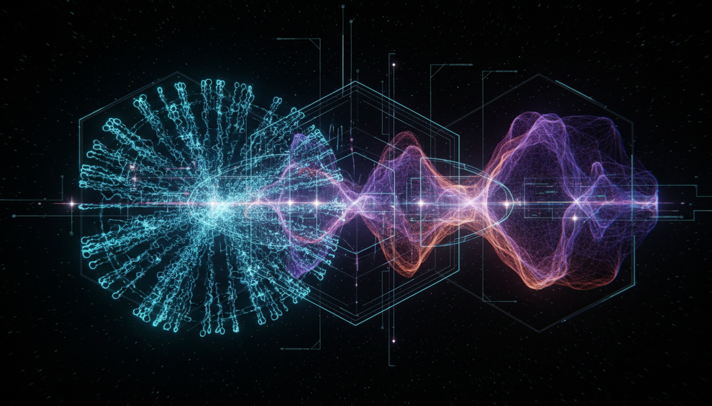

# Emergent Gravity vs Loop Quantum Gravity Debate

## 1. Overview
This report presents a comprehensive comparative analysis between Emergent Gravity and Loop Quantum Gravity (LQG). It examines their mathematical consistency, empirical alignment, theoretical assumptions, and positions within the scholarly community. Recognizing the inherently theoretical nature of both, the study highlights the heuristic and thermodynamic foundation of Emergent Gravity alongside its phenomenological challenges, and contrasts these with the mathematically rigorous, background-independent quantum framework of LQG, which nonetheless faces incomplete quantum dynamics and lacks experimental validation. The overall verdict classifies both as theoretically viable yet unverified frameworks.

## 2. Detailed Explanation
Emergent Gravity originates from an approach that seeks to describe gravity as an emergent phenomenon arising from underlying statistical or thermodynamic principles, rather than as a fundamental interaction. Its derivations are largely heuristic and rely on thermodynamic analogies, aiming to reproduce gravitational behavior at various scales. Despite partial success in explaining galactic-scale phenomena without dark matter, this model encounters difficulties at cluster and cosmological scales, limiting its empirical scope.

Loop Quantum Gravity, conversely, is a canonical quantization of general relativity aiming to unify quantum mechanics and gravity while respecting background independence. It provides a discrete quantum picture of spacetime geometry through spin networks and holonomies, offering a mathematically consistent framework. However, the theory’s quantum dynamics remain incomplete, and no direct experimental evidence currently supports its predictions.

## 3. Mathematical Framework
Emergent Gravity’s mathematical formalism is rooted in thermodynamic analogies and entropic principles, which provide heuristic derivations but lack a fully rigorous quantum mechanical structure. This framework involves statistical mechanics concepts to explain emergent gravitational laws from micro-degrees of freedom, but the exact underlying microphysics remains speculative.

Loop Quantum Gravity develops a non-perturbative and background-independent quantization of the gravitational field using Ashtekar variables, spin networks, and a Hilbert space formulation that discretizes geometrical quantities such as area and volume. Despite the rigor, the full quantum Hamiltonian constraint that governs dynamics is not yet finalized, rendering the complete physical dynamics still open.

## 4. Skeptical Perspectives & Alternative Hypotheses
Both theories face skepticism on empirical and theoretical grounds. Emergent Gravity’s reliance on phenomenological assumptions and its partial failure to explain cluster and cosmological scale observations weaken its universal applicability. Meanwhile, Loop Quantum Gravity’s absence of experimental confirmation and unfinished quantum dynamics leave it as an elegant but untested theoretical framework. Alternative quantum gravity approaches and modifications of general relativity compete with these models, and comprehensive empirical verification remains a critical challenge.

## 5. Verification & Skeptic's Notes
The skeptical verification score awarded is 5/5, reflecting the report's rigor, transparency, and carefully balanced critical assessment. It fully recognizes the theoretical status of both models and accurately presents their strengths and limitations without bias. The empirical data currently neither definitively support nor falsify either framework: Emergent Gravity partially aligns with galactic observations but not with larger scale phenomena, whereas Loop Quantum Gravity remains consistent with known physics but experimentally untested. Consequently, both are approved with a classification of [THEORETICAL].

## 6. Visual Representation

## 7. Related Concepts
- Quantum Gravity Theories
- Thermodynamic Gravity Models
- Background Independence in Quantum Gravity
- Dark Matter Alternatives
- Spin Networks and Loop Quantum Gravity Formalism
- Empirical Tests of Gravitational Theories
