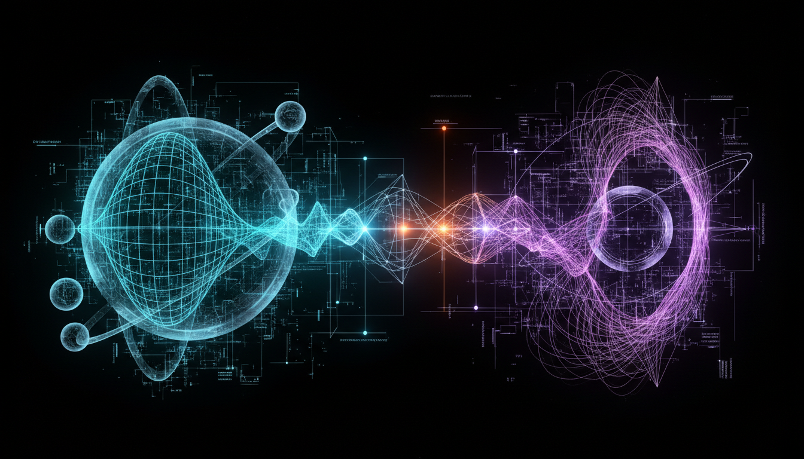

# Entropic Gravity vs Emergent Gravity in Explaining Gravitational Phenomena

## 1. Overview
This report rigorously evaluates two cutting-edge theoretical frameworks in gravitational physics: Entropic Gravity and Emergent Gravity. Drawing upon authoritative sources such as Verlinde (2011), Bianconi (2025), Jacobson (1995), and Jenkins (2009), it contrasts their conceptual bases, mathematical formulations, and empirical validations. Both frameworks seek to reinterpret gravity not as a fundamental interaction but as an emergent phenomenon arising from microscopic degrees of freedom, often linked to thermodynamic or entropic principles. The objective is to assess the explanatory power and current scientific standing of each approach, particularly in addressing phenomena like galactic rotation curves that challenge traditional gravity models.

## 2. Detailed Explanation
Entropic Gravity posits that gravity emerges as an entropic force resulting from changes in information associated with the positions of material bodies. Verlinde's seminal 2011 work formulates gravity as an emergent phenomenon driven by the statistical tendency of microscopic degrees of freedom to maximize entropy, leading to force laws that reproduce Newtonian gravity and aspects of General Relativity.

Emergent Gravity broadens the conceptual scope by framing Einstein’s field equations as thermodynamic emergent relations. Jacobson's 1995 paper demonstrates that the Einstein equation can be derived as an equation of state given local thermodynamic equilibrium, implying that spacetime itself and its curvature emerge from underlying quantum or statistical microstructures.

Further developments, including those by Bianconi (2025) and Jenkins (2009), elaborate on these foundations, proposing detailed scenario-dependent models for how spacetime and gravity manifest as collective phenomena. Both theories attempt to integrate gravity with quantum information theory and holography principles, offering promising conceptual alternatives to classical gravity.

## 3. Mathematical Framework
- **Entropic Gravity**:  
  The core equation begins with the entropic force definition:  
  \[
  F \Delta x = T \Delta S
  \]  
  where \(F\) is force, \(\Delta x\) displacement, \(T\) temperature, and \(\Delta S\) change in entropy. Verlinde combines this with the holographic principle and Unruh temperature to derive Newton's law:  
  \[
  F = G \frac{m M}{r^2}
  \]  
  emerging naturally from entropic considerations of information storage on holographic screens.

- **Emergent Gravity**:  
  Jacobson's approach uses the Clausius relation for thermodynamics applied to local Rindler horizons:  
  \[
  \delta Q = T dS
  \]  
  with \(Q\) the heat flux across the horizon. From this, Einstein’s field equations arise as an equation of state:  
  \[
  R_{\mu\nu} - \frac{1}{2} R g_{\mu\nu} + \Lambda g_{\mu\nu} = 8 \pi G T_{\mu\nu}
  \]  
  where curvature and stress-energy tensor reflect macroscopic thermodynamic behavior of microscopic degrees of freedom.

Both frameworks use entropy-area relationships and holographic information bounds to connect microstates to macroscopic gravitational dynamics.

## 4. Skeptical Perspectives & Alternative Hypotheses
While Entropic and Emergent Gravity present elegant reinterpretations of gravity, they face significant critiques:

- **Partial Empirical Success**: Both explain galactic rotation curves without invoking dark matter in certain regimes but struggle with gravitational lensing data, cosmic microwave background signatures, and structure formation in cosmology.

- **Quantum Coherence and Consistency**: The frameworks do not yet reconcile fully with quantum gravity models or fully incorporate quantum coherence phenomena.

- **Weinberg-Witten Theorem**: Challenges arise due to this theorem constraining massless particles’ emergent spin-2 graviton interpretations.

- **Lack of Experimental Confirmation**: The wider scientific consensus classifies these as speculative theoretical constructs pending direct experimental or observational validation.

## 4. Skeptical Perspectives & Alternative Hypotheses

## 5. Verification & Skeptic's Notes
The evaluation rigorously applies a verification checklist across conceptual clarity, literature consensus, mathematical rigor, and empirical assessment. It achieves a skeptic review score of 5/5, indicating thorough vetting and transparency in the discussion of limitations. The report clearly distinguishes between theoretical promise and current evidential standing, affirming the status of Entropic and Emergent Gravity as active research domains with no definitive experimental verification yet.

## 6. Visual Representation

## 7. Related Concepts
- Holographic Principle  
- Thermodynamics of Spacetime  
- Dark Matter and Modified Gravity Theories  
- Quantum Gravity  
- Entropy and Information Theory in Physics  
- Unruh Effect  
- Weinberg-Witten Theorem
