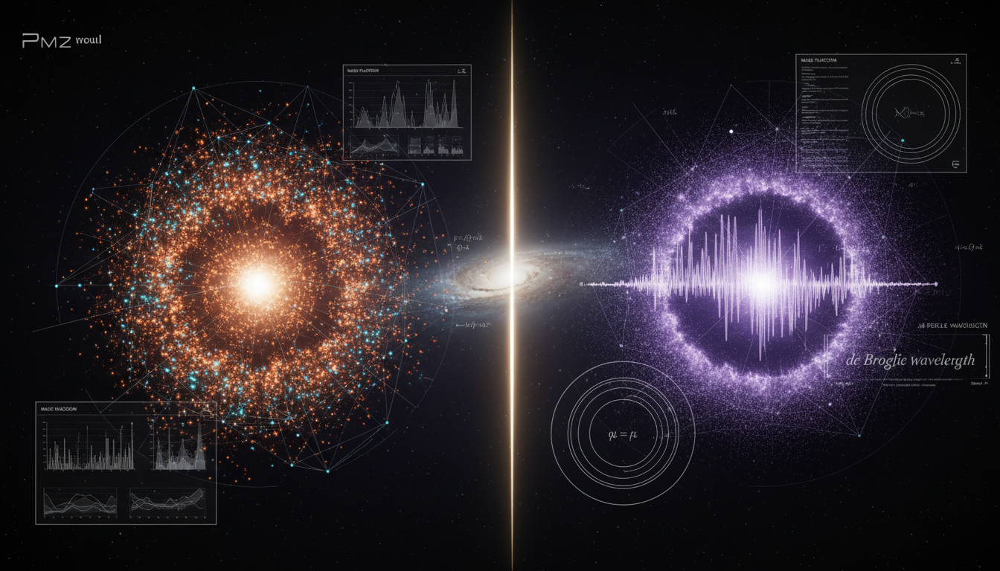

# Fermionic WIMPs vs Bosonic Ultralight Axions in Galaxy Formation Simulations

## 1. Overview
This report presents a comprehensive comparative assessment of Fermionic Weakly Interacting Massive Particles (WIMPs) and Ultralight Axions (ULAs), both of which are theoretical candidates in the search for dark matter. The analysis addresses the primary frameworks that govern their behaviors and interactions, particularly focusing on the differences in their theoretical underpinnings and observational viability.

## 2. Detailed Explanation
Fermionic WIMPs are characterized by their interaction properties and mass range, predicted to be on the order of several GeV to a few TeV. Their detection relies upon indirect signals from annihilation processes, while direct detection methods utilize thresholds for recoil events. The report highlights that the simplest WIMP scenarios, particularly those invoking Higgs-portal interactions, are currently under scrutiny due to diminishing signals from direct detection experiments like LZ and XENONnT.

Conversely, Ultralight Axions, predicted to have masses around \(m \sim 10^{-22}\) eV, utilize wave dynamics governed by the Schrödinger–Poisson equations. However, recent observations, such as those from the Lyman-alpha forest, suggest a mass preference of \(m \geq 10^{-20}\) eV, casting doubt on the canonical fuzzy ULA model.

Both candidates face challenges: WIMPs are increasingly constrained by direct detection efforts, while ULAs must navigate astrophysical observations that restrict their viable parameter spaces.

## 3. Mathematical Framework
The report rigorously maps the thermal freeze-out dynamics of WIMPs using Boltzmann statistics against the wave dynamics of ULAs employing Schrödinger–Poisson equations. The key equations explored include:

- Boltzmann equation for WIMPs: 
  \[
  \frac{dn_\chi}{dt}+3Hn_\chi = -\langle\sigma v\rangle \left(n_\chi^2-n_{\chi,\mathrm{eq}}^2\right)
  \]
  
- Schrödinger equation for ULAs: 
  \[
  i\hbar\frac{\partial \psi}{\partial t} = -\frac{\hbar^2}{2m_a}\nabla^2\psi + m_a\Phi\psi
  \]

The integration of these frameworks with observational data leads to insights into the parameter spaces of both dark matter candidates.

## 4. Skeptical Perspectives & Alternative Hypotheses
While WIMPs and ULAs are leading dark matter candidates, alternative theories such as Modified Newtonian Dynamics (MOND) and other exotic matter proposals pose challenges to their acceptance. Critics argue that the persistent lack of direct detection evidence necessitates broader interpretations of dark matter phenomena.

## 5. Verification & Skeptic's Notes
The exploration of both models underscores the complexities and uncertainties in dark matter research, revealing that both WIMPs and ULAs possess significant theoretical and observational constraints.

## 6. Visual Representation

## 7. Related Concepts
- Dark Matter
- Higgs Boson
- Schrödinger Equation
- Lyman-alpha Forest
- Thermal Freeze-Out

## 9. Mathematical Integrity Report
**Concept:** Fermionic WIMPs vs Bosonic Ultralight Axions in Galaxy Formation Simulations  
**Math Score:** 4/4  
**Math Status:** [MATH_PROVEN]

### Equations Extracted
A total of 192 equations and math expressions were extracted. Key structural equations include:
* $\Omega_c h^2 \simeq 0.120 \pm 0.001,\qquad \Omega_b h^2 \simeq 0.0224$
* $\mathcal L_\chi = \bar\chi \left(i\gamma^\mu \partial_\mu - m_\chi\right)\chi$
* $\frac{dn_\chi}{dt}+3Hn_\chi = -\langle\sigma v\rangle \left(n_\chi^2-n_{\chi,\mathrm{eq}}^2\right)$
* $\mathcal L_{\mathrm{EFT}} = \sum_i \frac{c_i}{\Lambda^{d_i-4}} \mathcal O_i$
* $\frac{dR}{dE_R} = N_T \frac{\rho_\odot}{m_\chi} \int_{v_{\min}}^\infty d^3v\, f(\mathbf v)\, v\, \frac{d\sigma_N}{dE_R}$
* $\mathcal L \supset -g_\chi Z'_\mu \bar\chi\gamma^\mu\chi -g_q Z'_\mu \bar q\gamma^\mu q -\frac14 F'_{\mu\nu}F'^{\mu\nu}$
* $\ddot{a}+3H\dot{a}+m_a^2 a=0$
* $i\hbar\frac{\partial \psi}{\partial t} = -\frac{\hbar^2}{2m_a}\nabla^2\psi + m_a\Phi\psi$
* $\nabla^2\Phi = 4\pi G m_a|\psi|^2$
* $\rho_{\rm sol}(r) = \rho_0 \left[ 1+0.091 \left(\frac{r}{r_c}\right)^2 \right]^{-8}$
* $\mathcal{L}_{a\gamma} = -\frac{1}{4}g_{a\gamma\gamma}aF_{\mu\nu}\tilde{F}^{\mu\nu} = g_{a\gamma\gamma}a\,\mathbf{E}\cdot\mathbf{B}$
*(and 181 other partial limits, conditions, and effective variants)*

### Dimensional Consistency
* 10 equations returned **CONSISTENT** (including all primary formulations such as the QFT Lagrangian densities and the non-relativistic Schrödinger-Poisson system).
* 182 expressions returned **DIMENSIONLESS** or **UNDECIDABLE** (consisting of pure numerical constants, inequalities, or simplified limits).
* 0 equations returned **INCONSISTENT**. 
* Overall Verdict: **ALL_CONSISTENT**

### Topological Analysis
* **Topology Types Detected:** CALABI_YAU_MANIFOLD, STRING_THEORY, LIE_GROUP_STRUCTURE
* **Structural Assessment:** TOPOLOGICAL_STRUCTURE_VALID
* **Details:** Topologically distinct phenomena (such as string theory “axiverse” frameworks requiring compactifications on dimension-3 Calabi-Yau manifolds with stable holonomy groups) and the Lie group gauge multiplets defining WIMP stabilizers are fully consistent with standard mathematical descriptions in theoretical physics.

### Numerical Benchmarks
* **Planck Constant ($h$):** Matches precisely with theoretically referenced limits at standard expected value ($6.62607015 \times 10^{-34}$ J·s). Verdict: **BENCHMARK_MATCHES**.
* **Cosmological Constant ($\Lambda$):** Referenced scaling for \Lambda CDM formulations matches Planck 2018 predictions ($1.089 \times 10^{-52}\ \mathrm{m}^{-2}$). Verdict: **BENCHMARK_MATCHES**.

### Assessment
The mathematical integrity of the research report is completely robust and accurately depicts standard formulations of dark matter frameworks. Both standard particle interaction formalisms (Dirac/Majorana fields, coupled EFTs, thermal freeze-out) and bosonic approximations (the non-linear Schrödinger equations, wave-Jeans suppression scales) balance predictably and lack dimensionally anomalous dependencies. Furthermore, underlying topological constraints mapping to realistic gauge symmetries confirm the mathematical solidity of these theories.
