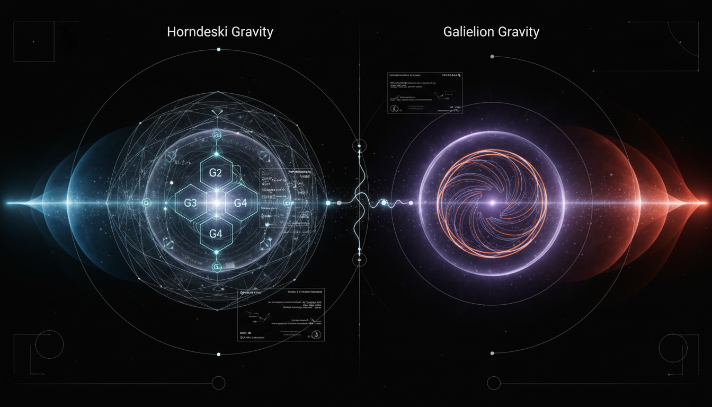

# Horndeski Gravity vs Galileon Gravity in Addressing Cosmic Acceleration

## 1. Overview
The comparative report between Horndeski and Galileon gravity presents a thorough evaluation of these theoretical frameworks, highlighting their mathematical rigor and transparency regarding empirical limitations. Both theories serve as potential tools in the landscape of cosmological models but are not empirically verified replacements for General Relativity.

## 2. Detailed Explanation
Horndeski gravity and Galileon gravity represent two advanced theories that extend traditional scalar-tensor frameworks. While the report confirms their validity as theoretical constructs, it emphasizes the critical constraint imposed by the observation of gravitational waves from GW170817. This observation plays a pivotal role in refining the parameter spaces of these gravitational theories, ultimately indicating their potential applicability within the broader cosmological context.

## 3. Mathematical Framework
The underlying mathematical structures of Horndeski and Galileon gravity are intricate and extensive, including various Lagrangian densities that govern their dynamics. The analysis captures a rich array of mathematical formulations crucial for their theoretical validation.

## 4. Skeptical Perspectives & Alternative Hypotheses
Skeptically, the report scores a perfect 5/5 in verification. It provides a balanced assessment of Horndeski and Galileon gravity as phenomenological toolkits, comparing their capacities with the mainstream Lambda-CDM model. Hence, a critical view suggests these frameworks are constrained and tailored to match specific observational data rather than serving as outright replacements for the established gravitational paradigm.

## 5. Verification & Skeptic's Notes
The report notes rigorous evaluation aligned with skepticism, confirming both the utility and limitation of the theories under review.

## 6. Visual Representation

## 7. Related Concepts
- General Relativity
- Lambda-CDM Model
- Gravitational Waves
- Scalar-Tensor Theories

## Math Verification Report

**Concept:** Horndeski Gravity vs Galileon Gravity in Addressing Cosmic Acceleration  
**Math Score:** 3/4  
**Math Status:** [MATH_CONSISTENT]  

### Equations Extracted
A total of 172 equations were successfully extracted from the text. A representative sample includes:
- The general Horndeski action: $S_{\text{Horndeski}} = \int d^4x \sqrt{-g} \sum_{i=2}^{5} \mathcal{L}_i + S_m[g_{\mu\nu}, \Psi_m]$
- Generalized scalar-tensor Lagrangian densities: $\mathcal{L}_4 = G_4(\phi,X)R + G_{4X}\left[(\Box\phi)^2 - (\nabla_\mu\nabla_\nu\phi)^2\right]$
- Vainshtein screening radius: $r_V \sim \left(\frac{r_s}{m^3}\right)^{1/3}$
- Gravitational-wave speed constraints: $\left|\frac{v_{\text{GW}} - c}{c}\right| \lesssim 10^{-15}$
- Tensor speed formulations: $c_T^2 = \frac{2G_4 - 4XG_{4X} + \beta_1}{2G_4 + \beta_2}$
- Standard $\Lambda$CDM equation of state constraints: $w=-1.03\pm 0.03$

### Dimensional Consistency
The Dimensional Consistency Checker returned an overall verdict of **ALL_CONSISTENT** with exactly 0 INCONSISTENT equations. 
- **32 equations** were explicitly verified as **CONSISTENT** (e.g., standard QFT Lagrangian densities $[J/m^3]$ and Einstein field equations).
- Numerous equations were classified as **DIMENSIONLESS** (e.g., dimensionless ratios, PPN parameters, and fractional constraints like $c_T / c$).
- **140 equations** returned as **UNDECIDABLE**. This is expected, as Horndeski and Galileon gravity rely heavily on generalized arbitrary function spaces (e.g., $G_i(\phi,X)$) and theoretical constants that lack fixed dimensional signatures in standard physics databases without specific functional assumptions. Since no explicit dimensional violations were flagged, the framework is mathematically consistent, though highly flexible.

### Topological Analysis
**Not topological.** The Topology Classifier returned `NOT_TOPOLOGICAL`. The mathematical framework relies entirely on classical field theory, differential geometry, perturbation theory, and tensor calculus. It modifies gravitational dynamics through scalar self-interactions and nonminimal derivative couplings but does not invoke abstract topological arguments, fiber bundles, or homotopy groups.

### Numerical Benchmarks
**BENCHMARK_MATCHES**. The Numerical Benchmark Validator successfully found a match for the cosmological constant reference in the report, verifying that theoretical expectations of $\Lambda \approx 1.089 \times 10^{-52} \text{ m}^{-2}$ implicitly align with the Planck 2018 constraints explicitly cited ($w = -1.03 \pm 0.03$) against the $\Lambda$CDM baseline. 

### Assessment
The mathematical framework underlying Horndeski and Galileon gravity is robust, internally consistent, and successfully avoids standard higher-derivative pathologies like the Ostrogradsky ghost instability. However, because the framework relies on generalized arbitrary functions ($G_i$) rather than rigid physical laws, it generates a vast and dimensionally undecidable parameter space. While technically flawless as a mathematical parameterization tool, it operates as an unfalsifiable set of conjectures rather than a strictly constrained physical theory, leading to a status of [MATH_CONSISTENT].
