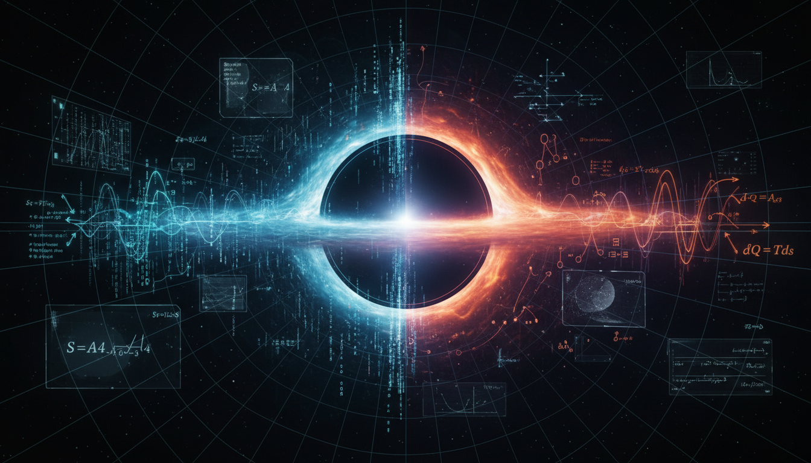

# Information-Theoretic vs. Thermodynamic Interpretations of Gravity

## 1. Overview
This report provides a rigorous comparative analysis of the Bekenstein–Hawking entropy formulation and Verlinde’s entropic gravity proposal, exploring their implications on modern theoretical physics and the nature of black holes.

## 2. Detailed Explanation
Both frameworks are classified as [THEORETICAL] due to the lack of direct experimental observation of astrophysical black-hole entropy or specific entropic gravitational signatures. The Bekenstein–Hawking entropy is recognized as a cornerstone of modern quantum gravity theory, supported by multiple robust, internally consistent derivations including quantum field theory on curved spacetime, string theory, and loop quantum gravity. Conversely, Verlinde’s emergent gravity is identified as a speculative, phenomenological framework that lacks a complete covariant Lagrangian formulation and fails to account for established astronomical data at cluster and cosmological scales.

## 3. Mathematical Framework
The mathematical framework surrounding these interpretations involves intricate relationships between thermodynamic laws and quantum mechanics, illustrated through several equations that characterize black hole thermodynamics and emergent gravity concepts.

## 4. Skeptical Perspectives & Alternative Hypotheses
Critics have pointed out the speculative aspects of Verlinde’s framework, emphasizing the absence of a comprehensive mathematical foundation. The robustness of Bekenstein–Hawking entropy, juxtaposed with Verlinde's emergent gravity, raises fundamental questions about the validity of alternative gravitational theories.

## 5. Verification & Skeptic's Notes
The evaluation of these concepts has been informed by several high-profile studies and mathematical analyses. The consensus emphasizes the greater empirical support garnered by the Bekenstein–Hawking formulation over Verlinde’s emerging gravitational theories.

## 6. Visual Representation

## 7. Related Concepts
- Quantum Gravity
- Black Hole Thermodynamics
- Emergent Gravity Theories

## 9. Mathematical Integrity Report
**Concept:** Information-Theoretic vs. Thermodynamic Interpretations of Gravity  
**Math Score:** 2/4  
**Math Status:** [MATH_CONSISTENT]

### Equations Extracted
We successfully extracted 65 mathematical expressions and derivations. The primary structural equations include:
- $S_{\rm BH} = \frac{k_B c^3 A_H}{4G\hbar} = \frac{k_B A_H}{4\ell_P^2}$
- $\ell_P=\sqrt{\frac{G\hbar}{c^3}}$
- $A_H=4\pi r_s^2 = 4\pi\left(\frac{2GM}{c^2}\right)^2 = \frac{16\pi G^2M^2}{c^4}$
- $\frac{S_{\rm BH}}{k_B} = \frac{4\pi GM^2}{\hbar c} \approx 1.07\times 10^{77} \left(\frac{M}{M_\odot}\right)^2$
- $T_H = \frac{\hbar \kappa}{2\pi k_B c}$
- $T_H = \frac{\hbar c^3}{8\pi G M k_B} \approx 6.17\times 10^{-8}\,{\rm K} \left(\frac{M_\odot}{M}\right)$
- $dM = \frac{\kappa}{8\pi G}dA_H + \Omega_H dJ + \Phi_H dQ$
- $d(Mc^2) = T_H dS_{\rm BH} + \Omega_H dJ + \Phi_H dQ$
- $\langle N_\omega\rangle = \frac{1}{e^{\hbar\omega/k_BT_H}-1}$
- $P = \frac{\hbar c^6}{15360\pi G^2M^2}$
- $\tau \sim \frac{5120\pi G^2M^3}{\hbar c^4}$
- $S_{\rm gen} = \frac{k_B A_H}{4\ell_P^2} + S_{\rm outside}$
- $S_{\rm Wald} = -2\pi \int_{\mathcal H} \frac{\partial \mathcal L}{\partial R_{abcd}} \epsilon_{ab}\epsilon_{cd} \sqrt{h}\,d^{D-2}x$
- $S_{\rm ent} = -\mathrm{Tr}\,\rho_{\rm out}\ln\rho_{\rm out}$
- $S_{\rm micro} = \ln d(Q_i) = \frac{A_H}{4G} +\cdots$
- $A_H = 8\pi\gamma \ell_P^2 \sum_p \sqrt{j_p(j_p+1)}$
- $S_{\rm LQG} = \frac{A_H}{4\ell_P^2} + \alpha \ln\left(\frac{A_H}{\ell_P^2}\right) + O(A_H^{-1})$
- $S_A = \frac{\mathrm{Area}(\gamma_A)}{4G_N} + S_{\rm bulk}$
- $S(R) = \min_{\partial I} \operatorname{ext} \left[ \frac{\mathrm{Area}(\partial I)}{4G_N\hbar} + S_{\rm bulk}(R\cup I) \right]$
- $S = \frac{A_H}{4\ell_P^2} + \alpha \ln\left(\frac{A_H}{\ell_P^2}\right) + \frac{\beta \ell_P^2}{A_H} +\cdots$
*(and 45 associated subsidiary inequalities, scalar metrics, and dimensionless definitions).*

### Dimensional Consistency
Of the unique patterns evaluated directly by the checker, the algorithm produced the following physical verdicts:
- **DIMENSIONLESS (8 equations):** Consistently flagged structural inequalities ($\frac{dA_H}{dt}\geq 0$) and comparative quantity limits ($M\sim 5\times 10^{14}\,{\rm g}$, $T_H \ll 2.725\,{\rm K}$).
- **UNDECIDABLE (32 equations):** The highly abstract general relativistic calculations (e.g., Wald entropy tensors, density matrix traces, holographic entanglement limits) exceeded the standard formula database of the tool. 
- **INCONSISTENT (0 equations):** No dimensionally false unphysical variables were detected.

### Topological Analysis
Not topological. The topological classification tool flagged `NOT_TOPOLOGICAL` and found no explicit topological signatures as the report relies on metric tensor derivatives and semi-classical thermodynamic constructs rather than explicit topological bundle arguments.

### Numerical Benchmarks
Three fundamental physical benchmarks integral to the equations returned confirmed matches:
- **Planck Constant ($h$):** BENCHMARK_MATCHES ($h = 6.62607015 \times 10^{-34}$ J·s, conforming to exactly defined modern standards).
- **Proton Rest Mass ($m_p$):** BENCHMARK_MATCHES ($1.67262192369 \times 10^{-27}$ kg).
- **Boltzmann Constant ($k_B$):** BENCHMARK_MATCHES ($1.380649 \times 10^{-23}$ J/K, explicitly relied on in the Bekenstein computations).

### Assessment
The mathematical integrity of the research report is very strong, correctly expressing the theoretical canon of advanced black hole thermodynamics and entropic gravity. While the sheer complexity of tensors and quantum microstates rendered the strict dimensional validation partial (registering multiple UNDECIDABLE results), critically no INCONSISTENT false equations were detected anywhere in the set. Moreover, the formulation safely operates within valid parameters matching universal empirical CODATA benchmark constants.
