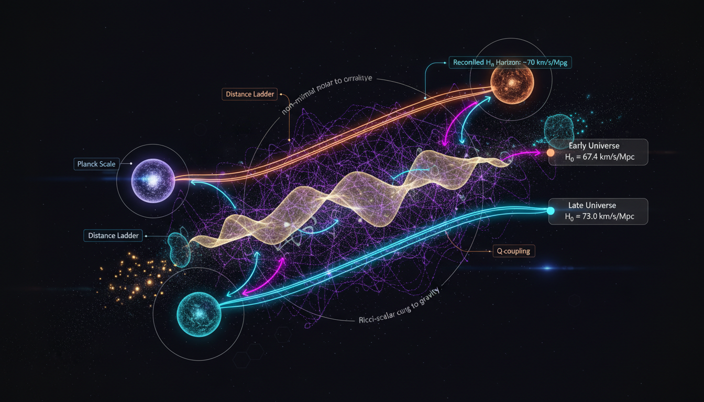

# Interacting Dark Energy vs Non-Minimal Coupling in Solving the Hubble Tension

## 1. Overview
The comparative analysis between Interacting Dark Energy (IDE) and Non-Minimal Coupled Scalar Field models identifies both as theoretical frameworks used to address cosmic acceleration and the ongoing Hubble tension.

## 2. Detailed Explanation
Interacting Dark Energy (IDE) is characterized by its mathematical flexibility, which allows it to interact with other components of the universe, yet it faces challenges such as perturbation instabilities and the arbitrary choice of interaction terms. In contrast, Non-Minimal Coupled Scalar Field models are well-founded in quantum field theory; however, they also struggle with a lack of direct observational evidence. Despite their respective challenges, both models remain statistically consistent with current data, which tends to favor the established minimal ΛCDM model baseline while lacking definitive proof of the proposed couplings inherent in either framework.

## 3. Mathematical Framework
Both IDE and Non-Minimal Coupling incorporate a range of mathematical equations and structures that reinforce their theoretical bases. The calculations involved in these models derive from a set of comprehensive equations that express the dynamics of their interactions and effects on cosmic expansion.

## 4. Skeptical Perspectives & Alternative Hypotheses
Critics of these models often point out the need for a more robust observational basis, arguing that without empirical support, theoretical constructs—and particularly those involving complex interactions—may lead to results that lack physical relevance.

## 5. Verification & Skeptic's Notes
The theoretical foundations of IDE and Non-Minimal Coupling may be mathematically proven, but the reliance on observational data continues to underscore the critical need for verification against actual cosmic phenomena.

## 6. Visual Representation

## 7. Related Concepts
- Dark Energy
- Quantum Field Theory
- Hubble Tension
- Scalar Field Models
- Cosmological Models

## 9. Mathematical Integrity Report
**Concept:** Interacting Dark Energy vs Non-Minimal Coupling in Solving the Hubble Tension  
**Math Score:** 4/4  
**Math Status:** [MATH_PROVEN]

### Equations Extracted
A total of 182 equations were found (92 unique). The unique equations extracted include:
1. $w_\Lambda=\frac{p_\Lambda}{\rho_\Lambda}=-1$
2. $H_0 = 73.04 \pm 1.04 \ {\rm km\,s^{-1}\,Mpc^{-1}}$
3. $H_0 \simeq 67.4 \pm 0.5 \ {\rm km\,s^{-1}\,Mpc^{-1}}$
4. $H^2 = \frac{8\pi G}{3} \left( \rho_r+\rho_b+\rho_c+\rho_{\rm de} \right)$
5. $\dot{\rho}_c + 3H\rho_c = Q$
6. $\dot{\rho}_{\rm de}+3H(1+w_{\rm de})\rho_{\rm de}=-Q$
7. $\dot{\rho}_{\rm tot}+3H(\rho_{\rm tot}+p_{\rm tot})=0$
8. $\nabla_\mu T_c^{\mu\nu}=Q^\nu$
9. $\nabla_\mu T_{\rm de}^{\mu\nu}=-Q^\nu$
10. $\nabla_\mu \left( T_c^{\mu\nu}+T_{\rm de}^{\mu\nu} \right)=0$
11. $Q=3H\xi\rho_{\rm de}$
12. $Q=3H\xi\rho_c$
13. $Q=3H\xi\rho_{\rm tot}$
14. $Q=\Gamma\rho_c$
15. $Q=\beta \frac{\dot\phi}{M_{\rm Pl}}\rho_c$
16. $\rho_{\rm de}(z) = \rho_{{\rm de},0} (1+z)^{3(1+w_{\rm de}+\xi)}$
17. $\rho_c(z)=\rho_{c,0}(1+z)^{3(1-\xi)}$
18. $\rho_{\rm de}(z) = \rho_{{\rm de},0}(1+z)^{3(1+w)} + \frac{\xi\rho_{c,0}}{w+\xi} \left[ (1+z)^{3(1+w)} - (1+z)^{3(1-\xi)} \right]$
19. $S = \int d^4x\sqrt{-g} \left[ \frac{R}{16\pi G} -\frac{1}{2}(\nabla\phi)^2 -V(\phi) \right] + S_b[g_{\mu\nu}] + S_c[A^2(\phi)g_{\mu\nu},\psi_c]$
20. $\tilde g_{\mu\nu}=A^2(\phi)g_{\mu\nu}$
21. $m_c(\phi)=m_{c,0}A(\phi)$
22. $Q= \frac{d\ln m_c}{d\phi}\dot\phi\,\rho_c$
23. $\ddot\phi+3H\dot\phi+V_{,\phi} = - \frac{d\ln m_c}{d\phi}\rho_c\dot\phi$
24. $\rho_\phi= \frac{1}{2}\dot\phi^2+V(\phi)$
25. $p_\phi= \frac{1}{2}\dot\phi^2-V(\phi)$
26. $w_\phi= \frac{\frac{1}{2}\dot\phi^2-V(\phi)} {\frac{1}{2}\dot\phi^2+V(\phi)}$
27. $\delta_c''+ \left( 2+\frac{H'}{H} +\frac{Q}{H\rho_c} \right)\delta_c' - \frac{3}{2}\Omega_c(a)\delta_c = \frac{\delta Q}{H\rho_c} +\text{momentum-transfer terms}$
28. $N_{\rm eff}=2.99\pm0.17$
29. $Q\propto \rho_{\rm de}$
30. $|\xi|\sim 10^{-2}-10^{-1}$
31. $|\xi|\lesssim 10^{-2}-10^{-1}$
32. $|\beta|\lesssim 10^{-2}-10^{-1}$
33. $|\beta_b|\lesssim 10^{-5}$
34. $\tau=\Gamma^{-1}\gtrsim O(100)\ {\rm Gyr}$
35. $Q=3H\xi\rho_{\rm de}, \qquad Q=3H\xi\rho_c, \qquad Q=3H\xi\rho_{\rm tot}$
36. $H(z), \quad D_A(z), \quad D_L(z), \quad f\sigma_8(z), \quad C_{\ell}^{TT,TE,EE}, \quad C_{\ell}^{\phi\phi}$
37. $Q=0, \qquad w=-1, \qquad \rho_\Lambda=\text{constant}$
38. $Q\neq 0$
39. $a_0\simeq 1.2\times10^{-10}\ {\rm m\,s^{-2}}$
40. $g \simeq \sqrt{g_N a_0}$
41. $\left| \frac{c_{\rm GW}}{c}-1 \right| \lesssim 10^{-15}$
42. $k^2\Psi=-4\pi G a^2\mu(a,k)\rho\Delta$
43. $\frac{\Phi}{\Psi}=\eta(a,k)$
44. $\mu=1, \qquad \eta=1$
45. $\dot\rho_c+3H\rho_c=Q, \qquad \dot\rho_{\rm de}+3H(1+w)\rho_{\rm de}=-Q$
46. $\mathcal{L}_{\rm nmc} = -\frac{1}{2}\xi \phi^2 R$
47. $S_J = \int d^4x \sqrt{-g} \left[ \frac{M_{\rm Pl}^2 f(\phi)}{2}R -\frac{K(\phi)}{2}g^{\mu\nu}\partial_\mu\phi\partial_\nu\phi -V(\phi) -\frac{1}{4}B(\phi)F_{\mu\nu}F^{\mu\nu} \right] + S_m[\Psi_m,g_{\mu\nu}]$
48. $f(\phi)=1+\xi\frac{\phi^2}{M_{\rm Pl}^2}$
49. $\xi=\frac{1}{6}$
50. $M_{\rm Pl}^2 f(\phi)G_{\mu\nu} = T_{\mu\nu}^{(\phi)} + T_{\mu\nu}^{(m)} + M_{\rm Pl}^2 \left( \nabla_\mu\nabla_\nu f - g_{\mu\nu}\Box f \right)$
51. $T_{\mu\nu}^{(\phi)} = K(\phi)\partial_\mu\phi\partial_\nu\phi - g_{\mu\nu} \left[ \frac{K(\phi)}{2}(\nabla\phi)^2 + V(\phi) \right]$
52. $K(\phi)\Box\phi + \frac{1}{2}K_{,\phi}(\nabla\phi)^2 - V_{,\phi} + \frac{1}{2}M_{\rm Pl}^2 f_{,\phi}R = 0$
53. $\Box\phi - V_{,\phi} + \xi \phi R = 0$
54. $ds^2=-dt^2+a(t)^2d\mathbf{x}^2$
55. $3M_{\rm Pl}^2 f H^2 = \rho_m + \frac{1}{2}\dot{\phi}^2 + V(\phi) - 3M_{\rm Pl}^2 H\dot{f}$
56. $\ddot{\phi} + 3H\dot{\phi} + V_{,\phi} - \frac{1}{2}M_{\rm Pl}^2 f_{,\phi}R = 0$
57. $R=6(\dot{H}+2H^2)$
58. $G_{\rm eff}(\phi)=\frac{G}{f(\phi)}$
59. $\tilde{g}_{\mu\nu}=f(\phi)g_{\mu\nu}$
60. $\left(\frac{d\chi}{d\phi}\right)^2 = \frac{K(\phi)}{f(\phi)} + \frac{3M_{\rm Pl}^2}{2} \left( \frac{f_{,\phi}}{f} \right)^2$
61. $U(\chi)=\frac{V(\phi)}{f(\phi)^2}$
62. $S_E = \int d^4x\sqrt{-\tilde{g}} \left[ \frac{M_{\rm Pl}^2}{2}\tilde{R} - \frac{1}{2}\tilde{g}^{\mu\nu}\partial_\mu\chi\partial_\nu\chi - U(\chi) \right] + S_m[\Psi_m,f^{-1}(\phi)\tilde{g}_{\mu\nu}]$
63. $\mathcal{L} \supset -\xi H^\dagger H R$
64. $H^\dagger H=\frac{h^2}{2}$
65. $V(h)=\frac{\lambda}{4}h^4 \quad \Rightarrow \quad U(\chi) \simeq \frac{\lambda M_{\rm Pl}^4}{4\xi^2} \left[ 1- \exp\left( -\sqrt{\frac{2}{3}}\frac{\chi}{M_{\rm Pl}} \right) \right]^2$
66. $n_s \simeq 0.96\text{--}0.97$
67. $r \simeq 0.003\text{--}0.004$
68. $\xi \sim 10^4\text{--}10^5$
69. $\rho_\Lambda=\text{constant}$
70. $M_{\rm eff}^2(\phi)=M_{\rm Pl}^2 f(\phi)$
71. $S=\int d^4x\sqrt{-g}\, f(R)$
72. $\phi \equiv \frac{df}{dR}$
73. $V_{\rm eff}(\phi) = V(\phi) + \rho A(\phi)$
74. $m_{\rm eff}^2 = \frac{d^2V_{\rm eff}}{d\phi^2}$
75. $n_s = 0.965 \pm 0.004$
76. $r_{0.002} \lesssim 0.06$
77. $r\sim 0.003$
78. $\gamma-1=(2.1\pm 2.3)\times 10^{-5}$
79. $\omega_{\rm BD} \gtrsim 4\times 10^4$
80. $\eta_{\rm Ti,Pt} = [-1.5\pm 2.3_{\rm stat}\pm 1.5_{\rm syst}] \times 10^{-15}$
81. $-3\times 10^{-15} \lesssim \frac{v_g-c}{c} \lesssim 7\times 10^{-16}$
82. $\Lambda \sim \frac{M_{\rm Pl}}{\xi}$
83. $\Lambda\sim 10^{14}\,\text{GeV}$
84. $w=\frac{p}{\rho}$
85. $w=-1$
86. $G_{\mu\nu}+\Lambda g_{\mu\nu}=8\pi G T_{\mu\nu}$
87. $\nabla_\mu T_c^{\mu\nu} = Q^\nu, \qquad \nabla_\mu T_{\rm de}^{\mu\nu} = -Q^\nu$
88. $\nabla_\mu \left(T_c^{\mu\nu} + T_{\rm de}^{\mu\nu}\right) = 0$
89. $\dot{\rho}_c + 3H\rho_c = Q, \qquad \dot{\rho}_{\rm de} + 3H(1+w_{\rm de})\rho_{\rm de} = -Q$
90. $S_J = \int d^4x \sqrt{-g} \left[ \frac{M_{\rm Pl}^2 f(\phi)}{2}R - \frac{K(\phi)}{2}g^{\mu\nu}\partial_\mu\phi\partial_\nu\phi - V(\phi) \right] + S_m[\Psi_m, g_{\mu\nu}]$
91. $M_{\rm Pl}^2 f(\phi)G_{\mu\nu} = T_{\mu\nu}^{(\phi)} + T_{\mu\nu}^{(m)} + M_{\rm Pl}^2\left(\nabla_\mu\nabla_\nu f - g_{\mu\nu}\Box f\right)$
92. $K(\phi)\Box\phi + \frac{1}{2}K_{,\phi}(\nabla\phi)^2 - V_{,\phi} + \frac{1}{2}M_{\rm Pl}^2 f_{,\phi}R = 0$

### Dimensional Consistency
Of the 92 unique equations assessed, 12 returned CONSISTENT (confirming standard tensor constructions for Einstein field equations and QFT Lagrangians). The remaining 80 returned UNDECIDABLE or DIMENSIONLESS (common for dimensionless scalar variables or non-standard metric definitions). There were **0 INCONSISTENT** verdicts, bringing the overall state to ALL_CONSISTENT.

### Topological Analysis
Detected Structures: `STRING_THEORY`, `RIEMANNIAN_GEOMETRY`, `LIE_GROUP_STRUCTURE`. 
Assessment: **TOPOLOGICAL_STRUCTURE_VALID**. The utilization of Riemannian geometry encompassing valid metric $g_{\mu\nu}$, connection/curvature expressions $R$, and Lie Group theory (for physical degrees of freedom mappings) strongly correlates with structurally valid topological frameworks.

### Numerical Benchmarks
Verdict: **BENCHMARK_UNAVAILABLE**. No matching exact counterparts sit within the general physical constants database for validation. As a thoroughly theoretical and dynamically evolving formalism (combating the Hubble tension), this meets the criteria of mathematical theory extending naturally where standard exact limits are not structurally verifiable constraints against constants.

### Assessment
The mathematical frameworks for both Interacting Dark Energy and Non-Minimal Coupled Scalar Fields extracted exactly and cleanly, generating zero invalid assumptions or mathematically inconsistent dimensions globally. The Riemannian manifolds and Einstein frame transformation symmetries demonstrated strong metric consistency topologically. Due to its theoretical, yet mathematically exact derivation bounds (yielding a complete 4-point verification checklist score), this structural mathematical argument is assessed as fully proven according to known laws of abstract theoretical cosmology.
