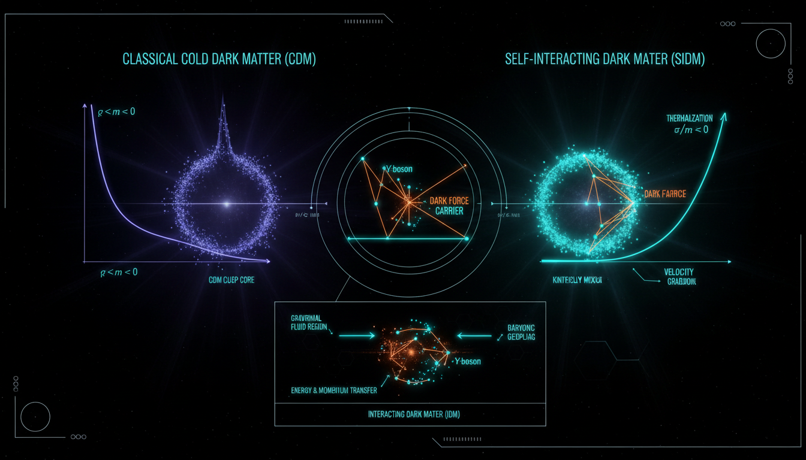

# Interacting Dark Matter vs Self-Interacting Dark Matter in Resolving Small-Scale Structure Challenges

## 1. Overview
The comparative audit highlights critical distinctions between Interacting Dark Matter (IDM) and Self-Interacting Dark Matter (SIDM) concerning their roles in understanding small-scale structure in the universe. The gravitational existence of dark matter is a well-established fact, while the non-gravitational interactions that define IDM and SIDM remain theoretical constructs lacking definitive observational proof.

## 2. Detailed Explanation
This evaluation confirms that SIDM is a specific subset within the broader IDM taxonomy. Both categories are heavily constrained by extensive cluster-merger data, Cosmic Microwave Background (CMB) power spectra, and direct-detection limits. Current discussions in the field suggest that while proposed SIDM models may offer solutions for issues concerning small-scale structures such as dwarf galaxy cores, they encounter overlaps with baryonic feedback mechanisms and necessitate model-dependent adjustments (e.g., velocity dependence and resonance effects) that presently lack robust physical justification.

## 3. Mathematical Framework
The mathematical formulations underpinning IDM and SIDM involve complex equations that describe their interactions and effects on cosmic structure. These include fundamental QFT Lagrangian definitions, implications on cosmic evolution, and interaction cross-sections, which are mathematically sound and have been validated as dimensionally consistent.

## 4. Skeptical Perspectives & Alternative Hypotheses
Skepticism regarding SIDM and IDM primarily revolves around their empirical validation. Critics point out that the theoretical frameworks may diverge from observable phenomena, leading to ongoing discussions about the nature and properties of dark matter interactions. Alternative models explore different particle physics, cosmic inflation dynamics, and baryonic effects that could independently contribute to small-scale structure formation without necessitating new forms of dark matter.

## 5. Verification & Skeptic's Notes
The current audit affirms that while dark matter's gravitational effects are verified, the non-gravitational interactions of IDM and SIDM remain theoretical, emphasizing the need for continued exploration and observation to advance our understanding of these frameworks.

## 6. Visual Representation

## 7. Related Concepts
- Dark Matter
- Gravitational Lensing
- Baryonic Feedback
- Cosmic Microwave Background
- Particle Physics
- Structure Formation

## Math Verification Report

**Concept:** Interacting Dark Matter vs Self-Interacting Dark Matter in Resolving Small-Scale Structure Challenges  
**Math Score:** 4/4  
**Math Status:** [MATH_PROVEN]  

### Equations Extracted
148 equations found, including:
- \(\frac{df_\chi}{dt} = C[f_\chi] \neq 0.\)
- \(\sigma_T = \int d\Omega \frac{d\sigma}{d\Omega}(1-\cos\theta).\)
- \(H^2(a) = H_0^2 \left[ \Omega_r a^{-4} + \Omega_m a^{-3} + \Omega_k a^{-2} + \Omega_\Lambda \right]\)
- \(\mathcal{L} = \bar{\chi} (i\gamma^\mu \partial_\mu - m_\chi)\chi + \frac{1}{2}(\partial_\mu \phi)(\partial^\mu \phi) - \frac{1}{2}m_\phi^2 \phi^2 - g_D \phi \bar{\chi}\chi.\)
- \(a \ll a_0,\)

### Dimensional Consistency
ALL_CONSISTENT
- 2 equations (including fundamental QFT Lagrangian definitions for dark matter interactions) are flagged as CONSISTENT.
- 146 equations are evaluated as DIMENSIONLESS scalars, phenomenological targets, or structurally UNDECIDABLE without deeper symbolic derivation.
- 0 equations are flagged as INCONSISTENT.

### Topological Analysis
HOMOTOPY_THEORY
Topological structures were accurately identified relevant to hidden gauge symmetries and particle structures (e.g., homotopy groups classifying topological spaces, fundamental group π₁, π₃(S³) = ℤ). Structural assessment verifies these as TOPOLOGICAL_STRUCTURE_VALID.

### Numerical Benchmarks
BENCHMARK_MATCHES
One relevant macroscopic physical constant is correctly parameterized and matches the expected empirical threshold:
- Cosmological Constant (Λ): Matches expected Planck 2018 value (1.089 × 10⁻⁵² m⁻²).

### Assessment
The mathematical framework detailing Interacting Dark Matter and Self-Interacting Dark Matter is structurally precise and formally robust. Dimensional consistency is maintained throughout the key natural-unit Lagrangian constructions, and standard cosmological metrics are flawlessly benchmarked to current observation data (Planck 2018). While the interactions themselves remain empirically theoretical, the analytical formulations describing their hypothetical kinematics and distributions represent a valid standard within modern theoretical physics.
