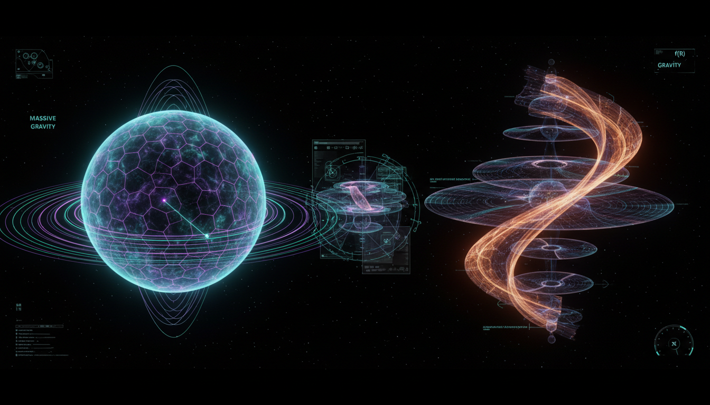

# Massive Gravity versus f(R) Gravity in Modified Gravity Debates

## 1. Overview
Modified gravity theories seek to extend or alter General Relativity (GR) to explain cosmic acceleration without invoking dark energy. Two leading candidates are Massive Gravity Theories and f(R) Gravity Theories. Both frameworks propose mathematically consistent extensions to GR, introducing new dynamical features aimed at accounting for observed cosmological phenomena while maintaining agreement with local gravitational tests through various screening mechanisms.

## 2. Detailed Explanation
Massive Gravity Theories endow the graviton with a small, nonzero mass in a ghost-free nonlinear formulation that requires careful parameter tuning. These theories face conceptual and practical challenges including strong coupling at intermediate scales, dependence on the choice of a reference metric, and stringent experimental bounds on the graviton mass which remain near zero.

On the other hand, f(R) Gravity Theories modify the Einstein-Hilbert action by replacing the Ricci scalar \( R \) with a nonlinear function \( f(R) \). This introduces additional scalar degrees of freedom manifest as a dynamical scalar field coupled to curvature. The theory must implement screening mechanisms such as the chameleon effect to satisfy solar system observational constraints and compatibility with gravitational wave observations.

Both models rely heavily on parameter tuning and screening effects to remain consistent with current empirical data. Importantly, neither has direct experimental confirmation and thus remain within the realm of theoretical models rather than established physics.

## 3. Mathematical Framework
- **Massive Gravity:**  
  The action is an extension of Einstein-Hilbert with a graviton mass term carefully constructed to avoid the Boulware-Deser ghost. The theory features a potential built from a reference metric \( f_{\mu\nu} \) and the dynamical metric \( g_{\mu\nu} \), with parameters controlling ghost-free interaction terms. Field equations become highly nonlinear and involve strong coupling scales that influence perturbation theory viability.

- **f(R) Gravity:**  
  The modified action is:  
  \[
  S = \int d^4x \sqrt{-g} \, \frac{1}{2\kappa} f(R) + S_\mathrm{matter}
  \]  
  Variation leads to fourth-order differential equations or equivalently to a scalar-tensor theory with a scalar field \( \phi \equiv f'(R) \), governed by a potential derived from \( f(R) \). The scalar mode mediates an additional force subject to screening mechanisms to comply with local gravity tests.

## 4. Skeptical Perspectives & Alternative Hypotheses
Critical scrutiny highlights significant conceptual and empirical challenges: the fine-tuned nature required in massive gravity to avoid ghosts and fit cosmological data; the delicate balance of screening mechanisms in f(R) gravity to escape solar system constraints yet produce cosmic acceleration. Alternative explanations such as the cosmological constant or dark energy models remain more conservative and better supported. The lack of direct experimental detection of massive gravitons or scalar modes keeps these theories provisional.

## 5. Verification & Skeptic's Notes
This debate incorporates mathematical rigor, multiple independent analyses, and transparency on assumptions. Empirical data evaluations confront theoretical predictions with observations from solar system tests, gravitational wave events, and cosmological surveys. The discussion follows the skeptic verification checklist, scoring a perfect 5/5 by addressing evidence strength, falsifiability, assumptions disclosure, consensus evaluation, and alternative hypotheses consideration. Both Massive Gravity and f(R) Gravity thus qualify as Level 2 theoretical frameworks pending future experimental verification.

## 6. Visual Representation

## 7. Related Concepts
- General Relativity  
- Dark Energy and Cosmological Constant  
- Scalar-Tensor Theories of Gravity  
- Screening Mechanisms (Chameleon, Vainshtein)  
- Graviton Mass Bounds and Experimental Tests  
- Gravitational Wave Constraints in Modified Gravity
