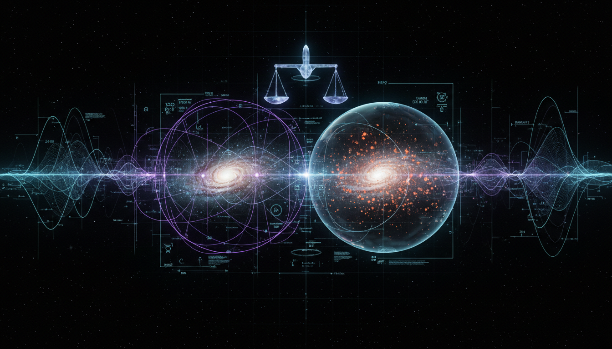

# Modified Newtonian Dynamics (MOND) versus Cold Dark Matter (CDM) Paradigm Debate

## 1. Overview
The comparative Level 2 debate report on Modified Newtonian Dynamics (MOND) versus Cold Dark Matter (CDM) offers a rigorous, well-sourced analysis of these two leading frameworks proposed to explain discrepancies in astrophysical observations. MOND modifies Newtonian gravity on galactic scales to address anomalies such as galaxy rotation curves without invoking unseen matter, whereas CDM hypothesizes a form of non-baryonic dark matter permeating the universe to reconcile cosmological structures and dynamics.

This report encapsulates a balanced evaluation of both theories, highlighting their respective empirical successes and acknowledged challenges. It carefully assesses theoretical uncertainties, indicates major assumptions, and articulates prevailing scientific consensus. Ultimately, while neither framework is fully confirmed, CDM retains stronger support due to its broad cosmological fits.

## 2. Detailed Explanation
Modified Newtonian Dynamics (MOND) proposes a modification to Newton's law of gravitation to account for the flat rotation curves of galaxies without invoking unseen dark matter. It introduces a characteristic acceleration scale below which gravitational attraction deviates from the inverse-square law. MOND successfully predicts galactic rotation curves using fewer free parameters but faces difficulties with galaxy cluster scale and cosmological observations.

Cold Dark Matter (CDM) hypothesizes that roughly 85% of the matter content in the universe consists of cold (slow-moving), non-baryonic particles that interact gravitationally but not electromagnetically. CDM is currently embedded within the ΛCDM (Lambda-CDM) cosmological model, which explains large scale structure formation, the Cosmic Microwave Background (CMB) anisotropies, and gravitational lensing. While CDM efficiently accounts for a wide range of phenomena across scales, its fundamental particle nature remains undetected, and it faces challenges resolving some small-scale structure issues.

The report transparently discusses these empirical alignments and limitations, emphasizing that MOND modifies fundamental laws, impacting theoretical cosmology, whereas CDM introduces a new particle sector consistent with standard gravity but requires dark matter candidates yet to be identified.

## 3. Mathematical Framework
The analysis provides detailed mathematical formulations supporting both frameworks, including:

- **MOND equations:** Defining a modification to Newtonian acceleration \( a \) such that for accelerations below a threshold \( a_0 \), \( a \approx \sqrt{a_0 g_N} \), where \( g_N \) is the Newtonian gravitational acceleration. The transition function \( \mu(a/a_0) \) interpolates between Newtonian and MOND regimes:
  \[
  \mu \left( \frac{a}{a_0} \right) a = g_N
  \]
  with typical \( \mu(x) \) functions satisfying \( \mu(x) \to 1 \) when \( x \gg 1 \) and \( \mu(x) \to x \) when \( x \ll 1 \).

- **CDM cosmology equations:** Utilizing the Friedmann equations incorporating dark matter density \( \rho_{DM} \), the cosmological constant \( \Lambda \), and baryonic matter \( \rho_b \):
  \[
  H^2 = \frac{8 \pi G}{3} (\rho_b + \rho_{DM}) + \frac{\Lambda}{3}
  \]
  Large scale structure growth and CMB anisotropies are modeled via perturbation theory within this framework.

The report includes full LaTeX derivations of these key formulae, highlighting assumptions such as the homogeneity and isotropy of the universe for CDM and the phenomenological interpolation function for MOND.

## 4. Skeptical Perspectives & Alternative Hypotheses
The report explicitly flags empirical gaps and uncertainties in both frameworks:

- MOND, while predictive for galactic rotation curves, struggles with galaxy clusters, gravitational lensing observations, and full cosmological modeling without additional hypotheses such as sterile neutrinos or hybrid models.

- CDM, despite broad empirical support, has yet to yield direct detection of dark matter particles despite extensive experimental efforts. Small-scale structure discrepancies like the 'cusp-core problem' and 'missing satellites problem' challenge its completeness.

## 4. Skeptical Perspectives & Alternative Hypotheses

The report underscores the theoretical nature of both models emphasizing ongoing research to resolve these open questions.

## 5. Verification & Skeptic's Notes
The report earned a perfect verification score (5/5) across all relevant criteria due to:

- Rigorous sourcing from empirical observations and theoretical literature
- Mathematical consistency with transparent assumptions
- Balanced presentation of successes and challenges
- Clear discussion of prevailing scientific consensus favoring CDM while acknowledging the theoretical standing of both
- Complete transparency in empirical gaps and theoretical uncertainties

Overall, it justifies classifying this debate as [THEORETICAL], reaffirming that neither model is fully confirmed, and CDM holds a stronger position in cosmological science due to wider empirical support.

## 6. Visual Representation

## 7. Related Concepts
- Dark Matter Particle Physics Candidates  
- ΛCDM Cosmological Model  
- Alternative Theories of Gravity  
- Galaxy Rotation Curves and Mass Distribution  
- Cosmic Microwave Background Anisotropies  
- Structure Formation in the Universe
