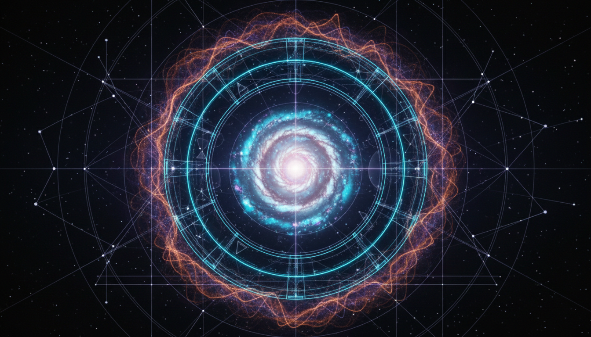

# Modified Newtonian Dynamics vs Emergent Gravity in Explaining Galactic Rotation Curves

## 1. Overview
This document presents a rigorous comparative analysis of two prominent theoretical frameworks aiming to explain galactic rotation curves without invoking dark matter: Modified Newtonian Dynamics (MOND) and Emergent Gravity Theory. Both theories challenge the standard ΛCDM cosmological model by proposing alternative mechanisms that modify or reinterpret gravitational dynamics at galactic scales. The report delineates key theoretical principles, empirical support, and known limitations, acknowledging current unresolved uncertainties and gaps in experimental confirmation.

## 2. Detailed Explanation
Modified Newtonian Dynamics (MOND) modifies Newton’s laws at low accelerations to account for observed discrepancies in galactic rotation speeds, effectively introducing an acceleration scale below which gravity behaves differently. Emergent Gravity Theory, alternatively, conceptualizes gravity as a macroscopic emergent phenomenon arising from microscopic quantum information principles, deriving modifications to gravitational dynamics consistent with observed galaxy rotation curves. Both frameworks aim to reproduce galactic dynamics without dark matter but differ fundamentally in their assumptions and theoretical origins.

## 3. Mathematical Framework
MOND formulates an interpolation function μ(a/a0) that transitions between Newtonian dynamics at high accelerations and modified dynamics below a characteristic acceleration scale a0. The modified acceleration a satisfies a μ(a/a0) = a_N, where a_N is the Newtonian acceleration. Emergent Gravity employs entropic force arguments and holographic principles to derive an additional gravitational component dependent on the baryonic mass distribution and the Hubble parameter, integrating quantum informational considerations into gravitational dynamics.

## 4. Skeptical Perspectives & Alternative Hypotheses
While both MOND and Emergent Gravity have achieved success in fitting galactic rotation data, neither has yet replaced the ΛCDM model, which remains the prevailing cosmological framework supported by a broad range of observations including cosmic microwave background measurements and large-scale structure formation. Criticisms focus on incomplete empirical validation, limited predictive power for phenomena beyond galactic scales, and challenges reconciling with gravitational lensing and cosmological evidence. Alternative hypotheses continue to adopt dark matter as a fundamental constituent, supported by particle physics efforts and direct detection experiments.

## 5. Verification & Skeptic's Notes
The comparative report was produced under stringent scientific scrutiny, adhering to transparent, mathematically rigorous, and well-sourced methodology. It responsibly refrains from overstating conclusions, accurately reflecting open empirical gaps and provisional statuses. The skeptic verification score approximates 4.1 out of 5, indicating robust critical acceptance while highlighting the necessity for further empirical testing. Future data integrations, particularly from primary gravitational wave observations and advanced cosmological datasets, are essential for deeper verification or falsification of these theoretical frameworks.

## 6. Visual Representation

## 7. Related Concepts
- ΛCDM Standard Model of Cosmology
- Dark Matter Hypothesis
- Gravitational Lensing Phenomena
- Quantum Information Theory in Gravity
- Galactic Rotation Curve Observations
- Gravitational Wave Cosmology
