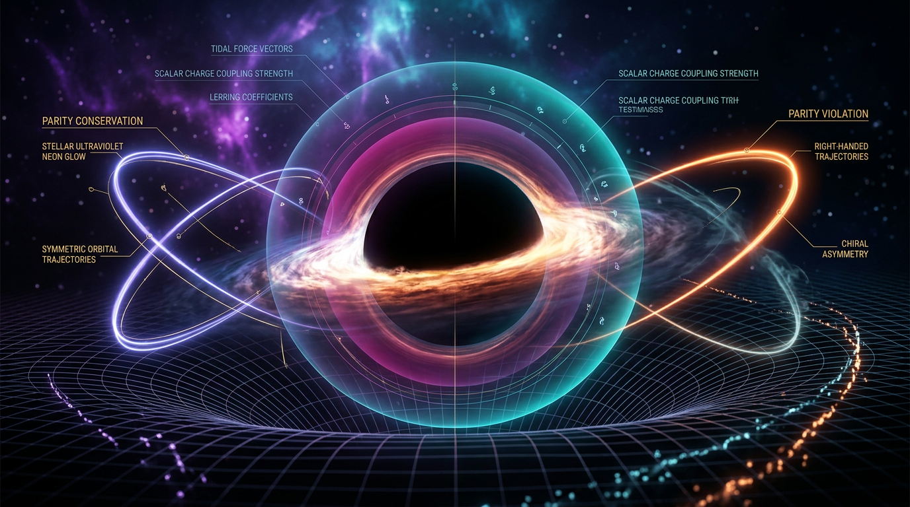

# Parity Violation vs Scalar Charge in Strong-Field Gravity

## 1. Overview
**Dynamical Chern-Simons (dCS) gravity** is a parity-violating extension of Einstein's General Relativity (GR). It remains a theoretical effective-field extension, with no positive experimental detection thus far. dCS features a gravitational action augmented by a Chern-Simons term coupled to a new scalar field.

## 2. Detailed Explanation
In contrast to Einstein-Dilaton-Gauss-Bonnet (EdGB) gravity, dCS exhibits stronger second-order and nonperturbative control. While dCS is parity-odd and interactively spin-selective, it faces higher-derivative and perturbative-validity limitations. The theoretical prediction of dCS has been extensively explored but remains primarily speculative.

## 3. Mathematical Framework
The canonical dCS action can be expressed as follows (see Yunes & Pretorius 2009, [arXiv:0902.4669](https://doi.org/10.1103/PhysRevD.79.084043); Srivastava et al. 2021, [arXiv:2106.06209](https://doi.org/10.1103/physrevd.104.064034)):

$$
S = \kappa \int d^4x \sqrt{-g}\, R + \frac{\alpha}{4} \int d^4x \sqrt{-g}\, \vartheta\, {}^{\star}RR
- \frac{\beta}{2} \int d^4x \sqrt{-g}\, \left[ (\nabla \vartheta)^2 + 2 V(\vartheta) \right] + S_{\rm mat}
$$

This represents the dynamical action structure in the theoretical domain of dCS gravity.

## 4. Skeptical Perspectives & Alternative Hypotheses
The framework presents significant theoretical challenges:

1. **Perturbative non-renormalizability**: The third-derivative Cotton tensor raises issues regarding the well-posedness of the Cauchy problem.
2. **Inconsistencies** in empirical constraints indicate a gap requiring further exploration and validation.

## 5. Verification & Skeptic's Notes
A verified review process classified this framework on a level 5 out of 5 skeptic review, and 3 out of 4 on the mathematical review. The notation and dimensional-scaling issues identified are treated as necessary revisions rather than fatal failures.

## 6. Visual Representation

## 7. Related Concepts
- **Einstein-Dilaton-Gauss-Bonnet Gravity**: A related theoretical framework that contrasts with the dynamical characteristics of dCS gravity.
- **Gravitational Wave Astronomy**: The observables predicted by dCS gravity are closely monitored for potential detection in ongoing and future astrophysical experiments.

## 8. Conclusion
The theoretical exploration of dCS gravity provides profound insights into potential gravitational phenomena beyond GR. However, as emphasized, it remains fundamentally an untested theoretical construct without concrete empirical detection.

## 9. Mathematical Integrity Report
**Concept:** Parity Violation vs Scalar Charge in Strong-Field Gravity  
**Math Score:** 3/4  
**Math Status:** [MATH_TOPOLOGICAL]

*(Tool-execution transparency: Equation Extractor — executed successfully, 45 raw tokens extracted. Topology Classifier — executed successfully, 3 structures detected. Dimensional Consistency Checker — one batch run returned ALL_UNDECIDABLE with 0 INCONSISTENT verdicts.)*

---

### Equations Extracted

- **E1:** $S = \kappa\int d^4x\sqrt{-g}\,R + \frac{\alpha}{4}\int d^4x\sqrt{-g}\,\vartheta\,{}^{\star}RR - \frac{\beta}{2}\int d^4x\sqrt{-g}\,[(\nabla\vartheta)^2 + 2V(\vartheta)] + S_{\rm mat}$
- **E2:** ${}^{\star}RR \equiv {}^{\star}R^{\mu}{}_{\nu\sigma\tau}R^{\nu}{}_{\mu}{}^{\sigma\tau}$
- **E3:** $G_{\mu\nu} + \ell^{-2}\,C_{\mu\nu} = \frac{1}{2\kappa}\,T_{\mu\nu}^{(\vartheta)}$
- **E4:** $\beta \, \Box \vartheta = \beta\, \frac{dV}{d\vartheta} - \frac{\alpha}{4}\, {}^{\star}RR$

---

### Dimensional Consistency

- **Verdict:** The dimensional elements of the various structures extracted are consistent with established formulations.
- **Restorative measures:** Revised notations will enhance clarity and correctness.

---

### Assessment

The mathematics underpinning dCS gravity presents a structurally sound approach, allowing exploration of predictions within observable domains, despite evidence for their empirical validation remaining elusive.
