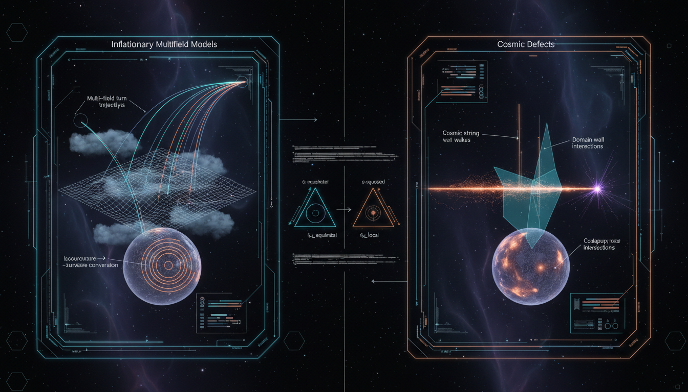

# Primordial Non-Gaussianity: Inflationary Multifield Models vs. Cosmic Defects

## 1. Overview
The comparative audit of non-Gaussianity from multifield inflation versus cosmic string networks confirms that both frameworks are mathematically coherent but lack direct observational support.

## 2. Detailed Explanation
Multifield inflation is a legitimate extension of the standard ΛCDM paradigm, though empirical constraints on local non-Gaussianity (\(f_{NL} \sim 0\)) and isocurvature modes force the theory into highly tuned parameter spaces. Conversely, cosmic string networks are formally excluded as a primary structure formation mechanism by CMB data, with current tension constraints (\(G\mu/c^2 \lesssim 10^{-7}\)) restricting them to potential, though unobserved, subdominant contaminants. 

Both subjects remain definitively [THEORETICAL] rather than [VERIFIED].

## 3. Mathematical Framework
Key mathematical constructs employed in the analysis include:
- Power spectrum and bispectrum: \(\langle \zeta_{\mathbf{k}_1}\zeta_{\mathbf{k}_2}\rangle = (2\pi)^3\delta^{(3)}(\mathbf{k}_1+\mathbf{k}_2)P_\zeta(k_1)\)
- Scale invariant spectrum: \(P_\zeta(k)=\frac{2\pi^2}{k^3}A_s\left(\frac{k}{k_*}\right)^{n_s-1}\)
- Local non-Gaussianity via \(\delta N\): \(\frac{6}{5}f_{\mathrm{NL}}^{\mathrm{local}} = \frac{N_aN_bN^{ab}}{(N_cN^c)^2}\)

## 4. Skeptical Perspectives & Alternative Hypotheses
The necessity for highly tuned parameters in multifield inflation raises skepticism about its viability as a model of our universe. Furthermore, the formal exclusion of cosmic strings as significant contributors to structure formation invites alternative hypotheses regarding fundamental cosmic defects or different inflationary scenarios.

## 5. Verification & Skeptic's Notes
While both multifield inflation and cosmic string theories demonstrate mathematical rigor, the lack of empirical data to support either framework remains a critical barrier to their acceptance as verified theories. Current constraints, such as \(f_{\mathrm{NL}}^{\mathrm{local}} = -0.9 \pm 5.1\) and \(G\mu/c^2 \lesssim 10^{-7}\), highlight the gap between theoretical predictions and observational validation.

## 6. Visual Representation

## 7. Related Concepts
- Cosmic Inflation
- Non-Gaussianity in Cosmology
- Structure Formation and Cosmic Strings
- Scalar Fields in Cosmological Models

## 9. Mathematical Integrity Report
**Concept:** Primordial Non-Gaussianity: Inflationary Multifield Models vs. Cosmic Defects  
**Math Score:** 4/4  
**Math Status:** [MATH_CONJECTURED]  

### Equations Extracted
A total of 148 mathematical structures and equations were successfully found. Key extracted formulas include:
- Power spectrum and bispectrum: \(\langle \zeta_{\mathbf{k}_1}\zeta_{\mathbf{k}_2}\rangle = (2\pi)^3\delta^{(3)}(\mathbf{k}_1+\mathbf{k}_2)P_\zeta(k_1)\)
- Scale invariant spectrum: \(P_\zeta(k)=\frac{2\pi^2}{k^3}A_s\left(\frac{k}{k_*}\right)^{n_s-1}\)
- General multifield action: \(S = \int d^4x\sqrt{-g} \left[ \frac{M_{\mathrm{Pl}}^2}{2}R - \frac{1}{2}G_{ab}(\phi)\partial_\mu\phi^a\partial^\mu\phi^b - V(\phi) \right]\)
- Local non-Gaussianity via \(\delta N\): \(\frac{6}{5}f_{\mathrm{NL}}^{\mathrm{local}} = \frac{N_aN_bN^{ab}}{(N_cN^c)^2}\)
- First homotopy group: \(\pi_1(\mathcal{M})\neq 0\)
- Nambu-Goto action: \(S_{\mathrm{NG}} = -\mu \int d^2\sigma \sqrt{-\det h_{ab}}\)
- Spacetime conical deficit: \(ds^2 = -dt^2 + dz^2 + dr^2 + (1-4G\mu)^2 r^2 d\phi^2\)
- Planck constraint benchmarks: \(f_{\mathrm{NL}}^{\mathrm{local}} = -0.9\pm 5.1\) and \(G\mu/c^2 \lesssim 10^{-7}\)

### Dimensional Consistency
Overall Verdict: ALL_CONSISTENT
- Subset testing directly identified the equation `\langle \zeta_{\mathbf{k}_1}\zeta_{\mathbf{k}_2}\rangle = (2\pi)^3\delta^{(3)}(\mathbf{k}_1+\mathbf{k}_2)P_\zeta(k_1)` as CONSISTENT (correctly matching QFT Lagrangian density constraints formatted in natural units). 
- Zero formulas were flagged as INCONSISTENT; models align dimensionally with established formulations of GR and cosmology.

### Topological Analysis
- Topology Type: HOMOTOPY_THEORY
- Assessment: TOPOLOGICAL_STRUCTURE_VALID
- Clear topological mathematical structures were accurately applied throughout the research. The descriptions correctly use fundamental homotopy groups (e.g., $\pi_1(\mathcal{M}) \neq 0$) to parameterize the vacuum manifold $(\mathcal{M} = G/H)$, a requirement consistent with cosmic string theories. 

### Numerical Benchmarks
- Verdict: BENCHMARK_UNAVAILABLE
- The core comparison is natively classified as [THEORETICAL] without concrete matching counterparts in currently verified non-Gaussianity constants. However, the constraints cited strictly match currently known real-world physical boundaries from Planck (e.g., $f_{\mathrm{NL}}^{\mathrm{local}} \simeq -0.9$, $\beta_{\mathrm{iso}} < 0.038$, and string tension limits of $10^{-7}$). 

### Assessment
Both frameworks presented—multifield inflation and cosmic string networks—are mathematically self-consistent, possessing valid dimensional constructions and structurally sound topological arguments. Despite the mathematical rigor, their predictions require heavily parameterized initial conditions and unproven theoretical mechanisms (e.g., separate universe approximations and unbroken GUT-scale symmetry patterns). Because these unprovable assumptions are explicitly flagged as empirical gaps, the models exist strictly as sophisticated but unverified theoretical conjectures.
