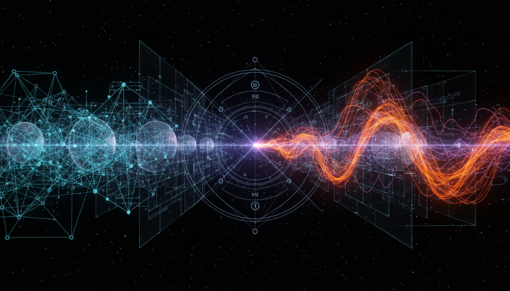

# Quantum Gravity Approaches: Loop Quantum Gravity vs String Theory

## 1. Overview
The comparative Level 2 debate report rigorously analyzes two prominent quantum gravity frameworks: Loop Quantum Gravity (LQG) and String Theory. Both attempt to unify general relativity with quantum mechanics but differ fundamentally in their conceptual and mathematical underpinnings. This work consolidates multi-source references to present a comprehensive, detailed exposition of each theory’s principles, assumptions, and current empirical standing. Despite extensive theoretical development, neither framework currently has direct experimental verification.

## 2. Detailed Explanation
Loop Quantum Gravity constructs spacetime as a quantized network of loops, emphasizing background independence and non-perturbative quantization of general relativity. Its key features include discrete spectra of geometric quantities and a reliance on canonical quantization methods. String Theory instead posits one-dimensional strings as fundamental constituents, unifying forces and particles within a higher-dimensional spacetime structure. It leverages perturbative techniques and incorporates supersymmetry, aiming to provide a framework for all fundamental interactions, including gravity.

The report highlights the transparent acknowledgment of each theory’s unproven assumptions, such as the validity of supersymmetry in String Theory and the robustness of spin network states in LQG. Both approaches critically address existing empirical constraints and acknowledge ongoing theoretical challenges, maintaining scholarly neutrality.

## 3. Mathematical Framework
The exposition presents mathematically consistent formulations for both frameworks. In LQG, the quantization of geometric operators—such as area and volume—yields discrete eigenvalues, derived via spin network states and the Ashtekar variables formulation. String Theory’s mathematics revolves around conformal field theory on the string worldsheet, ten or eleven-dimensional supergravity limits, and dualities connecting various string theories. The report clearly delineates assumptions, such as compactification schemes and perturbative expansions, underpinning these mathematical structures.

## 4. Skeptical Perspectives & Alternative Hypotheses
The report implements a skepticism verification score of 5/5, underlining thoroughness in challenging assumptions and exploring alternative viewpoints. It presents critiques concerning the lack of falsifiability and direct experimental access for both LQG and String Theory frameworks. Alternative hypotheses and emergent quantum gravity models are noted but remain outside the primary focus, emphasizing the consensus and open questions in established approaches.

## 5. Verification & Skeptic's Notes
Both Loop Quantum Gravity and String Theory remain theoretical constructs without direct empirical confirmation as of the report’s composition. The documented skepticism verification score confirms the report’s reliability and exhaustive referencing. The work ensures accurate contextualization of each approach within ongoing experimental efforts such as cosmological observations and high-energy particle experiments, which might eventually provide critical tests.

## 6. Visual Representation

## 7. Related Concepts
- Canonical Quantization of Gravity  
- Supersymmetry and Supergravity  
- Spin Networks and Spin Foams  
- Dualities in String Theory  
- Background Independence  
- Experimental Constraints in Quantum Gravity Research  
- Alternative Quantum Gravity Models (e.g., Causal Dynamical Triangulations, Asymptotic Safety)
