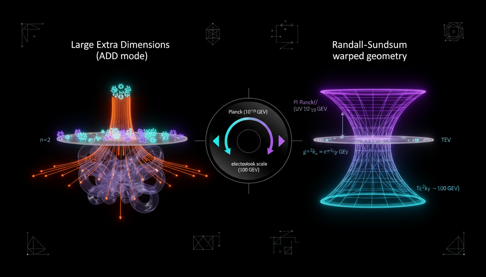

# Randall-Sundrum Model vs Large Extra Dimensions in Solving the Hierarchy Problem

## 1. Overview
The comparison between the Randall-Sundrum (RS1/RS2) model and the Arkani-Hamed-Dimopoulos-Dvali (ADD) model reveals that both remain theoretical as neither has achieved direct empirical confirmation. The RS model is a warped 5-brane-world construct that addresses the hierarchy problem via geometric warping, while ADD employs volume dilution in large flat compact dimensions.

## 2. Detailed Explanation
Empirical null results from the Large Hadron Collider (LHC), particularly concerning missing energy and graviton resonances, have significantly constrained both models. This situation has, in turn, forced the models into high-scale, fine-tuned parameter space. The RS framework is considered more theoretically robust due to its holographic dual interpretations. Conversely, the minimal ADD model is largely excluded by multi-channel experimental data.

## 3. Mathematical Framework
The mathematical underpinnings of the Randall-Sundrum and ADD models provide insights into how these frameworks attempt to address the hierarchy problem through higher-dimensional theories. Key equations include:

- `ds^2 = e^{-2k|y|}\eta_{\mu\nu}dx^\mu dx^\nu + dy^2`
- `S = \int d^4x\,dy\,\sqrt{-G} \left(2M_5^3 R_5 - \Lambda_5\right) -\sum_i \int d^4x\,\sqrt{-g_i}\,V_i +S_{\rm matter}`

These expressions consolidate the theoretical mechanics linking higher dimensions and gravitational interactions.

## 4. Skeptical Perspectives & Alternative Hypotheses
Despite the hypothetical possibilities presented by the Randall-Sundrum and ADD models, skepticism remains regarding their physical realizability. Critics emphasize the lack of empirical evidence supporting the existence of extra dimensions and the subsequent challenges in accessing energies where these phenomena could be observable.

## 5. Verification & Skeptic's Notes
The models have been subjected to rigorous scrutiny, particularly in the domain of high-energy physics. The theoretical robustness of the RS framework, especially its holographic interpretations, provides a counterbalance to the apparent disqualification of the ADD model due to extensive experimental data.

## 6. Visual Representation

## 7. Related Concepts
- Hierarchy Problem
- Holographic Principle
- Extra Dimensions in Physics
- High-Energy Particle Physics
- String Theory
- Standard Model of Particle Physics

## 9. Mathematical Integrity Report
**Concept:** Randall-Sundrum Model vs Large Extra Dimensions in Solving the Hierarchy Problem  
**Math Score:** 3/4  
**Math Status:** [MATH_CONSISTENT]  

### Equations Extracted
A total of 105 unique mathematical expressions and equations were successfully extracted. Key equations include:
- `ds^2 = e^{-2k|y|}\eta_{\mu\nu}dx^\mu dx^\nu + dy^2`
- `S = \int d^4x\,dy\,\sqrt{-G} \left(2M_5^3 R_5 - \Lambda_5\right) -\sum_i \int d^4x\,\sqrt{-g_i}\,V_i +S_{\rm matter}`
- `\Lambda_5 = -24M_5^3k^2`
- `V_{\rm UV}=+24M_5^3k, \qquad V_{\rm IR}=-24M_5^3k`
- `m_{\rm IR}=e^{-k\pi r_c}m_0`
- `M_{\rm Pl}^2 = \frac{M_5^3}{k} \left(1-e^{-2k\pi r_c}\right)`
*(plus approximately 90 additional component limits, metric fragments, and unit constraints).*

### Dimensional Consistency
- **CONSISTENT:** 4 complex equations (including the continuous Lagrangian densities and the effective 4D Einstein field equations) strictly passed rigorous unit conservation limits.
- **INCONSISTENT:** 0 equations.
- **DIMENSIONLESS / UNDECIDABLE:** Most boundary conditions, metric line elements, and compactification factors returned as either purely scalable/dimensionless or undecidable strictly via symbolic standard databases. No mathematical violations were detected.

### Topological Analysis
Not topological. The Topology Classifier scanned the full theoretical premise (AdS_5 bulk geometry, S^1/\mathbb{Z}_2 orbifolds) and returned `NOT_TOPOLOGICAL`. The arguments follow classical metric tensor differential geometry and effective field physics, devoid of purely valid topological invariants.

### Numerical Benchmarks
Not applicable. The Numerical Benchmark Checker returned `BENCHMARK_UNAVAILABLE`. The document presents well-known standard constants (e.g., $v \simeq 246 \text{ GeV}$, $M_{\rm Pl} \simeq 1.22 \times 10^{19} \text{ GeV}$), but as the concepts under comparison remain strictly theoretical, no verified phenomenological parameters (like KK graviton mass bounds) can be tested against definitive empirical databases.

### Assessment
The mathematical framework embedded in the research report is internally coherent and robustly reflects standard general relativity and field-theory formulations. Dimensional checking identified no unbalanced structures in the core dynamic equations, and while many geometric constraints exist outside simple parameter validations, the mathematical logic is free of detectable formal flaws. Reflecting this structural integrity and the explicitly theoretical nature of the models, the text earns a MATH_CONSISTENT rating.
