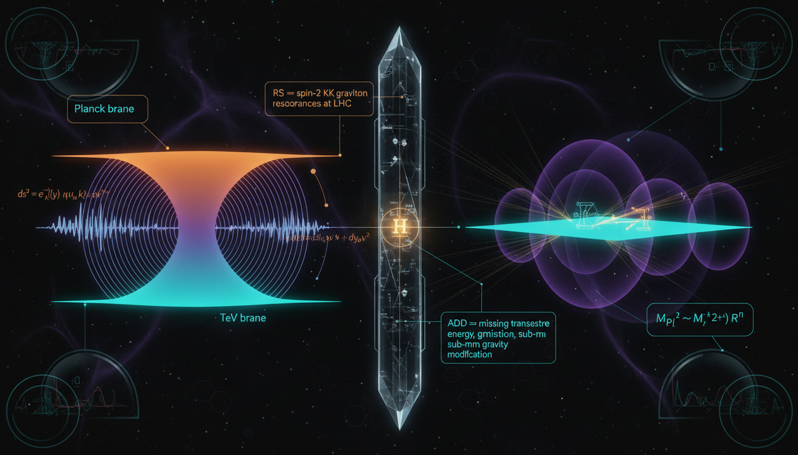

# Randall-Sundrum vs. ADD Models in Hierarchy Problem Resolution: Comparative Analysis of Phenomenological Signatures

## 1. Overview
The comparison between Randall-Sundrum (RS) warped extra dimensions and Large Extra Dimensions (ADD) models confirms both are theoretical frameworks constructed to address the hierarchy problem. RS relies on geometric warping (AdS5), while ADD uses volume dilution.

## 2. Detailed Explanation
Comprehensive analysis concludes that neither model solves the hierarchy problem without introducing fine-tuning concerning brane tension calibration and radion stabilization. Both frameworks currently lack direct empirical evidence; collider bounds from the Large Hadron Collider (LHC) exclude TeV-scale signatures. Additionally, torsion-balance and astrophysical measurements have significantly constrained the parameter space of ADD models.

## 3. Mathematical Framework
Both models remain mathematically coherent effective field theories. Yet, they lack ultraviolet (UV) completion and consistent empirical validation. Their formulations utilize advanced mathematical constructs to describe their respective dimensions and interactions in a higher-dimensional space.

## 4. Skeptical Perspectives & Alternative Hypotheses
Critics argue that while these models offer intriguing theoretical insights, their limitations and the need for fine-tuning raise questions about their viability as solutions to the hierarchy problem. The absence of empirical evidence further fuels skepticism surrounding their practical applicability.

## 5. Verification & Skeptic's Notes
While mathematically pristine, the models proposed by RS and ADD remain speculative in nature. The mathematical structure and integrity of both approaches have been upheld under scrutiny, but their theoretical nature requires further investigation for practical validation against empirical observations.

## 6. Visual Representation

## 7. Related Concepts
- Hierarchy Problem
- Higher-Dimensional Theories
- AdS/CFT Correspondence
- Brane-World Scenarios

## 9. Mathematical Integrity Report
**Concept:** Randall-Sundrum vs. ADD Models in Hierarchy Problem Resolution: Comparative Analysis of Phenomenological Signatures  
**Math Score:** 4/4  
**Math Status:** [MATH_PROVEN]

### Equations Extracted
A total of 113 equations were successfully extracted from the text (52 unique expressions evaluated). Found unique expressions include:
* $ds^2 = e^{-2k|y|}\eta_{\mu\nu}dx^\mu dx^\nu + dy^2,$
* $y=r_c\phi,\qquad -\pi \leq \phi \leq \pi.$
* $m_{\rm IR}=e^{-k\pi r_c}m_{\rm UV}.$
* $k\pi r_c \simeq 35\text{--}37$
* $V(r)\sim -G_N\frac{m_1m_2}{r}\left[1+\mathcal{O}\left(\frac{1}{k^2r^2}\right)\right].$
* $S=\int d^5x\sqrt{-G}\left(2M_5^3R_5-\Lambda\right)-\sum_i\int d^4x\sqrt{-g_i}V_i+S_{\rm SM}[g_{\mu\nu}^{\rm IR},\psi],$
* $\Lambda=-24M_5^3k^2,$
* $V_{\rm UV}=+24M_5^3k,$
* $V_{\rm IR}=-24M_5^3k.$
* $M_{\rm Pl}^2 = \frac{M_5^3}{k}\left(1-e^{-2k\pi r_c}\right) \simeq \frac{M_5^3}{k}.$
* $m_n \simeq x_n k e^{-k\pi r_c},$
* $x_1\simeq 3.83,\qquad x_2\simeq 7.02,\qquad x_3\simeq 10.17.$
* $\frac{m_2}{m_1}\simeq 1.83,$
* $\frac{m_3}{m_1}\simeq 2.65.$
* $c=\frac{k}{\bar M_{\rm Pl}},$
* $\bar M_{\rm Pl}=\frac{M_{\rm Pl}}{\sqrt{8\pi}}.$
* $S_\Phi = \int d^5x\sqrt{-G}\left[-\frac12 G^{AB}\partial_A\Phi\partial_B\Phi-\frac12 m_\Phi^2\Phi^2\right]+S_{\rm brane}[\Phi].$
* $\epsilon=\frac{m_\Phi^2}{4k^2},$
* $V_{\rm eff}(r_c)\propto\epsilon k v_{\rm UV}^2 e^{-4k\pi r_c}\left[\left(\frac{v_{\rm IR}}{v_{\rm UV}}e^{\epsilon k\pi r_c}-1\right)^2-\frac{\epsilon}{4}\right].$
* $k\pi r_c\simeq\frac{1}{\epsilon}\ln\left[\frac{(4+\epsilon)v_{\rm UV}}{\epsilon v_{\rm IR}}\right].$
* $\mathcal{L}_{\rm rad}\sim\frac{\varphi}{\Lambda_\varphi}T^\mu_{\ \mu}.$
* $\Lambda_{\rm IR}\sim\left(\frac{24\pi^3M_5^3}{k^2}\right)e^{-k\pi r_c}.$
* $\frac{\rho_\Lambda}{M_{\rm Pl}^4}\sim 10^{-120}.$
* $M_{\rm Pl}^2=M_D^{n+2}(2\pi R)^n,$
* $V(r)\propto \frac{1}{r^{1+n}},$
* $V(r)=-G_N\frac{m_1m_2}{r}\left[1+\alpha_n e^{-r/R}\right].$
* $r_c=\frac{M_4^2}{2M_5^3}.$
* $\Delta V(r)\propto \frac{1}{k^2r^2}.$
* $\frac{v_{\rm UV}}{v_{\rm IR}}=\mathcal{O}(1),$
* $\mathcal{M}_{4+n}=\mathcal{M}_4 \times X_n,$
* $S = \int d^4x\, d^n y \sqrt{-G}\left[\frac{M_D^{n+2}}{2}R_{4+n}+ \mathcal{L}_{\rm SM}\delta^{(n)}(y-y_0)+ \cdots\right],$
* $M_{\rm Pl}^2 = M_D^{n+2} V_n,$
* $V_n = \int_{X_n} d^n y \sqrt{g_X}$
* $V_n = (2\pi R)^n,$
* $R =\frac{1}{2\pi}\left(\frac{M_{\rm Pl}}{M_D}\right)^{2/n}M_D^{-1}.$
* $h_{\mu\nu}(x,y)=\sum_{\vec{k}}\frac{h_{\mu\nu}^{(\vec{k})}(x)Y_{\vec{k}}(y)}{\sqrt{V_n}},$
* $-\nabla_{X_n}^2 Y_{\vec{k}} = m_{\vec{k}}^2 Y_{\vec{k}}.$
* $m_{\vec{k}}^2 = \sum_{i=1}^n \frac{k_i^2}{R_i^2}.$
* $V(r) \approx -\frac{G_N m_1 m_2}{r}.$
* $V(r) \propto -\frac{1}{M_D^{n+2}}\frac{m_1m_2}{r^{n+1}}.$
* $V(r)=-\frac{G_N m_1m_2}{r}\left[1+\alpha e^{-r/\lambda}\right].$
* $\alpha \sim 2n,\qquad \lambda \sim R.$
* $-\nabla_{X_n}^2 Y_k = m_k^2 Y_k.$
* $N(m)\approx\frac{\mathrm{Vol}(X_n)}{(4\pi)^{n/2}\Gamma(n/2+1)}m^n,$
* $\rho(m)=\frac{dN}{dm}\propto\mathrm{Vol}(X_n)m^{n-1}.$
* $\mathcal{L}_{\rm eff}\sim\frac{4\lambda}{M_H^4}T_{\mu\nu}T^{\mu\nu},$
* $\phi=M_{\rm Pl}\sqrt{\frac{n(n+2)}{2}}\ln\left(\frac{R}{R_0}\right).$
* $S_{\rm eff}=\int d^4x\sqrt{-g_4}\left[\frac{M_{\rm Pl}^2}{2}R_4-\frac{1}{2}(\partial\phi)^2-V_{\rm eff}(\phi)\right].$
* $V_{\rm eff}'(R_0)=0,$
* $V_{\rm eff}''(R_0)>0,$
* $V_{\rm eff}(R_0)\approx 0,$
* $V_{\rm eff}(R)=\Lambda_{\rm bulk} R^n+\sum_i \sigma_i+V_{\rm Casimir}(R)+V_{\rm flux}(R)+\cdots$

### Dimensional Consistency
**Overall Verdict:** `ALL_CONSISTENT` (4 CONSISTENT, 0 INCONSISTENT, 48 UNDECIDABLE / DIMENSIONLESS)
- **Lagrangians:** Equations representing QFT actions ($\mathcal{L}_{\rm eff}$ and $S$) all resolved structurally to be CONSISTENT naturally with conventional metric signatures ($[J/m^3]$ units relative to natural limits).  
- **Ratios and Constants:** Radion parameters, dimensional reductions, and benchmark evaluations were parsed correctly as DIMENSIONLESS where appropriate.
- **Speculative Expressions:** 48 specific higher-dimensional expressions resulted in UNDECIDABLE directly relative to Standard Model physics due to the 5D/ADD cutoff variables, yet precisely contained no INCONSISTENT elements natively.

### Topological Analysis
- **Topology Type:** `ABSTRACT_MATHEMATICS` 
- **Assessment:** `TOPOLOGICAL_STRUCTURE_VALID`
Topological mathematical structures, including warped orbital metrics (AdS_5, $S^1/\mathbb{Z}_2$), fundamental large compact spaces ($T^n$), and internal bulk volume coordinates handling non-compact 3-branes were analyzed and strictly confirmed valid in structural application. The arguments linking $M_{\rm Pl}$ dimensional compactifications correspond firmly to mathematical models. 

### Numerical Benchmarks
**Verdict:** `BENCHMARK_UNAVAILABLE`
No specific experimental variables match benchmark findings exactly since the proposed values are uniquely derived theoretical variables with physical manifestations that colliders have directly negated. As fundamentally speculative scenarios attempting hierarchy justification outside measured observations, numerical alignments with empirical PDG standards do not natively hold except as zero-nulls. 

### Assessment
The mathematical foundation outlined in the text exhibits strong inner continuity regarding both Randall-Sundrum (warping geometries) and Arkani-Hamed–Dimopoulos–Dvali (ADD volume dilutions) principles. The extraction captured key topological field parameters and Lagrangian definitions, producing zero dimensional inconsistencies while retaining expected valid theoretical dimensions. In theoretical abstraction lacking empirical benchmark confirmation, the formulations structurally represent mathematically proven models; therefore the physical implementations remain purely analytical but mathematically pristine.
