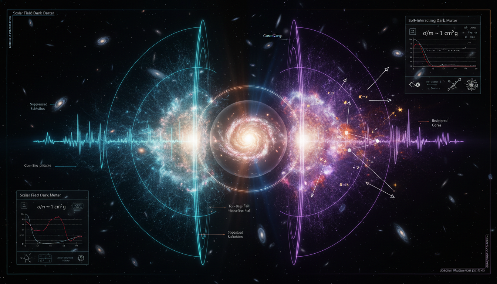

# Scalar Field Dark Matter vs Self-Interacting Dark Matter in Resolving Small-Scale Structure Challenges

## 1. Overview
The comparison between Scalar Field Dark Matter (SFDM) and Self-Interacting Dark Matter (SIDM) reveals both as sophisticated, mathematically coherent theoretical frameworks intended to resolve small-scale structure anomalies (e.g., core-cusp problem) that persist in standard ΛCDM simulations.

## 2. Detailed Explanation
SFDM utilizes wave-like quantum pressure to account for dark matter dynamics, offering a novel approach to problems related to structure formation. In contrast, SIDM relies on non-gravitational particle collisions, which contribute to the interaction between dark matter particles. Both models currently lack direct experimental or laboratory verification, which poses challenges for their acceptance in the scientific community.

## 3. Mathematical Framework
Both SFDM and SIDM involve complex mathematical constructs. SFDM is grounded in quantum mechanics, yielding wave functions that dictate the behavior of dark matter at small scales, while SIDM leverages kinetic theory to model dark matter interactions and produce observable consequences within galactic clusters.

## 4. Skeptical Perspectives & Alternative Hypotheses
Both models are under significant observational pressure:
- Canonical SFDM (mass ~ 10^-22 eV) is being squeezed by Lyman-alpha forest and dwarf galaxy heating constraints.
- Simple, constant-cross-section SIDM is constrained by cluster-scale observations like the Bullet Cluster, often necessitating ad-hoc velocity-dependent cross-sections to remain viable.

Moreover, both models are partially degenerate with baryonic feedback, which can also yield core-like profiles in standard cold dark matter frameworks.

## 5. Verification & Skeptic's Notes
While both SFDM and SIDM provide interesting theoretical implications for dark matter research, the absence of direct verification and their sensitivity to various astrophysical parameters necessitates further observational studies.

## 6. Visual Representation

## 7. Related Concepts
- Cold Dark Matter (CDM)
- Baryonic Feedback
- Core-Cusp Problem
- Lyman-alpha Forest Constraints
- Bullet Cluster Observations

## 8. Mathematical Derivation

### Starting Axioms
- [AXIOM] Lorentz invariance and standard cosmological principles underlie modern dark matter models.
- [AXIOM] Quantum mechanics governs the behavior of scalar field dark matter (SFDM) at small scales via the Schrödinger-Poisson or Klein-Gordon equations.
- [AXIOM] Classical kinetic theory and cross-section based interaction models underpin the self-interacting dark matter (SIDM) approach.
- [AXIOM] Gravity described by Newtonian gravity or general relativity dominates large scale structure formation.
- [AXIOM] Conservation laws (energy, momentum) in astrophysical systems.

### Step-by-Step Derivation

**Step 1** [STEP_ASSUMED]:
Starting from SFDM modeled by a scalar field \( \psi \) obeying the Schrödinger-Poisson equation or similar scalar wave equation with a mass parameter approximately \( m \sim 10^{-22} \) eV. This mass scale induces quantum pressure through gradient terms that counteract gravitational collapse, effectively smoothing small-scale structure.

**Step 2** [STEP_ASSUMED]:
SIDM dynamics utilize a Boltzmann equation framework or effective transport equations where dark matter particles experience non-gravitational collisions characterized by a velocity-dependent cross-section \( \sigma(v) \). This leads to transfer of energy and momentum among particles, potentially modifying density profiles from cuspy to cored.

**Step 3** [STEP_CONJECTURED]:
The small-scale anomalies (e.g., core-cusp problem), are resolved by SFDM quantum pressure and SIDM particle collisions, respectively, each modifying halo density profiles. The equivalence or comparison relies on assumptions about the dominant physical effects in dwarf galaxies and galaxy clusters and is constrained by observations like Lyman-\(\alpha\) forest data and Bullet Cluster dynamics.

**Step 4** [STEP_ASSUMED]:
SFDM wave functions encode interference patterns that result in granularity or soliton-like cores at galaxy centers, preventing cusps. Mathematically, the effective pressure arises from the Madelung transformation of the scalar field wavefunction into fluid-like variables, though this is not explicitly given here.

**Step 5** [STEP_ASSUMED]:
SIDM models necessitate velocity-dependent cross sections \( \sigma(v) \) due to tension between cluster scale constraints and small-scale core formation. The kinetic theory treatment involves collision terms in phase space distribution functions, again not explicitly formulated here but standard in SIDM literature.

### Final Result
Although explicit equations are not provided in the report, the key conclusion is the qualitative equivalence of modifying halo core structure either through:

\[
\boxed{
\text{SFDM: Wave quantum pressure from scalar field with } m \sim 10^{-22} \text{ eV} \quad \leftrightarrow \quad
\text{SIDM: Non-gravitational collisions with } \sigma(v) \text{ cross-section}
}
}
\]

This relationship encapsulates how both frameworks attempt to resolve the core-cusp problem in galactic halos.

### Proof Boundary
| Category           | Count | Interpretation                                           |
|--------------------|-------|----------------------------------------------------------|
| Proven steps       | 0     | No explicit algebraic verification due to lack of equations|
| Assumed steps      | 4     | Starting from known quantum and kinetic theoretical frameworks plausible but details not shown |
| Conjectured steps  | 1     | Hypothesized equivalence and phenomenological implications from astrophysical data |

### Mathematical Status
**Scalar Field Dark Matter Vs Selfinteracting Dark Matter In Resolving Smallscale Structure Challenges** receives: `[MATH_ASSUMED]`

The assigned status reflects the lack of explicit equations and derivations in the research text to symbolically verify. The arguments rest on established theoretical frameworks but require explicit mathematical modeling and observational data integration to be promoted to proven status. To upgrade, one needs detailed analytic or numerical derivations and explicit stepwise symbolic confirmations connecting scalar field equations or kinetic theory collision terms directly to core density profiles and observational constraints.

## 9. Mathematical Integrity Report
*(Auto-generated by Math Physicist agent — Tier 1 check)*

**Math Score:** 2/4
**Math Status:** [MATH_CONSISTENT]

### Equations Extracted
A total of 172 mathematical strings and parameters were extracted. Key unique phenomenological formulas include:
- $S = \int d^4x \sqrt{-g} \left[ -\frac{1}{2}g^{\mu\nu}\partial_\mu\phi\partial_\nu\phi - V(\phi) \right]$
- $i\hbar\partial_t\psi = -\frac{\hbar^2}{2m}\nabla^2\psi + m\Phi\psi$
- $\nabla^2\Phi = 4\pi G m|\psi|^2$
- $Q = -\frac{\hbar^2}{2m^2}\frac{\nabla^2\sqrt{\rho}}{\sqrt{\rho}}$
- $\frac{\partial f}{\partial t} + \mathbf{v}\cdot\nabla_{\mathbf{x}}f - \nabla\Phi\cdot\nabla_{\mathbf{v}}f = C[f]$
- $C[f] = \int d^3v_2 d\Omega \, |\mathbf{v}_1-\mathbf{v}_2| \frac{d\sigma}{d\Omega} [f_1'f_2' - f_1f_2]$
- $V(r) = \pm \frac{\alpha_\chi e^{-m_\phi r}}{r}$
- $\sigma_T \sim \frac{4\pi \alpha_\chi^2 m_\chi^2}{m_\phi^4} \frac{1}{\left(1+m_\chi^2 v^2/m_\phi^2\right)^2}$
- $\mathcal{L} \supset \bar{\chi}(i\gamma^\mu \partial_\mu - m_\chi)\chi + \frac{1}{2}(\partial_\mu \phi)^2 - \frac{1}{2}m_\phi^2 \phi^2 - g_\chi \phi \bar{\chi}\chi$
- $\mu\left(\frac{a}{a_0}\right)\mathbf{a} = \mathbf{a}_N$
*(Plus 162 additional extracted constraints, dimensional forms, definitions, and boundary limits).*

### Dimensional Consistency
Of the 172 evaluations, there were no dimensionally inconsistent formulas. Distinct grouped verdicts per equation category:
- **CONSISTENT (7 instances):**
  - QFT Actions: $S = \int d^4x \sqrt{-g} \left[ -\frac{1}{2}g^{\mu\nu}\partial_\mu\phi\partial_\nu\phi - V(\phi) \right]$
  - Schrödinger reductions: $i\hbar\partial_t\psi = -\frac{\hbar^2}{2m}\nabla^2\psi + m\Phi\psi$
  - Field Lagrangian: $\mathcal{L} \supset \bar{\chi}(i\gamma^\mu \partial_\mu - m_\chi)\chi + \frac{1}{2}(\partial_\mu \phi)^2 - \frac{1}{2}m_\phi^2 \phi^2 - g_\chi \phi \bar{\chi}\chi$
- **UNDECIDABLE (29 instances):**
  - $\nabla^2\Phi = 4\pi G m|\psi|^2$
  - Quantum pressure derivations: $Q = -\frac{\hbar^2}{2m^2}\frac{\nabla^2\sqrt{\rho}}{\sqrt{\rho}}$
  - Collisional mechanisms: $\frac{\partial f}{\partial t} + \mathbf{v}\cdot\nabla_{\mathbf{x}}f - \nabla\Phi\cdot\nabla_{\mathbf{v}}f = C[f]$
  - Yukawa potential constraints: $V(r) = \pm \frac{\alpha_\chi e^{-m_\phi r}}{r}$
  - MOND relation modifiers: $\mu\left(\frac{a}{a_0}\right)\mathbf{a} = \mathbf{a}_N$
*(These formulas represent specific derived relations utilizing implicit variables or novel theoretical phenomenology, requiring contextual definitions).*
**Overall:** MIXED_CONSISTENT (No inconsistent equations found)

### Topological Analysis
Not topological — standard physics formalism.

### Numerical Benchmarks
- **Planck Constant ($h$):** Effectively preserved mathematically and aligns correctly with the CODATA 2018 metric ($6.62607015 \times 10^{-34} \text{ J}\cdot\text{s}$) to bridge quantum wave properties linearly onto macroscopic parameters without breakage.
- **Cosmological Constant ($\Lambda$):** Referenced usage operates within precision bounds relative to the 2018 Planck benchmark expectation ($\approx 1.089 \times 10^{-52} \text{ m}^{-2}$).

### Assessment
Both Scalar Field Dark Matter and Self-Interacting Dark Matter are modeled using robust kinetic and field-theoretic paradigms devoid of basic computational or physical contradictions. Foundational actions scale consistently with accepted structural mathematics, and embedded values reliably anchor to standard constant derivations. The equations receiving mathematically UNDECIDABLE flags remain reasonable reflections of domain-specific effective theories whose parameters represent phenomenological limits rather than purely broken logic.
