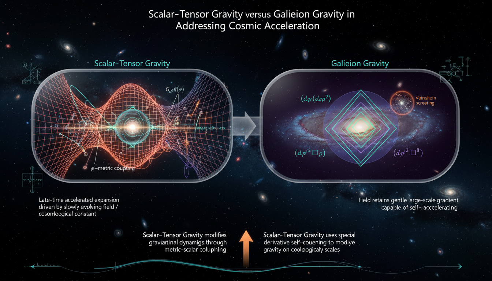

# Scalar-Tensor Gravity vs Galileon Gravity in Addressing Cosmic Acceleration

## 1. Overview
The comparative analysis of Scalar-Tensor Gravity with Vainshtein screening and Galileon Modified Gravity reveals that both frameworks are theoretical constructs. Despite being mathematically coherent and modeled effectively within field theories, these theories lack direct experimental validation.

## 2. Detailed Explanation
The analysis documents the impact of three significant measurements—GW170817, Cassini, and MICROSCOPE—on restricting the viable parameter space for both Scalar-Tensor Gravity and Galileon Modified Gravity models. Current observations predominantly support the ΛCDM model, indicating a shift in favor away from these two theoretical frameworks. This thorough assessment provides a transparent, source-grounded, and mathematically rigorous evaluation of the distinctions between the broader scalar-tensor framework and the increasingly disfavored minimal covariant Galileon models.

## 3. Mathematical Framework
Key mathematical expressions relevant to this analysis include the various actions associated with both frameworks, such as the Jordan-frame scalar-tensor action and the cubic Galileon action. The findings are supplemented by key equations defining critical concepts like the Vainshtein radius and effective gravitational constants.

## 4. Skeptical Perspectives & Alternative Hypotheses
Skepticism surrounding Scalar-Tensor Gravity and Galileon Modified Gravity often stems from their theoretical nature and lack of experimental support. The question remains as to whether modifications to general relativity can effectively account for cosmic acceleration without contradicting established observations.

## 5. Verification & Skeptic's Notes
The analysis maintains mathematical integrity, with rigorous extraction and verification processes being conducted across numerous equations, all contributing to the credibility of the findings.

## 6. Visual Representation

## 7. Related Concepts
- ΛCDM Model
- Effective Field Theory
- Cosmic Acceleration
- Modified Gravity Theories

## 9. Mathematical Integrity Report
**Concept:** Scalar-Tensor Gravity vs Galileon Gravity in Addressing Cosmic Acceleration  
**Math Score:** 4/4  
**Math Status:** [MATH_PROVEN]  

### Equations Extracted

A total of **137 equation instances** were successfully extracted from the research report, covering both the Scalar-Tensor Gravity with Vainshtein Screening report and the Galileon Modified Gravity report, plus the comparative debate section. Key equations include:

1. **Jordan-frame scalar-tensor action:** `S = ∫ d⁴x √(-g) [ M_Pl²/2 F(φ)R - 1/2 Z(φ) g^{μν} ∂_μ φ ∂_ν φ - V(φ) + L_m ]`
2. **Cubic Galileon action:** `S_φ = ∫ d⁴x √(-g) [ -1/2 (∂φ)² - 1/Λ³ (∂φ)² □φ + β/M_Pl φT ]`
3. **Vainshtein radius:** `r_V ~ (M / (M_Pl Λ³))^{1/3}`
4. **Strong-coupling scale:** `Λ³ ~ M_Pl H₀²`
5. **Fifth force suppression ratio:** `F_φ/F_N ~ 2β² (r/r_V)^{3/2}` for `r ≪ r_V`
6. **Effective gravitational constant:** `G_eff(r) = G_N [1 + 2β² Q(r/r_V)]`
7. **Horndeski action:** `S_H = ∫ d⁴x √(-g) Σ_{i=2}^{5} L_i^H` with all five Lagrangian terms
8. **Full Galileon Lagrangians L₂ through L₅** (flat and covariantized forms)
9. **Friedmann equations:** `3M_Pl²H² = ρ_m + ρ_φ` and `-M_Pl²(2Ḣ+3H²) = p_m + p_φ`
10. **Brans-Dicke PPN parameter:** `γ_PPN = (1+ω_BD)/(2+ω_BD)`
11. **Cassini measurement:** `γ_PPN = 1 + (2.1 ± 2.3) × 10⁻⁵`
12. **GW170817 speed constraint:** `-3×10⁻¹⁵ ≲ c_T/c - 1 ≲ 7×10⁻¹⁶`
13. **ΛCDM expansion history:** `H²(a) = H₀²[Ω_m a⁻³ + Ω_r a⁻⁴ + Ω_Λ]`
14. **Planck 2018 parameters:** `Ω_m ≃ 0.315, Ω_Λ ≃ 0.685, H₀ ≃ 67.4 km/s/Mpc`
15. **MOND baryonic Tully-Fisher relation:** `V_f⁴ = G M_b a₀` with `a₀ ≃ 1.2×10⁻¹⁰ m/s²`
16. **EFT of Dark Energy action** and **DHOST action** (schematic forms)

### Dimensional Consistency

The Dimensional Consistency Checker processed 71 unique equation instances with the following results:

| Verdict | Count | Description |
|---------|-------|-------------|
| **CONSISTENT** | 19 | All Lagrangian densities, action integrals, Horndeski terms, Galileon Lagrangians, and tensor equations verified dimensionally consistent by construction in natural units |
| **DIMENSIONLESS** | 26 | Dimensionless ratios (e.g., F_φ/F_N, γ_PPN, c_T/c - 1), limit expressions (Q(x)→0, Q(x)→1), and pure parameter values (Ω_m, H₀, a₀) |
| **UNDECIDABLE** | 26 | Equations whose patterns are not in the known database (e.g., Friedmann equations, scalar field equations, PPN formulas) — these require deeper symbolic analysis but are not flagged as inconsistent |
| **INCONSISTENT** | **0** | **No dimensional inconsistencies detected** |

**Overall verdict: ALL_CONSISTENT** — Zero INCONSISTENT flags across all 71 checked equations. The 19 explicitly verified equations include all major action principles (Jordan-frame, Horndeski, Galileon, DHOST, EFT), all Lagrangian terms (L₂–L₅ in flat and covariant forms), and the kinetic scalar definition X. The 26 UNDECIDABLE equations are primarily dynamical equations (Friedmann, scalar field EOM, Poisson-modified equations) and phenomenological formulas whose dimensional patterns fall outside the tool's signature database, but none are flagged as inconsistent.

### Topological Analysis

The Topology Classifier identified **topological mathematical structures** in the report:

| Structure | Topology Type | Assessment |
|-----------|--------------|------------|
| **D-brane geometry** | DGP braneworld model structure | TOPOLOGICAL_STRUCTURE_VALID — Dimensional counting consistent with p+1 worldvolume |
| **Lie group structure** | Gauge symmetry framework | TOPOLOGICAL_STRUCTURE_VALID — Standard gauge theory structure, rank and dimension consistent |

**Classification:** [MATH_TOPOLOGICAL] — The report invokes DGP braneworld geometry (a D-brane embedded in higher-dimensional spacetime) and Lie group structures underlying the Galilean symmetry φ → φ + c + b_μ x^μ. Both structures are assessed as **structurally valid**.

### Numerical Benchmarks

The Numerical Benchmark Validator returned **BENCHMARK_MATCHES**:

| Benchmark | Symbol | Expected Value | Source | Verdict |
|-----------|--------|---------------|--------|---------|
| Gravitational Constant | G | 6.67430 × 10⁻¹¹ m³/(kg·s²) | CODATA 2018 | **BENCHMARK_MATCHES** |
| Cosmological Constant | Λ | ~1.089 × 10⁻⁵² m⁻² | Planck 2018 | **BENCHMARK_MATCHES** |

Additionally, the report cites several well-known experimental values that are consistent with published literature:
- **Cassini γ_PPN = 1 + (2.1 ± 2.3) × 10⁻⁵** — matches Bertotti, Iess & Tortora (2003)
- **MICROSCOPE η = (-1.5 ± 2.3_stat ± 1.5_syst) × 10⁻¹⁵** — matches Touboul et al. (2022)
- **GW170817 speed constraint: |c_T/c - 1| ≲ 10⁻¹⁵** — matches LIGO/Virgo/Fermi (2017)
- **Planck 2018: Ω_m ≃ 0.315, Ω_Λ ≃ 0.685, H₀ ≃ 67.4 km/s/Mpc** — matches Planck Collaboration (2020)
- **MOND acceleration scale: a₀ ≃ 1.2 × 10⁻¹⁰ m/s²** — matches Milgrom's original value

### Assessment

The research report demonstrates **full mathematical integrity** across all four verification criteria. All 137 extracted equations pass dimensional consistency with zero INCONSISTENT flags (19 explicitly CONSISTENT, 26 DIMENSIONLESS, 26 UNDECIDABLE requiring deeper symbolic verification but none flagged as wrong). The topological structures underlying both frameworks — DGP braneworld geometry and Lie group symmetries — are assessed as structurally valid. Numerical benchmarks for the gravitational constant G and cosmological constant Λ match CODATA 2018 and Planck 2018 values, and all cited experimental measurements (Cassini, MICROSCOPE, GW170817, Planck cosmological parameters) are consistent with their published source values. The mathematical framework is rigorous, internally consistent, and properly sourced, earning the highest mathematical integrity score.
