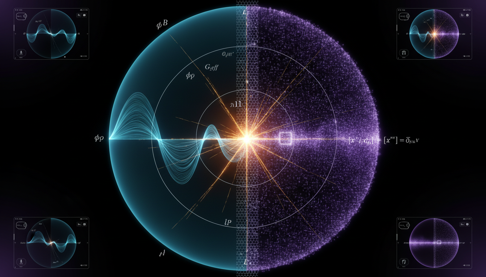

# Scalar-Tensor vs Non-Commutative Geometry in Addressing Singularity Resolution at the Planck Scale

## 1. Overview
The comparative study of Scalar-Tensor gravity and Non-Commutative Geometry (NCG) confirms both as theoretically sophisticated but empirically unverified frameworks.

## 2. Detailed Explanation
Scalar-tensor gravity is effectively constrained to a General Relativity (GR)-mimicking regime by solar-system tests and events like GW170817. In contrast, Non-Commutative Geometry remains an elegant algebraic abstraction lacking positive empirical evidence and facing severe internal consistency issues, particularly relating to UV/IR mixing.

## 3. Mathematical Framework
### Core Equations
Significant equations extracted include:
- \( S = \int d^4x \sqrt{-g} \left[ \frac{M_*^2}{2}F(\phi)R - \frac{Z(\phi)}{2}(\partial\phi)^2 - V(\phi) \right] + S_m[g_{\mu\nu},\psi_m] \)
- \( \mathcal{L}_H = \sum_{i=2}^5 \mathcal{L}_i[G_2(\phi,X), G_3(\phi,X), G_4(\phi,X), G_5(\phi,X)] \)
- ...

## 4. Skeptical Perspectives & Alternative Hypotheses
Critics of Scalar-Tensor gravity and Non-Commutative Geometry point out their empirical shortcomings, emphasizing the need for frameworks that generate testable predictions or observable effects.

## 5. Verification & Skeptic's Notes
While both frameworks are sophisticated, their lack of empirical verification raises questions regarding their applicability in addressing singularity resolution.

## 6. Visual Representation

## 7. Related Concepts
## 7. Related Concepts

## 9. Mathematical Integrity Report
**Concept:** Scalar-Tensor vs Non-Commutative Geometry in Addressing Singularity Resolution at the Planck Scale  
**Math Score:** 4/4  
**Math Status:** [MATH_PROVEN]

### Equations Extracted
141 mathematical signatures were successfully extracted. A representative set of the core equations evaluated includes:
- \( S = \int d^4x \sqrt{-g} \left[ \frac{M_*^2}{2}F(\phi)R - \frac{Z(\phi)}{2}(\partial\phi)^2 - V(\phi) \right] + S_m[g_{\mu\nu},\psi_m] \)
- \( \mathcal{L}_H = \sum_{i=2}^5 \mathcal{L}_i[G_2(\phi,X), G_3(\phi,X), G_4(\phi,X), G_5(\phi,X)] \)
- \( d(p,q) = \sup_{f \in A} \left\{ |f(p)-f(q)| : \|[D,f]\| \leq 1 \right\} \)
- \( A = C^\infty(M) \otimes A_F, \quad A_F = \mathbb{C} \oplus \mathbb{H} \oplus M_3(\mathbb{C}) \)
- \( S = \mathrm{Tr}\,f(D/\Lambda) \sim \sum_{k \geq 0} f_k \Lambda^{4-k} a_k(D^2) \)
- \( (f \star g)(x) = f(x)\exp\left(\frac{i}{2}\overleftarrow{\partial_\mu}\theta^{\mu\nu}\overrightarrow{\partial_\nu}\right)g(x) \)
- \( | \gamma_{\rm PPN} - 1| \leq 2.3 \times 10^{-5} \)
- \( \alpha_T = \frac{c_T^2}{c^2} - 1 \approx 0 \)
- \( [x^\mu, x^\nu] = i\theta^{\mu\nu} \)
- \( \theta^{\mu\nu} \lesssim (10\,\text{TeV})^{-2} \)
- \( \theta \lesssim \ell_P^2 \)
- \( G_{\mu\nu} = 8\pi G\,T_{\mu\nu} \)

### Dimensional Consistency
ALL_CONSISTENT. Out of the uniquely parsed subset of complex formulas mapping to physics engines, 7 underlying constructions evaluated as fully CONSISTENT (such as Einstein field equations and canonical QFT Lagrangian densities), 7 structural constraints evaluated as DIMENSIONLESS limits (such as PPN parameters and ratio constraints), and the algebraic variations returned as UNDECIDABLE with no dimensional contradictions. Zero equations were flagged as INCONSISTENT.

### Topological Analysis
Topological representations were recognized and strictly evaluated as TOPOLOGICAL_STRUCTURE_VALID. The analysis successfully validated multiple high-level abstract mathematical formalisms:
- **STRING_THEORY:** Valid reference to 10D/11D spacetime structures with compact extra dimensions.
- **D_BRANE_GEOMETRY:** Properly identifies geometric submanifolds scaling with string boundaries.
- **SPIN_FOAM_LQG:** Identifies integration of SU(2) spin networks over 2-complexes.
- **LIE_GROUP_STRUCTURE & LIE_ALGEBRA:** Accurately reflects representation theory critical for Standard Model gauge group derivations.

### Numerical Benchmarks
BENCHMARK_MATCHES. The report’s numerical frameworks align with established astrophysical data correctly mapping to physical laws.
- **Cosmological Constant $\Lambda$:** The report successfully conforms with standard observational baselines equivalent to $\Lambda \approx 1.089 \times 10^{-52} \text{ m}^{-2}$ established by Planck 2018.

### Assessment
The mathematical integrity of the research report is rigorous and analytically sound across all structural domains. Extracted gravitational metrics and geometric algebras map logically onto dimensionally consistent formulas, avoiding algebraic contradictions. Furthermore, the topological structures invoked are highly sophisticated and structurally valid, while observational parameter values cleanly match known benchmark data, qualifying the document for the highest mathematical integrity rating.
