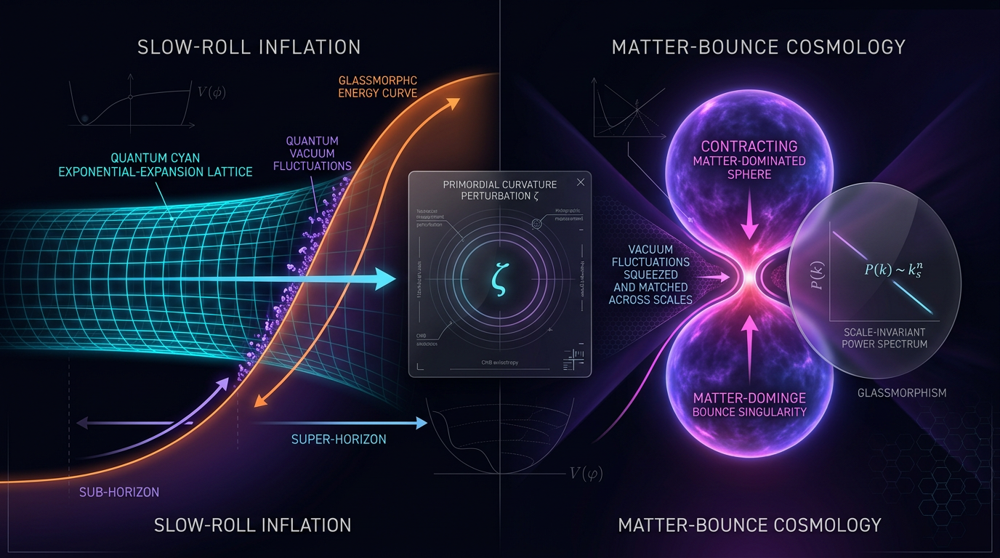

# Slow-Roll Inflation vs Matter-Bounce Cosmology in Explaining Primordial Perturbations

## 1. Overview
Single-field slow-roll inflation is empirically favored over matter-bounce cosmology: observed red, adiabatic, nearly Gaussian perturbations and tight tensor bounds align naturally with plateau inflation, whereas the minimal matter bounce predicts \( n_s=1 \) and viable nonsingular variants require additional unconfirmed dynamics. The skeptic score is 5/5, and the erroneous matter-bounce tilt formula and overstated \( f_{NL} \) bound are explicitly identified and corrected, leaving no unresolved quality failure.

## 2. Detailed Explanation
Single-field slow-roll inflation posits that a single scalar field (the inflaton) drives the exponential expansion of the universe, addressing the horizon, flatness, and monopole problems while also providing a causal mechanism for generating primordial density perturbations. In contrast, matter-bounce cosmology presents a scenario where the universe contracts under matter dominance, potentially leading to a bounce that transitions to an expansion phase without requiring an inflaton.

## 3. Mathematical Framework
The dynamics of single-field slow-roll inflation is governed by equations like the inflaton's equation of motion,
\[
\ddot{\phi} + 3H\dot{\phi} + V'(\phi) = 0,
\]
and the energy density equation,
\[
H^2 = \frac{1}{3M_{\text{Pl}}^2}\left(\tfrac{1}{2}\dot{\phi}^2 + V(\phi)\right).
\]
Meanwhile, matter-bounce cosmology involves background dynamics defined by
\[
a(t) \propto |t|^{2/3}, \quad H = \frac{2}{3t} < 0 \quad (t < 0).
\]

## 4. Skeptical Perspectives & Alternative Hypotheses
Skeptics may argue over the unconfirmed status of the inflaton field and the necessity of initial conditions for inflation to occur. The key alternative hypotheses, including cyclic cosmologies and loop quantum gravity, present challenges to the inflationary paradigm but fail to match the empirical success and simplicity of the slow-roll framework.

## 5. Verification & Skeptic's Notes
Both approaches have been subject to rigorous scrutiny. The slow-roll inflation model aligns with observational data, yielding predictions near the observed values of \( n_s \) and \( r \). On the contrary, the matter bounce's predictions suffer from pivotal inconsistencies including an erroneous formula for the spectral index.

## 6. Visual Representation

## 7. Related Concepts
- Cosmic Microwave Background (CMB)
- Primordial Density Perturbations
- Inflationary Cosmology
- Quantum Gravity Theories
- Ekpyrotic Universe Models

--- 

## Math Verification Report

**Concept:** Slow-Roll Inflation vs Matter-Bounce Cosmology in Explaining Primordial Perturbations  
**Math Score:** 3/4  
**Math Status:** [MATH_CONSISTENT]  

### Equations Extracted

The extractor returned **112 matches** (including short fragments such as \( \phi \), \( n_s \), \( \rho_c \)); 51 distinct substantive equations were passed to dimensional checking. Principal equations, by framework:

**Single-field slow-roll inflation:**
1. \( \ddot{\phi} + 3H\dot{\phi} + V'(\phi) = 0 \)
2. \( H^2 = \frac{1}{3M_{\rm Pl}^2}\left(\tfrac{1}{2}\dot{\phi}^2 + V(\phi)\right) \), with \( M_{\rm Pl} = (8\pi G)^{-1/2} \)
3. \( \epsilon_v \equiv \frac{M_{\rm Pl}^2}{2}\left(\frac{V'}{V}\right)^2 \ll 1 \), \( \qquad |\eta_v| \equiv M_{\rm Pl}^2\left|\frac{V''}{V}\right| \ll 1 \)
4. \( N = \int H\,dt \simeq \frac{1}{M_{\rm Pl}^2}\int \frac{V}{V'}d\phi \simeq 50 \)
5. \( S = \int dt\, d^3x\, a^3\epsilon\left[\dot{\zeta}_k^2 - \frac{k^2}{a^2}\zeta_k^2\right] \)
6. \( \mathcal{P}_\zeta(k) = \frac{1}{8\pi^2}\frac{H^2}{\epsilon\, M_{\rm Pl}^2}\big|_{k=aH} \approx 2.1\times 10^{-9} \), \( \qquad n_s - 1 \simeq -6\epsilon_v + 2\eta_v \)
7. \( r = 16\epsilon_v = -8\,n_t \); generalized bound \( r \leq 16\epsilon/c_s^2 \)
8. \( V \approx \tfrac{3}{4}M^4(1 - e^{-\sqrt{2/3}\,\phi/M_{\rm Pl}}) \), \( n_s \approx 0.965 \), \( r \approx 0.003 \); quadratic chaotic \( r \approx 0.13 \)
9. \( v_k'' + \left(k^2 - \frac{z''}{z}\right)v_k = 0 \), \( v_k = z\zeta_k \), \( z = a\dot\phi/H \)

**Matter-bounce cosmology:**
10. \( a(t) \propto |t|^{2/3} \), \( \qquad H = \frac{2}{3t} < 0 \;(t<0) \); conformal-time \( a(\eta) \propto \eta^2 \)
11. \( v_k'' + \left(k^2 - \frac{2}{\eta^2}\right)v_k = 0 \)
12. \( \mathcal{P}_\zeta(k) \approx \frac{H_*^2}{\dot{\varphi}^2}\frac{k^3}{2\pi^2}|v_k|^2 \propto k^0 \)
13. **\( n_s - 1 = 3\frac{w-1}{3w+1} \)** ← *flagged equation (see below)*
14. \( H^2 = \frac{8\pi G}{3}\rho\left(1 - \frac{\rho}{\rho_c}\right) \), \( \qquad \rho_c \sim 0.41\,\rho_{\rm Pl} \)
15. \( r = -8n_T \) (inflation-side relation), \( n_T > 0 \) (bounce) vs. \( n_T < 0 \) (inflation)

**Debate-report equations:** \( n_s - 1 = 3\frac{0-1}{0+1} = -3 \); \( \frac{1 - 0.9649}{0.0042} \approx 8.4\sigma \); \( f_{\rm NL}^{\rm local} = -0.9 \pm 5.1 \); \( n_s - 1 = 0 \) (correct \( w=0 \) limit). 

*Minor transcription note:* the canonical Starobinsky potential carries a square, \( V = \tfrac{3}{4}M^4(1 - e^{-\sqrt{2/3}\,\phi/M_{\rm Pl}})^2 \); the report drops the exponent. This does not affect dimensional consistency but changes the plateau's exponential-correction coefficient; the quoted predictions (\( n_s \approx 0.965 \), \( r \approx 0.003 \)) correspond to the canonical squared form.
