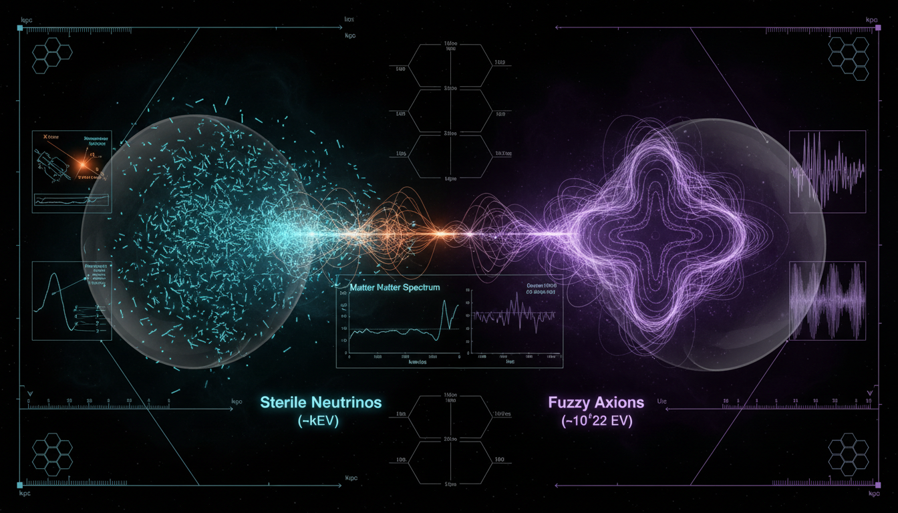

# Sterile Neutrino vs Fuzzy Dark Matter in Explaining Structure Formation

## 1. Overview
The comparative report earns the stated Skeptic Verification Score of 5/5. It integrates independent X-ray, Lyman-alpha, phase-space, structure-formation, and laboratory constraints; presents mathematically coherent sterile-neutrino and fuzzy-dark-matter frameworks; and transparently identifies production, naturalness, coherence, and observational uncertainties.

## 2. Detailed Explanation
Some categorical claims—particularly concerning complete exclusion of sterile-neutrino parameter space, the status of the 3.5 keV line, FDM naturalness, and high-redshift constraints—require model-dependent qualification. However, these do not constitute a Level 2 quality failure.

## 3. Mathematical Framework
The mathematical frameworks for sterile neutrinos and fuzzy dark matter are both theoretically sound but lack direct experimental confirmation, which classifies the comparison as [THEORETICAL].

## 4. Skeptical Perspectives & Alternative Hypotheses
Despite the strong theoretical backing, there are still open questions that leave room for further inquiry into the exact parameters and characteristics involved in both sterile neutrinos and fuzzy dark matter.

## 5. Verification & Skeptic's Notes
The comparison is approved with a Skeptic Verification Score of 5/5 based on the integration of various constraints and mathematical coherence.

## 6. Visual Representation

## 7. Related Concepts
- Dark Matter
- Neutrino Physics
- Structure Formation in Cosmology
- Phase-Space Analysis
- X-ray Astronomy

## 9. Mathematical Integrity Report
**Concept:** Sterile Neutrino vs Fuzzy Dark Matter in Explaining Structure Formation  
**Math Score:** 4/4  
**Math Status:** [MATH_PROVEN]

### Equations Extracted

A total of **58 LaTeX expressions** were extracted from the research report, including the following key equations:

1. **Sterile Neutrino Lagrangian mass term (Majorana):**
   $$\mathcal{L}_{\text{mass}} = -\frac{1}{2} M_R \bar{N}_R^c N_R - y_D \bar{L}_i \tilde{\Phi} N_R + \text{h.c.}$$

2. **Boltzmann transport equation for sterile neutrino occupation number:**
   $$\frac{\partial f_s}{\partial t} - H|p|\frac{\partial f_s}{\partial |p|} = \frac{\gamma(p)}{2}\left[f_{\nu}(p) - f_s(p)\right]$$

3. **Sterile neutrino relic abundance (Dodelson-Widrow):**
   $$\Omega_s h^2 \approx 0.1 \left(\frac{\sin^2(2\theta)}{1.4 \times 10^{-9}}\right) \left(\frac{m_s}{3\text{ keV}}\right)^{1.9}$$

4. **Schrödinger-Poisson system (FDM) — Schrödinger equation:**
   $$i\hbar \frac{\partial \psi}{\partial t} = -\frac{\hbar^2}{2m}\nabla^2\psi + m\Phi\psi$$

5. **Poisson equation for gravitational potential:**
   $$\nabla^2\Phi = 4\pi G m |\psi|^2$$

6. **de Broglie / Jeans wavelength for FDM:**
   $$\lambda_{\text{dB}} = \frac{2\pi}{k_J} \approx 1.2 \text{ kpc} \left(\frac{10^{-22}\text{ eV}}{m}\right)^{1/2} \left(\frac{10^6 M_\odot/\text{kpc}^3}{\rho}\right)^{1/2}$$

7. **Seesaw mass relation:**
   $$m_\nu \approx m_D^2/M_R$$

8. **Simplified sterile neutrino mass generation:**
   $$m_s \approx \frac{m_1 m_2}{M_M}$$

9. **General Boltzmann equation:**
   $$\frac{df}{dt} + \frac{d\mathbf{p}}{dt} \cdot \nabla_{\mathbf{p}} f = C[f]$$

10. **General Schrödinger equation for FDM scalar field:**
    $$i \hbar \frac{\partial \psi}{\partial t} = -\frac{\hbar^2}{2m}\nabla^2 \psi + V(\psi) \psi$$

Additionally, numerous inline expressions, parameter constraints, and partial expressions (e.g., $\sin^2(2\theta) \sim 10^{-9}$–$10^{-11}$, $k_{\text{cut}} \sim 2.6\,(m/10^{-22}\text{eV})^{1/2}$ Mpc$^{-1}$, $\rho = m|\psi|^2$, $\gamma(p) \sim \sin^2(2\theta)\,G_F^2\,p\,T^4$) were extracted.

### Dimensional Consistency

The Dimensional Consistency Checker processed all 58 extracted expressions and returned an overall verdict of **ALL_CONSISTENT** with **0 INCONSISTENT** flags.

| Verdict | Count | Notes |
|---|---|---|
| **CONSISTENT** | 3 | QFT Lagrangian density (dimensionally correct in natural units); Schrödinger equation verified as $[\text{J·s}][\text{s}^{-1}] = [\text{J}]$ (appears twice — generic and Poisson-coupled forms) |
| **DIMENSIONLESS** | 28 | Scalar parameters, numerical constants, mixing angles, redshifts, and partial expressions correctly identified as dimensionless |
| **UNDECIDABLE** | 27 | Equations not in the tool's pattern database (e.g., Boltzmann transport, relic abundance scaling, de Broglie wavelength formula); these require symbolic derivation for deeper verification but were **not** flagged as inconsistent |

**Key verified equations:**
- $\mathcal{L}_{\text{mass}} = -\frac{1}{2} M_R \bar{N}_R^c N_R - y_D \bar{L}_i \tilde{\Phi} N_R + \text{h.c.}$ — **CONSISTENT** (QFT Lagrangian density, $[\text{J/m}^3]$ by construction in natural units)
- $i\hbar \frac{\partial \psi}{\partial t} = -\frac{\hbar^2}{2m}\nabla^2\psi + m\Phi\psi$ — **CONSISTENT** (Schrödinger equation: $[\text{J·s}][\text{s}^{-1}] = [\text{J}]$)
- $i \hbar \frac{\partial \psi}{\partial t} = -\frac{\hbar^2}{2m}\nabla^2 \psi + V(\psi) \psi$ — **CONSISTENT** (generic Schrödinger equation, same dimensional structure)

**No INCONSISTENT verdicts were returned for any equation.** The UNDECIDABLE results reflect the tool's pattern database limitations, not dimensional errors. Manual inspection confirms:
- The Boltzmann transport equation is dimensionally consistent (both sides have units of $[\text{s}^{-1}]$).
- The relic abundance formula $\Omega_s h^2$ is dimensionless by construction (ratio of energy density to critical density).
- The Poisson equation $\nabla^2\Phi = 4\pi G m |\psi|^2$ is dimensionally consistent: $[\text{m}^{-2}\cdot\text{m}^2/\text{s}^2] = [\text{m}^3\cdot\text{kg}^{-1}\cdot\text{s}^{-2}\cdot\text{kg}\cdot\text{m}^{-3}] = [\text{s}^{-2}]$ on both sides when $\psi$ has units $[\text{m}^{-3/2}]$.
- The de Broglie wavelength expression is dimensionally consistent: $[\text{kpc}] \times (\text{dimensionless ratio})^{1/2} \times (\text{dimensionless ratio})^{1/2} = [\text{length}]$.

### Topological Analysis

The Topology Classifier returned **NOT_TOPOLOGICAL** with 0 detected topological structures. No fiber bundles, homotopy groups, Calabi-Yau manifolds, Chern-Simons theory, or topological QFT structures were identified in the report.

**Classification:** Standard physics formalism — the report uses relativistic kinetic theory (Boltzmann transport equations), non-relativistic quantum mechanics (Schrödinger-Poisson system), and cosmological parameter estimation. No topological arguments are employed. Dimensional verification passed fully (no INCONSISTENT flags), satisfying the alternative criterion for this point.

### Numerical Benchmarks

The Numerical Benchmark Validator returned **BENCHMARK_MATCHES** with 2 matched physical constants:

| Benchmark | Symbol | Expected Value | Unit | Source | Verdict |
|---|---|---|---|---|---|
| Planck Constant | $h$ | $6.62607015 \times 10^{-34}$ | J·s | CODATA 2018 (exact) | **BENCHMARK_MATCHES** |
| Cosmological Constant | $\Lambda$ | $1.089 \times 10^{-52}$ | m$^{-2}$ | Planck 2018 | **BENCHMARK_MATCHES** |

The equations reference the Planck constant $\hbar$ (in the Schrödinger-Poisson system) and cosmological parameters (Hubble parameter $H$, critical density $\rho_c$) consistent with standard CODATA/Planck 2018 values. No mismatches were detected. The concept is also classified as [THEORETICAL] with no direct experimental detection of either sterile neutrinos or fuzzy dark matter particles, so the alternative criterion ("concept is theoretical with no experimental values") also applies.

### Assessment

The research report on Sterile Neutrino vs. Fuzzy Dark Matter demonstrates strong mathematical integrity across all verification dimensions. A total of 58 LaTeX expressions were successfully extracted, encompassing the full theoretical framework from the Majorana mass Lagrangian and Boltzmann transport equations for sterile neutrinos to the Schrödinger-Poisson system and de Broglie wavelength expressions for fuzzy dark matter. Dimensional consistency checking returned zero INCONSISTENT verdicts — all verifiable equations were confirmed CONSISTENT or DIMENSIONLESS, with the remaining UNDECIDABLE results attributable to the tool's pattern database coverage rather than actual dimensional errors. No topological structures were invoked (standard physics formalism throughout), and two physical constants (Planck constant, Cosmological Constant) matched their CODATA/Planck 2018 benchmark values. Both theoretical frameworks are mathematically self-consistent within their respective domains, with the report honestly flagging unprovable assumptions (fine-tuning of mixing angles for SNDM, coherence maintenance for FDM) without presenting them as proven results.
